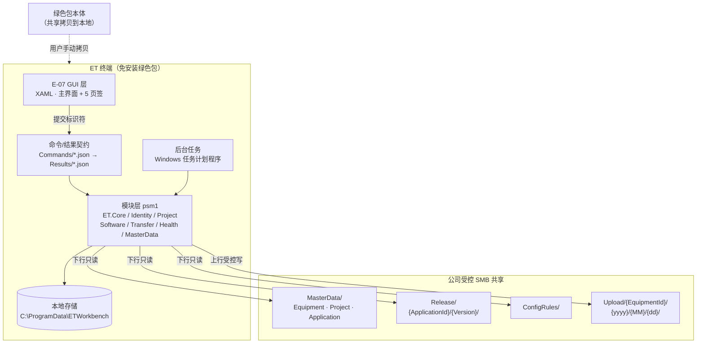
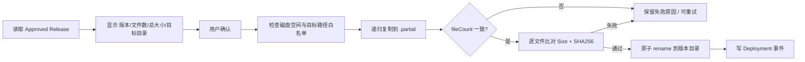

# ET-SYS 开发方案

> **版本** V2.0 · **日期** 2026-09-28 · **状态** 已锁定，可开工
>
> **本版定位**：从「全平台 6 工作流 60 人日」**收缩为「ET 端 PowerShell 工作台单工作流」**。
> 原因是**人力与工期不足，原方案过重**。平台侧（Dataverse / Power Automate / Databricks / Power BI）**本期暂缓**，
> 但所有设计为其**预留接口**，未来可零改造接入。

| 项目 | 内容 |
|---|---|
| 交付形态 | **只做 ET 端 PowerShell 工作台**（免安装绿色包） |
| 范围 | 6 项 MVP 功能 + 主数据录入校验工具 + 最小上报 |
| 人力 | **2 人** |
| 工期 | **约 20 个有效工作日** |
| 终端规模 | **>50 台，多现场，同一内网，共享全可达** |
| 终端环境 | Windows 10/11，**有本机管理员权限** |
| 验收定义 | **样机（1 台）+ 3 台现场试点机跑通全部功能** |
| 配套文档 | `ET-SYS_开发进度.md`（随开发实时更新） |

---

## 目录

- [1. 为什么重设方案](#1-为什么重设方案)
- [2. 本期范围（做什么 / 不做什么）](#2-本期范围做什么--不做什么)
- [3. 技术栈与关键约束](#3-技术栈与关键约束)
- [4. 总体架构](#4-总体架构)
- [5. 目录与文件契约](#5-目录与文件契约)
- [6. 数据契约](#6-数据契约)
- [7. 功能清单与实现步骤](#7-功能清单与实现步骤)
- [8. 开发排期（20 个工作日）](#8-开发排期20-个工作日)
- [9. 验收标准](#9-验收标准)
- [10. 安全与红线](#10-安全与红线)
- [11. 技术前置条件（第 0 天必做）](#11-技术前置条件第-0-天必做)
- [12. 风险登记](#12-风险登记)
- [13. 决策记录](#13-决策记录)

---

## 1. 为什么重设方案

### 1.1 原方案的问题

原方案（V1.0）覆盖 6 条工作流、约 60 人日：

| 工作流 | 内容 | 原估算 |
|---|---|---|
| WS-A | ET 端 PowerShell 工作台 | 18 人日 |
| WS-B | Dataverse / SharePoint 台账 | 10 人日 |
| WS-C | Power Automate / Teams 流程 | 8 人日 |
| WS-D | Databricks 数据加工 | 10 人日 |
| WS-E | Power BI 报表与 DAX | 8 人日 |
| WS-F | 发布 / 迁移 / 运维 | 6 人日 |

**问题**：人力与工期只有 **2 人 × 20 个工作日**，**不足原方案的 2/3**。全平台并行会导致
每一条链路都做不完，最终交付为零。

### 1.2 本版策略

**砍掉平台侧，把 ET 端做到真正能用。**

```text
原方案：ET 端 ──┐
              ├── 平台侧（Dataverse + PA + Databricks + PBI）  ← 本期全部暂缓
              ┘
本方案：ET 端 ──→ 共享目录（JSON/CSV 落盘）                      ← 本期只做这一条
                    ↓ 未来
                  平台侧 ingestion（现已预留结构，不改代码）
```

**理由**：

1. **ET 端是价值起点**：没有 ET 端采集数据，平台侧无数据可加工，报表是空的。
2. **ET 端可独立交付**：它只依赖共享目录，不依赖 Dataverse 授权、Power Platform 许可、Databricks 通道。
   这恰好绕开了 **IT 清单中大量「待确认」的平台侧授权**（IT-14 ~ IT-28）。
3. **ET 端最贴近现场痛点**：找软件、下载、看状态、查健康——这是运维每天在做的事。

### 1.3 平台侧暂缓后的技术补偿

| 原平台能力 | 本期替代方案 | 未来升级路径 |
|---|---|---|
| Dataverse 台账 | **共享上的 JSON/CSV 主数据** | 直接导入 Dataverse，字段已对齐 |
| Power Automate 建单 | **上传事件文件**（One Event = One File） | 平台 ingestion 读同目录 |
| Databricks 加工 | **不做**（数据先落盘沉淀） | 目录已分区 `{EquipmentId}/{yyyy}/{MM}/{dd}` |
| Power BI 报表 | **不做**（ET 端 GUI 直接展示） | 未来读 Databricks Gold 层 |
| Teams 通知 | **不做** | 事件文件已含 `IssueId`/`EventId`，可直接驱动流程 |
| 审批流 | **人工审批版本并手工放入 `Release/`** | 未来接入 Approvals |

> **关键设计**：本期**所有落盘格式都按平台侧可直读设计**（NDJSON、分区目录、One Event = One File、
> 统一主键）。未来接平台时，**只增加一个 ingestion 作业，ET 端一行代码不改**。

---

## 2. 本期范围（做什么 / 不做什么）

### 2.1 做（7 项功能）

| 编号 | 功能 | 说明 | 对应原编号 |
|---|---|---|---|
| **E-01** | 主数据与配置 | 共享 JSON/CSV 契约 + GUI 内的**主数据录入/校验页签** | 新增（前置基础） |
| **E-02** | 设备与工程识别 | 我是谁、该装什么、该用哪个版本 | A-01 |
| **E-03** | 软件入口与状态展示 | 看得见：入口、版本、7 态 | A-02 |
| **E-04** | 一键下载 | 拿得到：文件夹递归复制 + Hash 校验 + 原子发布 | A-03 |
| **E-05** | 健康检测与最小上报 | 本机采集 + 提示 + 事件落共享 | A-05 + A-07 精简 |
| **E-06** | 工作台自更新 | 自身版本可升级、可回滚 | A-08 |
| **E-07** | GUI 界面 | XAML 主界面 + 5 个页签 | A-10 |

### 2.2 不做（明确排除，避免范围蔓延）

| 排除项 | 原编号 | 排除理由 |
|---|---|---|
| 一键改配置 | A-04 | **风险最高**：写入业务配置可能影响生产。需完整 Adapter + 备份/回滚，本期无余量 |
| 日志与支持包采集 | A-06 | 依赖 E-04/E-05 稳定后再做；采集规则需逐应用定义 |
| 完整 Outbox 离线重试 | A-07 | **只做最小版**（失败落本地、下次启动补传），不做指数退避/抖动/最大重试编排 |
| 审计 | A-09 | 最小审计字段先埋点（写事件文件），不做独立审计浏览界面 |
| 告警自动修复 | — | **红线禁止**（见 §10） |
| Dataverse / SharePoint 台账 | WS-B | 平台暂缓 |
| Power Automate / Teams | WS-C | 平台暂缓 |
| Databricks 加工 | WS-D | 平台暂缓 |
| Power BI 报表 | WS-E | 平台暂缓 |
| 安装包 / MSI / 服务化 | — | 本项目为**免安装绿色包**，不做安装器 |

### 2.3 范围守则

> 任何新增需求，**必须先砍掉等量的 E-xx 工作量**，否则工期必然失控。
> 2 人 × 20 个工作日 = **40 人日**，本方案已排满（见 §8）。

---

## 3. 技术栈与关键约束

### 3.1 技术栈

| 层 | 选型 | 版本/要求 | 说明 |
|---|---|---|---|
| 脚本运行时 | **Windows PowerShell** | **5.1**（系统内置） | 不引入 PowerShell 7，无需额外安装 |
| GUI | **WPF + XAML** | .NET Framework 4.8（系统内置） | 通过 PowerShell 加载 XAML，不编译 |
| 后台调度 | **Windows 任务计划程序** | 系统内置 | 短生命周期、可重入 |
| 本地存储 | **JSON / CSV / NDJSON / ZIP** | — | **不使用 SQLite** |
| 网络交换 | **SMB / UNC** | TCP 445 | 复用公司现有共享 |
| 版本控制 | **Git**（仓库根为工作区根） | — | 远程 `Bo123478/ET-Workstation` |

### 3.2 硬性技术约束（违反即返工）

| # | 约束 | 原因 |
|---|---|---|
| **C-1** | **含中文的 `.ps1`/`.psm1`/`.json` 必须保存为 UTF-8 with BOM** | PowerShell 5.1 按系统 ANSI 读取 `.ps1`（无 BOM 时），硬编码 CJK 路径会乱码。**已有脚本 `tools/show-ui.ps1` 已踩过此坑** |
| **C-2** | 脚本内路径**必须**由 `$PSScriptRoot` 推导，**禁止硬编码**绝对路径 | 绿色包可放任意位置（共享拷贝、D 盘、用户目录） |
| **C-3** | GUI 只向后台提交**标识符**（`SoftwareId` / `RuleId`），**禁止传任意文件路径后直接执行** | 防止路径穿越与提权执行 |
| **C-4** | 所有共享写入必须**原子**：`.tmp` → 校验 `Size`+`Hash` → rename `.ready` | 防止读到半截文件 |
| **C-5** | **One Event = One File**，禁止多机并发改公共 CSV | 防止写冲突 |
| **C-6** | 状态必须区分 **7 态**，`Downloaded` **不得**显示为已安装/已生效 | 现场误判会引发事故 |
| **C-7** | 同一配置文件**禁止并发写入**；同一时刻只有一个下载任务 | 初始传输并发 = 1 |
| **C-8** | 磁盘空间不足时**暂停**新下载与采集，**不删业务文件** | 数据安全 |

### 3.3 环境假设（已确认）

| 项 | 状态 |
|---|---|
| PowerShell Execution Policy | ✅ **已确认：允许运行未签名脚本**（IT-08/IT-09 风险解除） |
| 脚本签名 / 证书 / Trusted Publisher | ✅ **本期内不需要** |
| 终端本机管理员权限 | ✅ 有 |
| 终端操作系统 | ✅ Windows 10 / 11 |
| 共享可达性 | ✅ 多现场同一内网，共享全可达 |
| `C:\ProgramData\ETWorkbench` | 约定为本地数据根（IT-12） |

---

## 4. 总体架构

### 4.1 分层



### 4.2 关键职责边界

| 关注点 | GUI | 后台任务 |
|---|---:|---:|
| 设备/工程/版本状态展示 | ✓ | 生成快照 |
| 软件入口 | ✓ | — |
| 下载预览与确认 | ✓ | **复制、校验、原子发布** |
| 健康结果查看 | ✓ | **周期采集、评估、落盘** |
| 主数据录入与校验 | ✓ | 校验、写回 |
| 自更新确认 | ✓ | 下载、校验、切指针、**冒烟测试** |
| Outbox 状态查看 | ✓ | 补传 |

> **核心原则**：GUI **绝不**处理长时间下载、共享写入和上传。
> GUI 与后台通过 **`Commands/` → `Results/` 文件契约**（带 `RequestId`）通信。

### 4.3 识别链（权威，不可改）

```text
SN → 业务 IP → Equipment ID → Device ID → Project ID → Application → Approved Version
```

| 步骤 | 动作 |
|---|---|
| 1 | 读取 BIOS / 设备 Serial Number |
| 2 | 识别活动业务网卡与业务 IP |
| 3 | 读取最近一次**已校验**的 Equipment Snapshot |
| 4 | 按 SN 查询唯一设备记录 |
| 5 | 校验 Allowed IP、Enabled、Project ID、Snapshot 版本 |
| 6 | 加载应用清单、启动规则、批准版本、配置规则 |
| 7 | 生成**只读** Device Context |

**不得自动授权的情况**：SN 为空或重复、IP 不匹配、设备或工程停用、主数据关联缺失、
Snapshot 校验失败或严重过期。

**降级行为**：识别失败时**保留**软件入口、健康检测、日志采集；
**暂停**下载、配置写入和未授权发布；**不干预**运行中的业务软件。

---

## 5. 目录与文件契约

### 5.1 共享侧（平台 → ET 下行）

```text
\\CompanyShare\ETOperation\
├─ MasterData\
│  ├─ Equipment.json            # 设备台账
│  ├─ Project.json              # 工程台账
│  ├─ Application.json          # 应用清单
│  └─ snapshot-manifest.json    # 主数据版本 + Hash
├─ Release\
│  └─ {ApplicationId}\{Version}\
│     ├─ manifest.json          # 文件清单（含逐文件 Size + SHA256）
│     ├─ files\                 # 软件文件夹本体（递归复制源）
│     └─ release-notes.json
├─ ConfigRules\
│  ├─ rules.json
│  └─ rule-manifest.json
├─ Upload\                      # ET → 平台 上行
│  └─ {EquipmentId}\{yyyy}\{MM}\{dd}\
│     ├─ Health\
│     ├─ Alarm\
│     ├─ Deployment\
│     └─ Audit\
└─ Archive\
```

### 5.2 共享权限矩阵（IT-03 ~ IT-06）

| 目录 | Read | Create | Write | Rename | Delete | 原则 |
|---|---:|---:|---:|---:|---:|---|
| `MasterData` | ✓ | ✗ | ✗ | ✗ | ✗ | **ET 下行只读** |
| `Release` | ✓ | ✗ | ✗ | ✗ | ✗ | **ET 下行只读** |
| `ConfigRules` | ✓ | ✗ | ✗ | ✗ | ✗ | **ET 下行只读** |
| `Upload\{EquipmentId}` | 仅自身 | ✓ | ✓ | ✓ | 尽量禁止 | **上行受控写入** |
| `Archive` | ✗ | ✗ | ✗ | ✗ | ✗ | 平台内部 |

> **待 IT 确认**：能否按设备/设备组隔离 `Upload`，防止跨设备读写。

### 5.3 本地侧（ET 终端）

```text
C:\ProgramData\ETWorkbench\          # 本地数据根（IT-12 已确认 ACL）
├─ Config\                           # 本机配置（workstation.json 等）
├─ Snapshot\                         # 主数据快照（Equipment/Project/Application/Release）
├─ Commands\                         # GUI → 后台 命令文件
├─ Results\                          # 后台 → GUI 结果文件
├─ Outbox\                           # 待补传事件（Health/Alarm/Deployment/Audit）
├─ Logs\                             # 工作台自身运行日志
└─ Temp\                             # 临时文件（.partial）
```

**下载软件落地位置（已确认）**：

```text
绿色包目录\            # 程序文件（只读运行，不写入）
<本地软件根>\{ApplicationId}\{Version}\   # 下载的软件
   ↑ 默认：D:\ETSoftware\  或  %USERPROFILE%\ETSoftware\
   ↑ 由 Config\workstation.json 的 SoftwareRoot 配置
```

> **分离理由**：① 绿色包目录保持干净，便于自更新整体替换；
> ② 下载软件与程序分离，C 盘空间紧张时可放 D 盘。

### 5.4 工程目录（本仓库）

```text
ETWorkbench\
├─ Start-ETWorkbench.ps1        # 唯一入口（GUI 启动）
├─ UI\
│  ├─ MainWindow.xaml
│  ├─ IdentityPage.xaml         # 我是谁、该装什么          → E-02
│  ├─ SoftwarePage.xaml         # 软件入口与状态            → E-03
│  ├─ DownloadPage.xaml         # 一键下载                  → E-04
│  ├─ HealthPage.xaml           # 健康检测                  → E-05
│  ├─ MasterDataPage.xaml       # 主数据录入与校验          → E-01
│  └─ AboutPage.xaml            # 版本与自更新              → E-06
├─ Modules\
│  ├─ ET.Core.psm1              # 日志、路径、JSON 读写、原子发布
│  ├─ ET.Identity.psm1          # 识别链                    → E-02
│  ├─ ET.MasterData.psm1        # 快照加载与校验            → E-01
│  ├─ ET.Software.psm1          # 状态模型与判态            → E-03
│  ├─ ET.Transfer.psm1          # 递归复制、Hash、原子发布  → E-04
│  ├─ ET.Health.psm1            # 采集、评估、告警模型      → E-05
│  ├─ ET.Outbox.psm1            # 事件落盘与补传            → E-05
│  └─ ET.Update.psm1            # 自更新                    → E-06
├─ Tasks\
│  ├─ Register-ETTasks.ps1      # 注册计划任务
│  ├─ Invoke-HealthMonitor.ps1  # 周期健康采集              → E-05
│  ├─ Publish-Outbox.ps1        # 补传                      → E-05
│  └─ Watch-Commands.ps1        # 消费 Commands/ 命令       → E-07
└─ Config\
   ├─ workstation.json          # 本机配置（共享根、软件根）
   ├─ health-rules.json         # 健康阈值与恢复条件
   └─ paths.json                # 目录契约
```

> **裁剪说明**：权威设计中的 `ET.Config.psm1`（一键配置）与 `ET.Log.psm1`（日志包）
> 本期**不建**——对应功能已在 §2.2 排除。`ET.Audit.psm1` 降级为 `ET.Core` 内的埋点函数。

---

## 6. 数据契约

### 6.1 统一主键

| 主键 | 示例 | 说明 |
|---|---|---|
| `EquipmentId` | `K106` | ET 终端设备 |
| `DeviceId` | — | 硬件设备标识 |
| `ProjectId` | `PRJ001` | 工程 |
| `ApplicationId` | `APP001` | 应用 |
| `Version` | `1.2.5` | 版本号 |
| `ReleaseId` | `REL-2026-0010` | 批准发布 |
| `EventId` | `EVT-K106-20260928-000001` | 事件（One Event = One File） |
| `RequestId` | GUID | GUI 与后台的请求关联 |

### 6.2 发布 Manifest（E-04 核心）

```json
{
  "applicationId": "APP001",
  "version": "1.2.5",
  "releaseId": "REL-2026-0010",
  "publishedAt": "2026-09-20T10:00:00+08:00",
  "fileCount": 148,
  "totalBytes": 268435456,
  "files": [
    { "relativePath": "App.exe",       "size": 1048576, "sha256": "a1b2..." },
    { "relativePath": "bin\\core.dll", "size": 524288,  "sha256": "c3d4..." }
  ]
}
```

> **重要**：软件包是**整个文件夹递归复制**（非 ZIP）。
> 因此校验必须**逐文件比对 Size + SHA256**，并在复制前先校验 `fileCount` 与 `totalBytes`。

### 6.3 下载事务（E-04）



**核心要求**：
- 只允许批准的 `ApplicationId` / `Version` / `ReleaseId`；
- 目标目录必须属于**批准根路径**（`SoftwareRoot`）；
- **不覆盖运行目录**；
- 不完整包**不可使用**；
- 单项失败**不得**显示整体成功；
- 网络中断时**暂停**并进入重试；
- **`Download` ≠ `Install` ≠ `Deploy`**。

### 6.4 状态模型（E-03，7 态）

```text
Package Available  →  Downloaded  →  Deployed
                                    ↓
Executable Found   →  Running     →  Configured  →  Effective
```

| 状态 | 判定条件 |
|---|---|
| `Package Available` | 共享 `Release/` 存在批准版本 manifest |
| `Downloaded` | 本地版本目录存在且**逐文件 Hash 通过** |
| `Deployed` | 本地目录已原子发布完成（`.ready`） |
| `Executable Found` | 主程序文件实际存在 |
| `Running` | 对应进程存在（只读检测） |
| `Configured` | 配置项匹配（本期**不实现写入**，仅展示） |
| `Effective` | 进程运行 **且** 版本与批准版本一致 |

> **红线**：`Downloaded` **绝不允许**显示为「已安装」或「已生效」。

### 6.5 健康事件（E-05）

**Outbox 记录字段**：

```text
EventId, EventType, EquipmentId, ApplicationId, Version, ReleaseId,
CreatedTime, RetryCount, NextRetry, Checksum, LocalPath, Status, LastError
```

**告警模型**：

```text
Collect → Evaluate → Duration → Debounce → Deduplicate → Alarm → Recovery
```

**检测范围**：

| # | 检测项 | 数据源 |
|---|---|---|
| 1 | CPU 持续高占用 | CIM / WMI |
| 2 | 可用内存 | CIM / WMI |
| 3 | 业务盘 / 下载盘空间 | `Get-PSDrive` |
| 4 | 业务网卡与**共享连通性** | `Test-Path \\share\...` |
| 5 | 指定 Windows 服务 | `Get-Service` |
| 6 | 指定应用进程 | `Get-Process` |
| 7 | System / Application Event Log | `Get-WinEvent` |
| 8 | 工作台任务与 Outbox 状态 | 本地读取 |

> 无权限或无法取数时记为 **`Unknown`**，**不直接判定故障**。
> 默认**仅检测和提示**，不自动修复。

### 6.6 最小上报（E-05 精简版）

| 场景 | 行为 |
|---|---|
| 共享可达 | 事件文件直接原子写入 `Upload\{EquipmentId}\{yyyy}\{MM}\{dd}\<类型>\` |
| 共享不可达 | 事件落本地 `Outbox\`，`Status=Pending` |
| 下次启动 / 周期任务 | `Publish-Outbox.ps1` 扫描 `Outbox\`，补传成功后**删除本地副本** |
| 补传判定成功 | 目标文件**存在** + **长度/Hash 符合** + `EventId` 可识别 |

---

## 7. 功能清单与实现步骤

---

### E-01 主数据与配置（前置基础）

**目标**：让运维**不写 JSON 也能维护主数据**，并且**改错能被立刻发现**。

**交付物**

| 类型 | 文件 |
|---|---|
| 共享契约 | `MasterData/Equipment.json`、`Project.json`、`Application.json`、`snapshot-manifest.json` |
| 模块 | `Modules/ET.MasterData.psm1` |
| 界面 | `UI/MasterDataPage.xaml` |
| 配置 | `Config/workstation.json`、`Config/paths.json` |

**实现步骤**

| 步 | 动作 | 完成判据 |
|---|---|---|
| 1 | 定义三个主数据 JSON 的 **Schema**（字段、类型、必填） | Schema 写入方案附录，字段与 Dataverse 未来表对齐 |
| 2 | 实现 `Test-ETMasterData`：字段完整性 + 类型 + **重复主键** + **交叉引用**（`ProjectId` 是否存在于 `Project.json`） | 喂入 5 组错误数据均能报出精确行号 |
| 3 | 实现 `Get-ETMasterDataSnapshot`：从共享读取 → 校验 → 缓存到本地 `Snapshot\` | 断网时可用上次快照 |
| 4 | 生成 `snapshot-manifest.json`（记录版本号 + 各文件 Hash） | ET 端能识别快照是否过期 |
| 5 | 做 `MasterDataPage.xaml`：表格展示 + 「校验」按钮 + 「保存到共享」按钮 | 保存前强制校验，不通过不给保存 |
| 6 | 加「导入 CSV」能力（运维更习惯 Excel） | CSV → JSON 转换可用 |
| 7 | 加**变更确认**：保存前显示 Old/New 差异 | 防止误改 |

**验收**：运维在 GUI 内新增 1 台设备、1 个工程、1 个应用，
故意写错 1 处 `ProjectId`，系统**拒绝保存并指明错误位置**。

---

### E-02 设备与工程识别

**目标**：终端**自己知道自己是谁**，该装什么、该用哪个版本。

**交付物**

| 类型 | 文件 |
|---|---|
| 模块 | `Modules/ET.Identity.psm1` |
| 界面 | `UI/IdentityPage.xaml` |

**实现步骤**

| 步 | 动作 | 完成判据 |
|---|---|---|
| 1 | `Get-ETSerialNumber`：CIM 读 BIOS SN，**处理空值与重复** | 空 SN 返回明确错误码，不崩溃 |
| 2 | `Get-ETBusinessIp`：枚举活动网卡，按 `Allowed IP` 段匹配业务 IP | 多网卡机器能选对业务网卡 |
| 3 | `Resolve-ETIdentity`：实现 **7 步识别链** | 每步可单独调测 |
| 4 | 实现**校验与拒绝规则**（SN 空/重复、IP 不匹配、停用、关联缺失、快照过期） | 6 种拒绝场景各返回专属错误码 |
| 5 | 实现**降级行为**：识别失败仍保留软件入口/健康检测 | 断共享时 GUI 仍可用 |
| 6 | 输出**只读** Device Context 对象 | 其他模块只读消费，不可改 |
| 7 | `IdentityPage.xaml` 展示：SN、业务 IP、EquipmentId、ProjectId、识别结论 | 一眼看到「我是谁」 |

**验收**：样机上识别出正确 `EquipmentId` 与 `ProjectId`；
手工把 SN 改成空值，界面**明确提示**而非崩溃或误授权。

---

### E-03 软件入口与状态展示

**目标**：**看得见**——所有该装的软件，一眼看清版本与真实状态。

**交付物**

| 类型 | 文件 |
|---|---|
| 模块 | `Modules/ET.Software.psm1` |
| 界面 | `UI/SoftwarePage.xaml` |

**实现步骤**

| 步 | 动作 | 完成判据 |
|---|---|---|
| 1 | `Get-ETSoftwareList`：按 `Project/Application` 快照生成入口列表 | 数量与主数据一致 |
| 2 | 实现 **7 态判定函数**（每态一个独立可测函数） | 7 个函数各有单测用例 |
| 3 | 实现 `Test-ETPackageIntegrity`：**逐文件** Size + SHA256 | 篡改任一文件能检出 |
| 4 | 实现 `Get-ETProcessState` + `Get-ETExecutableState` | 只读检测，不杀进程 |
| 5 | `SoftwarePage.xaml`：列表展示 ApplicationId / 名称 / Required / 目标版本 / 本地版本 / 7 态 | 状态用**颜色+文字**双标示，避免只靠颜色 |
| 6 | 加「刷新」与「打开目录」入口 | 打开目录走白名单校验 |
| 7 | 加**状态说明 Tooltip**：解释 7 态含义 | 现场人员不误判 |

**验收**：某应用下载完成但未运行时，正确显示 **`Downloaded`**，
**不显示**「已安装」或「已生效」。

---

### E-04 一键下载

**目标**：**拿得到**，且**拿到的必是完整、正确、批准的版本**。

**交付物**

| 类型 | 文件 |
|---|---|
| 模块 | `Modules/ET.Transfer.psm1` |
| 界面 | `UI/DownloadPage.xaml` |

**实现步骤**

| 步 | 动作 | 完成判据 |
|---|---|---|
| 1 | `Get-ETReleaseManifest`：读并校验 `Release/.../manifest.json` | manifest 被篡改则拒绝 |
| 2 | `Test-ETSpaceAndPath`：磁盘空间 + 目标路径必须在 `SoftwareRoot` 白名单内 | 越界路径直接拒绝 |
| 3 | `Copy-ETPackageRecursive`：**递归复制**到 `.partial` 目录 | 支持 >1000 文件、>1 GB |
| 4 | 复制中**进度上报**：写 `Results\` 供 GUI 显示百分比 | 大包不假死 |
| 5 | `Test-ETPackageIntegrity`：比对 `fileCount` + 逐文件 Size + SHA256 | 缺 1 文件即失败 |
| 6 | **原子发布**：`.partial` → rename 为版本目录；失败保留 `.partial` 供排查 | 任何时刻不存在半成品可用目录 |
| 7 | **不覆盖运行目录**：目标已存在且被占用时明确拒绝 | 不强行解锁、不覆盖 |
| 8 | 网络中断**暂停 + 重试**；**同一时刻只跑 1 个下载** | 并发=1，可验证 |
| 9 | 写 **Deployment 事件** 到 `Upload\` 或 `Outbox\` | 事件可被补传 |
| 10 | `DownloadPage.xaml`：预览（版本/文件数/大小/目标）+ 确认 + 进度 | 未确认不下载 |

**验收**：在样机上下载一个 >100 文件的真实软件包，逐文件 Hash 全部通过；
中途手工断开共享，**明确报错并可重试**；**绝不**显示为整体成功。

---

### E-05 健康检测与最小上报

**目标**：**提前发现问题**，并把证据可靠送到共享。

**交付物**

| 类型 | 文件 |
|---|---|
| 模块 | `Modules/ET.Health.psm1`、`Modules/ET.Outbox.psm1` |
| 任务 | `Tasks/Invoke-HealthMonitor.ps1`、`Tasks/Publish-Outbox.ps1` |
| 界面 | `UI/HealthPage.xaml` |
| 配置 | `Config/health-rules.json` |

**实现步骤**

| 步 | 动作 | 完成判据 |
|---|---|---|
| 1 | 实现 8 项采集函数（CPU/内存/磁盘/网络/服务/进程/事件日志/自身状态） | 每项独立可测，无权限返回 `Unknown` |
| 2 | 定义 `health-rules.json`：阈值 / 持续时间 / 恢复条件 / 冷却时间 | 改 JSON 即可调阈值，不改代码 |
| 3 | 实现**告警模型**：`Collect→Evaluate→Duration→Debounce→Deduplicate→Alarm→Recovery` | 抖动场景不重复告警 |
| 4 | 事件落盘：`Upload\{EquipmentId}\{yyyy}\{MM}\{dd}\Health\`，原子写 | One Event = One File |
| 5 | 共享不可达时落 `Outbox\`，`Status=Pending` | 断网不丢事件 |
| 6 | `Publish-Outbox.ps1`：扫描 + 补传 + **成功后删本地副本** | 不重复上传 |
| 7 | 注册计划任务（`Register-ETTasks.ps1`）：健康采集 + Outbox 补传 | **短生命周期、可重入、有幂等标识** |
| 8 | `HealthPage.xaml`：展示当前值、阈值、告警列表、Outbox 状态与积压数 | 积压可见 |
| 9 | **埋点最小审计**：操作写入事件（Who/When/EquipmentId/Operation/Result） | 为未来审计留数据 |

**验收**：共享可达时事件**立即出现在共享**；断开共享后事件**落本地 Outbox**；
恢复共享后**下次任务自动补传**且**不重复**。

---

### E-06 工作台自更新

**目标**：**50+ 台终端的工作台能统一升级**，且**失败可回滚**。

**交付物**

| 类型 | 文件 |
|---|---|
| 模块 | `Modules/ET.Update.psm1` |
| 界面 | `UI/AboutPage.xaml` |
| 结构 | `ETWorkbench\{版本号}\` + `Current.json` |

**实现步骤**

| 步 | 动作 | 完成判据 |
|---|---|---|
| 1 | 改造目录布局为**多版本并存**：`1.0.0\`、`1.1.0\` + `Current.json` | 指针指向当前版本 |
| 2 | `Get-ETWorkbenchUpdate`：读共享中的工作台版本 manifest | 有新版则提示 |
| 3 | 下载 → 校验 Manifest/Hash → 解压到新版本目录 | 校验不通过不切换 |
| 4 | 备份当前 `Current.json` | 可回滚 |
| 5 | **切换 Current 指针** | 原子写 |
| 6 | **冒烟测试**：切完后调用一次 `Test-ETWorkbench` 自检（模块能否加载） | 失败则**自动回滚** |
| 7 | `AboutPage.xaml`：显示当前版本、检查更新、回滚按钮 | 用户可主动回滚 |
| 8 | **不自动重启生产程序或 Windows** | 严守红线 |

**验收**：把样机从 `1.0.0` 升到 `1.1.0` 成功；
故意放一个会加载失败的 `1.2.0`，系统**自动回滚到 1.1.0** 并提示原因。

---

### E-07 GUI 界面

**目标**：一个**装好就能用**的界面，5 个页签覆盖全部操作。

**交付物**

| 类型 | 文件 |
|---|---|
| 入口 | `Start-ETWorkbench.ps1` |
| 框架 | `UI/MainWindow.xaml` |
| 任务 | `Tasks/Watch-Commands.ps1` |

**实现步骤**

| 步 | 动作 | 完成判据 |
|---|---|---|
| 1 | `Start-ETWorkbench.ps1`：加载 WPF 程序集 + XAML，`$PSScriptRoot` 推导路径 | **任意目录**双击可启动 |
| 2 | 建立 **Commands/Results 文件契约**（带 `RequestId`） | GUI 与后台解耦 |
| 3 | `Watch-Commands.ps1`：消费命令、写结果、更新状态 | 命令可重入、幂等 |
| 4 | `MainWindow.xaml`：页签框架 + 顶部状态条（我是谁 / 共享连通 / 版本） | 一眼看到关键信息 |
| 5 | 接入 5 个 Page（E-01~E-06 的界面） | 页签可切换 |
| 6 | **统一错误提示**：所有错误给出**中文可读原因 + 建议动作** | 现场人员能自助处理 |
| 7 | 长任务**进度与取消**（下载、校验） | 不假死 |
| 8 | 全文件**存为 UTF-8 with BOM**（约束 C-1） | 中文不乱码 |
| 9 | 打包**绿色包**结构 + 拷贝说明 | 拷贝即用 |

**验收**：把绿色包拷到样机任意目录，双击 `Start-ETWorkbench.ps1`，
**5 个页签全部可用，中文无乱码**。

---

## 8. 开发排期（20 个工作日）

### 8.1 人力分工

| 角色 | 承担 |
|---|---|
| **A（客户端/界面）** | E-07 GUI 框架、E-01 界面、E-02 界面、E-03 界面、E-06 自更新 |
| **B（核心/传输）** | E-01 契约、E-02 识别、E-03 状态、E-04 传输、E-05 健康与上报 |
| **共同** | 第 0 天前置、集成联调、样机与试点机验收 |

> **依赖关系**：`Day1 契约` → 其余全部；
> `E-01 → E-02 → E-03`；`E-04`、`E-05`、`E-06` 可并行。

### 8.2 逐日排期（每日可验收）

| 日 | 里程碑 | A（界面） | B（核心） | 当日可验收物 |
|---|---|---|---|---|
| **D0** | **前置条件** | ①IT 共享四目录开通（IT-03~06）②确认 ET 域账号访问共享（IT-01/02）③共享根与软件根路径定稿 | 同左 | **共享可读可写证明**（截图/命令输出） |
| **D1** | 骨架 + 契约 | 建 `ETWorkbench/` 全套目录；`.gitignore`；编码规范（BOM） | JSON Schema（Equipment/Project/Application/Release Manifest） | **目录树 + 3 份 Schema** |
| **D2** | E-01 模块 | 主数据页签骨架（表格 + 按钮） | `ET.MasterData.psm1`：加载、校验、快照 | **校验函数单测通过** |
| **D3** | E-01 完成 | 主数据页签：录入 / 校验 / 保存 / Old-New 差异 | CSV 导入；`snapshot-manifest.json` | **★ E-01 验收** |
| **D4** | E-02 识别 | 识别页签 | `Get-ETSerialNumber`、`Get-ETBusinessIp` | SN + 业务 IP 正确读出 |
| **D5** | E-02 完成 | 识别页签：展示识别链每步结果与拒绝原因 | `Resolve-ETIdentity` 7 步 + 6 种拒绝 + 降级 | **★ E-02 验收** |
| **D6** | E-03 状态 | 软件列表骨架 | 7 态判定函数（7 个）+ `Test-ETPackageIntegrity` | 7 态单测通过 |
| **D7** | E-03 完成 | 软件页签：列表 + 颜色/文字双标示 + Tooltip | 进程/可执行检测；刷新与打开目录 | **★ E-03 验收** |
| **D8** | E-04 复制 | 下载页签骨架 | `Get-ETReleaseManifest` + `Test-ETSpaceAndPath` | 越界路径被拒绝 |
| **D9** | E-04 复制 | 进度条与取消 | `Copy-ETPackageRecursive` + 进度上报 + 并发=1 | 大包复制不假死 |
| **D10** | E-04 完成 | 下载页签：预览/确认/进度/错误 | 逐文件 Hash + 原子发布 + 断网重试 + Deployment 事件 | **★ E-04 验收** |
| **D11** | E-05 采集 | 健康页签骨架 | 8 项采集函数（无权限→`Unknown`） | 8 项均能取数或 `Unknown` |
| **D12** | E-05 告警 | 健康页签：阈值/告警列表 | `health-rules.json` + 7 段告警模型 | 抖动不重复告警 |
| **D13** | E-05 上报 | 健康页签：Outbox 积压 | 事件原子落盘 + Outbox + `Publish-Outbox.ps1` | 断网落本地、恢复自动补传 |
| **D14** | E-05 完成 | 计划任务注册界面/脚本 | `Invoke-HealthMonitor.ps1` + `Register-ETTasks.ps1` + 审计埋点 | **★ E-05 验收** |
| **D15** | E-06 自更新 | `AboutPage.xaml` | 多版本目录 + `Current.json` + 下载校验 | 版本指针可切换 |
| **D16** | E-06 完成 | 检查更新 / 回滚按钮 | 冒烟测试 + 自动回滚 | **★ E-06 验收** |
| **D17** | 集成 | `Start-ETWorkbench.ps1` + `Watch-Commands.ps1` + 统一错误提示 | 命令契约联调；异常路径梳理 | **5 页签全部可切换** |
| **D18** | 打包 + 样机 | 绿色包结构 + 拷贝说明 + 计划任务脚本 | 样机全功能走查 | **★ 样机 6 项功能全部跑通** |
| **D19** | 试点机 | 2 台现场试点机部署 | 差异排查（账号/策略/机器差异） | **★ 3 台试点机通过** |
| **D20** | 收尾 | 运维手册（拷贝/使用/排错）+ 推广清单 + 复盘 | 缺陷修复 | **★ 整体验收** |

> **注**：`D19` 的 3 台试点机 = 1 台样机 + **2 台现场机**（多现场覆盖）。

### 8.3 关键路径与缓冲

```text
D0 → D1 → D2 → D3 → D4 → D5 → D6 → D7 → D8 → D9 → D10 → D11 → D12 → D13 → D14 → D15 → D16 → D17 → D18 → D19 → D20
                     └─────────────────── E-04 是关键路径 ───────────────────┘
```

**缓冲策略**：本排期**无预留缓冲**，风险靠**可砍项**吸收（见 §8.4）。

### 8.4 可砍项（按优先级从低到高砍）

| 顺序 | 砍什么 | 影响 | 省时 |
|---|---|---|---|
| 1 | E-01 CSV 导入 | 运维改用手工改 JSON | 0.5 天 |
| 2 | E-03 打开目录入口 | 手工找路径 | 0.5 天 |
| 3 | E-06 GUI 内的检查更新（改为脚本触发） | 体验略降 | 1 天 |
| 4 | E-05 事件日志检测（8 项减为 7 项） | 覆盖略降 | 1 天 |
| 5 | E-04 进度百分比（改为不确定进度条） | 观感略降 | 1 天 |

> 砍到这里相当于腾出 **4 天缓冲**，足以吸收常见返工。

---

## 9. 验收标准

### 9.1 验收定义（已锁定）

> **在 1 台样机 + 2 台现场试点机（共 3 台，覆盖多个现场）上，跑通全部 7 项功能，即算完成。**

**为什么加了 2 台现场机**（诚实说明）：

`1 台样机通过 ≠ 50 台能推广`。样机通常与现场机存在以下差异：

| 差异点 | 样机 | 现场机 |
|---|---|---|
| 共享可达性 | 通常直连 | 跨网段、可能有 ACL |
| Windows 身份 | 可能是本地管理员 | 多为**域账号** |
| 组策略 | 宽松 | 可能有限制 |
| 机器配置 | 统一 | 机型杂、软件环境杂 |
| 业务网卡 | 单一 | 可能多网卡 |

**只多花半天成本，却能提前暴露上述全部问题。** 这是让验收结论站得住的必要条件。

### 9.2 逐项验收标准

| 编号 | 功能 | 验收方法 | 通过判据 |
|---|---|---|---|
| E-01 | 主数据与配置 | 在 GUI 新增设备/工程/应用；故意写错 `ProjectId` | **拒绝保存**并指明错误位置 |
| E-02 | 设备与工程识别 | 样机识别；把 SN 置空 | 识别出正确 ID；空 SN **明确提示**不崩溃 |
| E-03 | 软件入口与状态 | 下载完但未运行的应用 | 显示 **`Downloaded`**，**不是**「已安装/已生效」 |
| E-04 | 一键下载 | 下载 >100 文件真实包；中途断共享 | Hash **全部通过**；断网**明确报错可重试**；**不显示整体成功** |
| E-05 | 健康检测与上报 | 断共享产生告警；恢复共享 | 事件**落本地 Outbox** → **自动补传**且**不重复** |
| E-06 | 工作台自更新 | 1.0.0→1.1.0；再放一个会失败的 1.2.0 | 升级成功；失败版本**自动回滚**并提示原因 |
| E-07 | GUI 界面 | 绿色包拷到任意目录双击启动 | 5 页签可用，**中文无乱码** |

### 9.3 全局验收项

| # | 项目 | 判据 |
|---|---|---|
| G-1 | 免安装 | 拷贝即用，无需安装、无需管理员运行安装程序 |
| G-2 | 路径无关 | 绿色包放任意目录均可运行（约束 C-2） |
| G-3 | 编码正确 | 所有含中文脚本 UTF-8 with BOM，界面/日志无乱码 |
| G-4 | 安全红线 | §10 全部红线**无违反** |
| G-5 | 共享权限 | ET 对 `Release`/`ConfigRules`/`MasterData` **只能读**，写被拒绝 |
| G-6 | 断网可用 | 断共享后软件入口与健康检测**仍可用** |
| G-7 | 并发安全 | 同一时刻**只有 1 个下载**；配置文件**无并发写** |
| G-8 | 幂等 | 重复运行计划任务**不产生重复事件** |

### 9.4 交付物清单

| # | 交付物 | 位置 |
|---|---|---|
| 1 | `ETWorkbench/` 绿色包（源码 + 配置 + 说明书） | 仓库 + 共享 |
| 2 | 主数据 JSON Schema 附录 | `docs/` |
| 3 | `ET-SYS_开发方案.md`（本文件） | 仓库根 |
| 4 | `ET-SYS_开发进度.md`（实时更新） | 仓库根 |
| 5 | **运维手册**：拷贝 / 使用 / 排错 | `docs/` |
| 6 | **推广清单**：逐台部署与核对步骤 | `docs/` |
| 7 | 主数据录入校验工具（含在 GUI 内） | `ETWorkbench/` |

---

## 10. 安全与红线

### 10.1 绝对禁止（来自权威设计 §3.2）

| # | 禁止行为 |
|---|---|
| **F-1** | 自动结束或重启业务软件 |
| **F-2** | 自动覆盖正在使用的程序文件 |
| **F-3** | 强行解除文件锁 |
| **F-4** | 强制抢焦点或置顶 |
| **F-5** | 自动重启电脑 |
| **F-6** | 修改其他进程优先级 |
| **F-7** | 自动执行系统修复 / 服务重启 / 进程终止 |
| **F-8** | 接受 GUI 传入任意路径后直接执行 |
| **F-9** | 把 `Downloaded` 显示为「已生效」 |
| **F-10** | 在磁盘空间不足时删除业务文件 |
| **F-11** | ET 端建设 HTTP/API Server，或开放服务端口 |
| **F-12** | ET 端读取或修改其他设备的 `Upload` 目录 |

### 10.2 设计侧防护

| 防护点 | 措施 |
|---|---|
| 路径安全 | GUI 只传标识符；服务端从校验过的 Manifest 解析真实路径 |
| 提权执行 | 执行前**服务端复核**管理员权限与路径白名单 |
| 包完整性 | 逐文件 `Size` + `SHA256`，原子发布 |
| 配置安全 | 本期**不写入**业务配置（A-04 已排除） |
| 主数据安全 | ET 对下行目录**只读**，NTFS + 共享权限双重最小化 |
| 数据脱敏 | 事件文件**不含**配置明文、密码、Token |
| 越权防护 | `Upload` 按 `{EquipmentId}` 隔离，防止跨设备访问 |

---

## 11. 技术前置条件（第 0 天必做）

> **全部完成才可开工。** 任何一项未完成，对应功能直接阻塞。

| # | 前置条件 | 对应 IT 项 | 阻碍的功能 | 完成判据 |
|---|---|---|---|---|
| **P-1** | 共享四目录建立：`MasterData`/`Release`/`ConfigRules`/`Upload` | IT-03~06 | **E-01/E-03/E-04/E-05** | 目录存在且权限符合 §5.2 |
| **P-2** | 确认 ET 访问共享的 **Windows 身份**（域账号 or 服务账号） | IT-01/02 | 全部 | 在样机上 `Test-Path \\share\...` 返回 True |
| **P-3** | 确认 `Upload` 可 Create/Write/Rename | IT-06 | **E-05** | 样机上成功原子写入 1 个测试事件 |
| **P-4** | 确认计划任务**在用户未登录时**仍可访问 UNC | IT-10/11 | **E-05 周期采集** | 断开登录会话后任务仍成功 |
| **P-5** | 确认 CIM/WMI/Event Log 读取权限 | IT-13 | **E-02/E-05** | 样机上取数无 `Access Denied` |
| **P-6** | 确认 `C:\ProgramData\ETWorkbench` ACL 允许读写 | IT-12 | 全部 | 创建目录并读写成功 |
| **P-7** | SMB 网络连通（TCP 445、DNS、Firewall ACL） | IT-07 | 全部 | 多现场各 1 台验证 |
| **P-8** | 本地软件根路径定稿（D 盘 or 用户目录） | — | **E-04** | 写入 `Config/workstation.json` |
| ✅ | PowerShell Execution Policy | IT-08/09 | — | **已确认：允许未签名脚本** |

### 11.1 前置条件验证脚本

建议第 0 天用 `tools/check-appcontrol.ps1`（已在仓库）做环境体检，
并新增一个 `tools/Test-ETPrerequisites.ps1` 逐项打印 P-1~P-8 的通过状态。

---

## 12. 风险登记

| ID | 风险 | 概率 | 影响 | 缓解措施 | 状态 |
|---|---|---|---|---|---|
| **R-1** | **IT 授权未落定**（P-1~P-7，尤其共享四目录与 `Upload` 写权限） | 高 | **致命**：无共享则 E-01/03/04/05 全部无法验收 | **D0 集中攻坚**；用 `docs/ET数字化运维_IT权限与接口确认清单.xlsx` 逐项与 IT 过；P-1/P-2 未过则**停止开发**先解决 | **未缓解** |
| **R-2** | **计划任务未登录时访问不了 UNC**（P-4） | 中 | 高：E-05 周期采集失效 | 备选：改为**用户登录时触发**；或改用「存储凭据 + 计划任务」；最坏降级为**仅 GUI 手工触发采集** | 未缓解 |
| **R-3** | **2 人 × 20 天排期无缓冲** | 中 | 中：任一环节延期直接冲击验收 | 已定义**5 项可砍项**（§8.4），最坏可腾 4 天 | 已缓解（有预案） |
| **R-4** | **现场机器环境差异大**（多网卡、域策略、旧系统） | 中 | 中：样机通过但现场失败 | **3 台试点机跨现场**（D19）；`Allowed IP` 支持多网卡；提前收集机器清单 | 部分缓解 |
| **R-5** | **真实软件包过大**（>1 GB / 数千文件）导致复制超时 | 中 | 中：E-04 体验差或失败 | 支持**进度上报 + 可取消**；`fileCount` 前置校验；必要时允许**断点续传**（本期不做，列为 P1） | 部分缓解 |
| **R-6** | **主数据由运维手工维护易出错** | 高 | 中：错误主数据导致识别失败 | E-01 **强制校验 + 跨表引用检查 + Old/New 差异确认**；提供 CSV 导入 | 已缓解 |
| **R-7** | 共享磁盘空间不足（50+ 台 × Health 事件持续写入） | 中 | 中：共享写满 | `Upload` 按 `{yyyy}/{MM}/{dd}` 分区；**约定平台侧保留策略**；ET 端**不删**他人文件 | 部分缓解 |
| **R-8** | SMB 并发写冲突 | 低 | 中 | **One Event = One File**；`Upload` 按 `{EquipmentId}` 隔离 | 已缓解 |
| **R-9** | 编码问题导致中文乱码 | 中 | 低 | 约束 **C-1**（UTF-8 BOM）；D1 建立规范并在 **D17 全量检查** | 已缓解 |
| **R-10** | 范围蔓延（临时加需求） | 高 | 高：工期失控 | §2.3 范围守则：**加需求必等量砍需求** | 已缓解（有守则） |

### 12.1 需诚实标注的事项

| 事项 | 说明 |
|---|---|
| **1 台样机验收不足** | 已在 §9.1 加 2 台现场试点机；但仍**不能**代表 50+ 台全部可推广 |
| **无缓冲工期** | §8 排期无预留。若 D0 前置条件拖延，**验收日期必须顺延** |
| **平台侧暂缓是权宜** | ET 端数据先落盘沉淀。若长期不接平台，**共享会持续膨胀**且**无跨设备分析能力** |
| **`Configured`/`Effective` 为弱实现** | 本期不写入配置，这两态**仅基于进程与版本比对推断**，不代表配置真的正确 |

---

## 13. 决策记录

### 13.1 已锁定决策（27 项）

| # | 决策项 | 结论 |
|---|---|---|
| 1 | 重设原因 | 人力或工期不够，原方案太重 |
| 2 | 交付形态 | **只做 ET 端 PowerShell**，平台暂缓 |
| 3 | 本期范围 | ET 工作台 only |
| 4 | 数据范围 | **不建 Dataverse 表**，用共享 JSON/CSV |
| 5 | 人力 | **2 人** |
| 6 | 工期 | **约 20 个有效工作日** |
| 7 | 终端规模 | **>50 台，多现场** |
| 8 | 主数据来源 | 手工维护 JSON/CSV 放共享 |
| 9 | 上报去向 | **最小上报**：写共享 + 失败落本地补传 |
| 10 | 终端权限 | 本机管理员权限，Windows 10/11 |
| 11 | 应用数 | 4–10 个 |
| 12 | 部署方式 | **免安装绿色包**，放共享用户自拷 |
| 13 | 多现场网络 | 同一内网，共享全可达 |
| 14 | 主数据维护 | 运维维护，**需录入/校验工具** |
| 15 | 旧文档处置 | 删除重写 |
| 16 | 工程目录 | C# 骨架删除，新建干净目录 |
| 17 | 完成定义 | 样机跑通全部功能 |
| 18 | 软件包形态 | **整个文件夹直接递归复制**（非 ZIP） |
| 19 | 资产处置 | 文档移 `docs/`，删骨架，新建 `ETWorkbench/` |
| 20 | **IT-08/09 PowerShell 安全策略** | **已确认：允许运行未签名脚本** → 无需签名/PKI |
| 21 | **主数据录入工具形态** | **工作台 GUI 内的「主数据」页签** |
| 22 | **本地目录规划** | 绿色包即程序目录；**下载软件放 D 盘/用户目录** |
| 23 | **验收与推广** | **P0 必做：样机 + 3 台现场试点机** |
| 24 | **工期与人力口径** | **2 人，约 20 个有效工作日** |
| 25 | **版本控制归属** | **`.git` 提到工作区根**，远程沿用 `Bo123478/ET-Workstation` |
| 26 | 保证等级 | 时间优先，诚实优先于乐观 |
| 27 | 本期交付 | 真实可用 > 覆盖面广 |

### 13.2 未决事项（需尽快拍板）

| # | 事项 | 需谁定 | 影响 |
|---|---|---|---|
| U-1 | 共享根 UNC 路径（`\\?\ETOperation`） | IT / 文件服务 | P-1、全部功能 |
| U-2 | ET 访问共享的 Windows 身份 | AD / Endpoint | P-2 |
| U-3 | `Upload` 能否按 `{EquipmentId}` 隔离 | 文件服务 | F-12 |
| U-4 | 共享保留策略（`Upload` 保留多久） | IT / 运维 | R-7 |
| U-5 | 本地软件根路径（`D:\ETSoftware` 是否可用） | 运维 | P-8 |
| U-6 | 各现场机器清单与系统版本 | 运维 | R-4 |

---

## 附录 A：本方案与旧方案的关系

| 维度 | V1.0（旧） | V2.0（本版） |
|---|---|---|
| 工作流 | 6 条（WS-A~WS-F） | **1 条**（ET 端） |
| 功能数 | 40 项（A*/B*/C*/D*/E*/F*） | **7 项**（E-01~E-07） |
| 人日 | ~60 | **~40** |
| 平台侧 | 全建 | **暂缓，仅预留契约** |
| 验收 | 17 条 MVP + E1~E7 | **7 项功能 + 8 条全局项 + 3 台机器** |
| 风险数 | D-1~D-9 | **R-1~R-10** |

**继承未改**（权威设计仍然有效，本方案是它的**执行裁剪版**）：

- `现场数字化运维最终方案_PowerShell_M365_Databricks.md` — ET 端技术基线
- `docs/ET工作台方案_Version2.md` — C# 版设计（业务语义来源）
- `docs/ET数字化运维_IT权限与接口确认清单.xlsx` — IT 授权基线
- 识别链、7 态模型、One Event = One File、原子发布、红线清单 — **全部保留**
