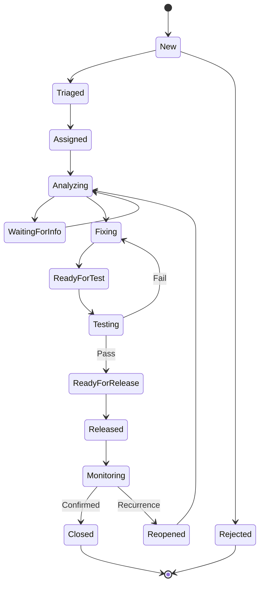

# 数据字典（Phase 1）— 现场设备与系统运维数字化平台

| 项 | 内容 |
|---|---|
| 版本 | V0.1 |
| 状态 | 设计稿，待评审 |
| 上游 | [`Phase1-实施方案.md`](Phase1-实施方案.md) §6 数据模型设计 |
| 适用范围 | Phase 1 落地的 6 张表 + 12 个全局选项集 |

> **本文档是实施方案 §6 的展开**。字段增删改需同步更新两处，并纳入 S2 阶段评审清单。

---

## 1. 命名与通用规范

| 项 | 规范 | 示例 |
|---|---|---|
| 表逻辑名 | `bjops_` + 小写名词 | `bjops_issue` |
| 列逻辑名 | `bjops_` + 小写名词 | `bjops_issuenumber` |
| 显示名 | 中文 | 问题编号 |
| 全局选项集 | `bjops_` + 小写名词 | `bjops_severity` |
| 备用键 | 业务编码列 | `bjops_appcode` |
| 自动编号 | `{前缀}-{yyyy}-{6位}` 或 `{前缀}-{yyyyMMdd}-{4位}` | `INC-2026-000123` |

**强制性规则**

1. **禁止列内联选项集**（Local Option Set）。所有选项集必须为全局选项集，可跨表复用。
2. **禁止使用 `statecode` / `statuscode` 承载业务状态**。这两个字段与 Dataverse 记录生命周期绑定（启用/停用），业务状态一律用自定义 `bjops_status`。
3. **禁止在流程中硬编码**环境地址、频道 ID、SLA 阈值。
4. **日期时间列统一使用「用户本地时区」**行为（Dataverse 三种行为之一），避免现场上报时间与服务器时区错位。

---

## 2. 全局选项集（12 个）

### 2.1 `bjops_environment` — 环境

| 值 | 显示名 | 说明 |
|---|---|---|
| 1 | DEV | 开发环境 |
| 2 | TEST | 测试环境 |
| 3 | UAT | 用户验收环境 |
| 4 | PROD | 生产环境 |

### 2.2 `bjops_issuetype` — 问题类型

| 值 | 显示名 | 说明 |
|---|---|---|
| 1 | Incident | 事件，生产中断或异常 |
| 2 | Bug | 缺陷，功能不符合预期 |
| 3 | Request | 服务请求 |
| 4 | Enhancement | 改进需求 |

### 2.3 `bjops_category` — 分类

| 值 | 显示名 |
|---|---|
| 1 | 功能 |
| 2 | 数据 |
| 3 | 性能 |
| 4 | 通信 |
| 5 | 权限 |
| 6 | 界面 |
| 7 | 其他 |

### 2.4 `bjops_severity` — 严重度

| 值 | 显示名 | 判定口径（设计稿 §6.3） |
|---|---|---|
| 1 | Critical | 生产中断 / 数据错误 / 安全事件，无绕过方案 |
| 2 | High | 主要功能不可用，有临时绕过方案 |
| 3 | Medium | 功能受影响但不阻塞，有替代方案 |
| 4 | Low | 体验问题、优化建议 |

> 严重度**由运维人员人工确认**，表单填写值仅为初始建议。表单提交后 FL-01 不做自动覆盖，由受理人在 Triaged 环节核定。

### 2.5 `bjops_reproducibility` — 可复现性

| 值 | 显示名 |
|---|---|
| 1 | Always |
| 2 | Intermittent |
| 3 | Once |
| 4 | Unknown |

### 2.6 `bjops_issuestatus` — 问题状态（**核心选项集**）

| 值 | 显示名 | 说明 |
|---|---|---|
| 1 | New | 新建，待受理 |
| 2 | Triaged | 已初判，完成分类与严重度核定 |
| 3 | Assigned | 已分派 |
| 4 | Analyzing | 分析中 |
| 5 | WaitingForInfo | 等待补充信息 |
| 6 | Fixing | 修复中 |
| 7 | ReadyForTest | 待测试 |
| 8 | Testing | 测试中 |
| 9 | ReadyForRelease | 待发布 |
| 10 | Released | 已发布 |
| 11 | Monitoring | 观察中，等待请求人确认 |
| 12 | Closed | 已关闭 |
| 13 | Reopened | 已重开 |
| 14 | Rejected | 已驳回 |

> ⚠️ **这 14 个取值必须与设计稿 §11 的状态机逐字一致。**
> 该取值集合被四处引用：选项集定义、状态机设计、视图筛选条件、流程条件分支。**任一处拼写不一致都会导致静默失效**——流程不报错，但分支不进，且难以排查。
> S2 阶段评审时需逐项核对这四处。

**状态机（设计稿 §11）**

### 2.7 `bjops_closecode` — 关闭代码

| 值 | 显示名 | 说明 |
|---|---|---|
| 1 | Fixed | 已修复 |
| 2 | Workaround | 已提供绕过方案 |
| 3 | Accepted | 接受现状 |
| 4 | Rejected | 驳回 |
| 5 | Duplicate | 重复问题 |
| 6 | NoRepro | 无法复现 |
| 7 | Cancelled | 已取消 |

### 2.8 `bjops_rootcause` — 根本原因（10 项）

| 值 | 显示名 |
|---|---|
| 1 | 需求理解偏差 |
| 2 | 设计缺陷 |
| 3 | 编码缺陷 |
| 4 | 配置错误 |
| 5 | 数据问题 |
| 6 | 环境问题 |
| 7 | 网络/通信故障 |
| 8 | 硬件故障 |
| 9 | 第三方组件问题 |
| 10 | 其他/未确定 |

### 2.9 `bjops_waitingreason` — 等待原因（6 项）

| 值 | 显示名 |
|---|---|
| 1 | 等待请求人补充信息 |
| 2 | 等待现场配合 |
| 3 | 等待厂商支持 |
| 4 | 等待环境可用 |
| 5 | 等待窗口期 |
| 6 | 等待其他问题解决 |

### 2.10 `bjops_apptype` — 应用类型（6 项）

| 值 | 显示名 |
|---|---|
| 1 | 上位机软件 |
| 2 | SCADA |
| 3 | 数据采集 |
| 4 | 报表分析 |
| 5 | 接口服务 |
| 6 | 其他 |

### 2.11 `bjops_versionsource` — 版本来源

| 值 | 显示名 | 说明 |
|---|---|---|
| 1 | 自动读取 | 由系统从台账带出（Canvas App 可实现，Forms 不可） |
| 2 | 手工选择 | 用户手工填写/选择 |

### 2.12 `bjops_issuesource` — 问题来源

| 值 | 显示名 | Phase |
|---|---|---|
| 1 | Forms | 1a |
| 2 | Power Apps | 1b |
| 3 | 系统内嵌 | 3（预留） |
| 4 | 日志工具 | 3（预留） |
| 5 | 邮件 | — |
| 6 | 其他 | — |

---

## 3. 表定义

### 3.1 `bjops_application` — 应用台账

| 逻辑名 | 显示名 | 类型 | 长度/精度 | 必填 | 说明 |
|---|---|---|---|---|---|
| `bjops_applicationid` | 应用 | 主键 GUID | — | — | 系统生成 |
| `bjops_appcode` | 应用编码 | 单行文本 | 20 | ✅ | **备用键** |
| `bjops_name` | 应用名称 | 单行文本 | 100 | ✅ | |
| `bjops_apptype` | 应用类型 | 选项集 `bjops_apptype` | — | ✅ | |
| `bjops_ownergroup` | 负责团队 | 单行文本 | 100 | ✅ | **流程据此决定通知对象** |
| `bjops_owner` | 负责人 | 用户 | — | | |
| `bjops_defaultenvironment` | 默认环境 | 选项集 `bjops_environment` | — | | |
| `bjops_currentprodversion` | 当前生产版本 | 单行文本 | 50 | | Phase 2 改为查找 `VersionRegistry` |
| `bjops_datamodelversion` | 数据模型版本 | 单行文本 | 50 | | |
| `bjops_status` | 状态 | 单行文本 | 20 | | 启用/停用 |
| `bjops_description` | 说明 | 多行文本 | 2000 | | |

**索引**：`bjops_appcode` 备用键。

---

### 3.2 `bjops_equipment` — 设备台账

| 逻辑名 | 显示名 | 类型 | 长度 | 必填 | 说明 |
|---|---|---|---|---|---|
| `bjops_equipmentid` | 设备 | 主键 GUID | — | — | |
| `bjops_equipmentcode` | 设备编码 | 单行文本 | 30 | ✅ | **备用键** |
| `bjops_name` | 设备名称 | 单行文本 | 100 | ✅ | |
| `bjops_application` | 所属应用 | 查找 → `bjops_application` | — | ✅ | |
| `bjops_productionline` | 生产线 | 单行文本 | 50 | | 创建 Issue 时由流程带出 |
| `bjops_area` | 区域 | 单行文本 | 50 | | |
| `bjops_hostname` | 主机名 | 单行文本 | 100 | | 🔒 **敏感，列级安全** |
| `bjops_ipaddress` | IP 地址 | 单行文本 | 45 | | 🔒 **敏感，列级安全** |
| `bjops_clientversion` | 客户端版本 | 单行文本 | 50 | | |
| `bjops_osversion` | 操作系统版本 | 单行文本 | 100 | | |
| `bjops_status` | 状态 | 单行文本 | 20 | | |
| `bjops_lastreporttime` | 最后上报时间 | 日期时间（用户本地时区） | — | | |

**索引**：`bjops_equipmentcode` 备用键。

**列级安全**：`bjops_hostname`、`bjops_ipaddress` 限制到 Operator / Developer / Admin 角色，Requester 不可见。

---

### 3.3 `bjops_issue` — 问题主表

#### A 组 · 身份与范围

| 逻辑名 | 显示名 | 类型 | 长度 | 必填 | 说明 |
|---|---|---|---|---|---|
| `bjops_issueid` | 问题 | 主键 GUID | — | — | |
| `bjops_issuenumber` | 问题编号 | **自动编号** | `INC-{yyyy}-{6位}` | ✅ | **备用键**，见 §5 |
| `bjops_title` | 标题 | 单行文本 | 200 | ✅ | |
| `bjops_application` | 所属应用 | 查找 → `bjops_application` | — | ✅ | |
| `bjops_module` | 模块 | 单行文本 | 100 | | |
| `bjops_environment` | 发生环境 | 选项集 `bjops_environment` | — | ✅ | |
| `bjops_equipment` | 关联设备 | 查找 → `bjops_equipment` | — | ⚠️ | **条件必填**，用业务规则实现 |
| `bjops_productionline` | 生产线 | 单行文本 | 50 | | 流程从设备台账带出 |
| `bjops_detectedversion` | 发现版本 | 单行文本 | 50 | | Phase 2 改查找 `VersionRegistry` |
| `bjops_versionsource` | 版本来源 | 选项集 `bjops_versionsource` | — | | |
| `bjops_clientversion` | 客户端版本 | 单行文本 | 50 | | |
| `bjops_datapipelineversion` | 数据管道版本 | 单行文本 | 50 | | |

> **条件必填**：当 `bjops_issuetype` ∈ {Incident, Bug} 时 `bjops_equipment` 必填；Request / Enhancement 可空。Dataverse 的列级必填是静态的，因此必须用**业务规则**实现条件必填，在 S2 阶段一并配置。

#### B 组 · 问题描述

| 逻辑名 | 显示名 | 类型 | 长度 | 必填 | 说明 |
|---|---|---|---|---|---|
| `bjops_issuetype` | 问题类型 | 选项集 `bjops_issuetype` | — | ✅ | |
| `bjops_category` | 分类 | 选项集 `bjops_category` | — | ✅ | |
| `bjops_severity` | 严重度 | 选项集 `bjops_severity` | — | ✅ | 初始建议值，受理人核定 |
| `bjops_eventtime` | 事件发生时间 | 日期时间（用户本地时区） | — | ✅ | |
| `bjops_impactscope` | 影响范围 | 多行文本 | 4000 | ✅ | |
| `bjops_steps` | 复现步骤 | 多行文本 | 4000 | | |
| `bjops_actualresult` | 实际结果 | 多行文本 | 4000 | | |
| `bjops_expectedresult` | 期望结果 | 多行文本 | 4000 | | |
| `bjops_reproducibility` | 可复现性 | 选项集 `bjops_reproducibility` | — | | |
| `bjops_temporarymeasure` | 临时措施 | 多行文本 | 2000 | | |

#### C 组 · 证据与关联

| 逻辑名 | 显示名 | 类型 | 长度 | 必填 | 说明 |
|---|---|---|---|---|---|
| `bjops_evidencefolderurl` | 证据文件夹 | 超链接 | — | | SharePoint `IssueEvidence` 路径 |
| `bjops_logpackageid` | 日志包编号 | 单行文本 | 50 | | |
| `bjops_logpackagelink` | 日志包链接 | 超链接 | — | | |
| `bjops_lotbatch` | 批次号 | 单行文本 | 50 | | |
| `bjops_relatedissue` | 关联问题 | 查找 → `bjops_issue`（自引用） | — | | |
| `bjops_relatedrelease` | 关联发布 | 单行文本 | 50 | | Phase 2 改查找 `ReleaseRegister` |

#### D 组 · 状态与处理

| 逻辑名 | 显示名 | 类型 | 长度 | 必填 | 说明 |
|---|---|---|---|---|---|
| `bjops_status` | 状态 | 选项集 `bjops_issuestatus` | — | ✅ | 默认 New |
| `bjops_assignee` | 负责人 | 用户 | — | | |
| `bjops_statusupdatetime` | 状态变更时间 | 日期时间 | — | | 流程维护 |
| `bjops_statuschangedby` | 状态变更人 | 用户 | — | | 流程维护 |
| `bjops_waitingreason` | 等待原因 | 选项集 `bjops_waitingreason` | — | | `status = WaitingForInfo` 时必填（业务规则） |
| `bjops_nextaction` | 下一步动作 | 单行文本 | 200 | | |
| `bjops_targetdate` | 目标日期 | 日期 | — | | FL-04 按 SLA 计算 |
| `bjops_closecode` | 关闭代码 | 选项集 `bjops_closecode` | — | | 关闭时必填（业务规则） |
| `bjops_rootcause` | 根本原因 | 选项集 `bjops_rootcause` | — | | |
| `bjops_solution` | 解决方案 | 多行文本 | 4000 | | |
| `bjops_permanentmeasure` | 永久措施 | 多行文本 | 2000 | | **与临时措施分列**（§11.2） |
| `bjops_fixversion` | 修复版本 | 单行文本 | 50 | | Phase 1 降级为文本，见 §6 |

#### E 组 · 流程控制

| 逻辑名 | 显示名 | 类型 | 长度 | 必填 | 说明 |
|---|---|---|---|---|---|
| `bjops_automationupdate` | 自动化更新 | 两选项 | — | ✅ | **防循环标志，默认否** |
| `bjops_formsresponseid` | 表单响应 ID | 单行文本 | 100 | | **唯一索引**，幂等键 |
| `bjops_correlationid` | 关联 ID | 单行文本 | 36 | | 贯穿流程链路 |
| `bjops_lastnotifiedon` | 最后通知时间 | 日期时间 | — | | |
| `bjops_sladeadline` | SLA 截止 | 日期时间 | — | | FL-01 计算 |
| `bjops_resolutiondeadline` | 解决截止 | 日期时间 | — | | FL-01 计算 |
| `bjops_escalationlevel` | 升级层级 | 整数 | — | | 默认 0 |
| `bjops_reporter` | 报告人 | 用户 | — | ✅ | |
| `bjops_reporteremail` | 报告人邮箱 | 单行文本 | 200 | | 用于通知 |
| `bjops_source` | 来源 | 选项集 `bjops_issuesource` | — | ✅ | |

**索引**

| 索引 | 类型 | 目的 |
|---|---|---|
| `bjops_formsresponseid` | **唯一** | 防表单重复建单 |
| `bjops_status` + `bjops_severity` | 复合 | SLA 扫描 / 看板 |
| `bjops_assignee` | 非唯一 | 我的待办 |
| `bjops_issuenumber` | 备用键 | 外部系统按编号 upsert |

---

### 3.4 `bjops_issuehistory` — 变更历史

| 逻辑名 | 显示名 | 类型 | 长度 | 必填 | 说明 |
|---|---|---|---|---|---|
| `bjops_issuehistoryid` | 历史 | 主键 GUID | — | — | |
| `bjops_issue` | 所属问题 | 查找 → `bjops_issue` | — | ✅ | |
| `bjops_fieldname` | 变更字段 | 单行文本 | 100 | ✅ | 存逻辑名 |
| `bjops_oldvalue` | 原值 | 多行文本 | 2000 | | |
| `bjops_newvalue` | 新值 | 多行文本 | 2000 | | |
| `bjops_changedby` | 变更人 | 用户 | — | ✅ | |
| `bjops_changedon` | 变更时间 | 日期时间 | — | ✅ | |
| `bjops_changesource` | 变更来源 | 选项集（人工/流程） | — | ✅ | |
| `bjops_comment` | 备注 | 多行文本 | 2000 | | |
| `bjops_correlationid` | 关联 ID | 单行文本 | 36 | | 可追溯是哪次流程运行写入 |

**记录粒度**：**一字段一记录**。一次修改 3 个关键字段产生 3 条历史行，而非 1 条含 JSON 的记录。

理由：便于按字段筛选（如"所有严重度变更"），且不需要在 Power BI 中解析 JSON。

---

### 3.5 `bjops_logpackage` — 日志包登记

| 逻辑名 | 显示名 | 类型 | 长度 | 必填 | 说明 |
|---|---|---|---|---|---|
| `bjops_logpackageid` | 日志包 | 主键 GUID | — | — | |
| `bjops_packagecode` | 日志包编号 | **自动编号** `LOG-{yyyyMMdd}-{4位}` | — | ✅ | 见 §5 |
| `bjops_issue` | 关联问题 | 查找 → `bjops_issue` | — | | |
| `bjops_equipment` | 关联设备 | 查找 → `bjops_equipment` | — | | |
| `bjops_applicationversion` | 应用版本 | 单行文本 | 50 | | |
| `bjops_environment` | 采集环境 | 选项集 `bjops_environment` | — | | |
| `bjops_collectiontime` | 采集时间 | 日期时间 | — | | |
| `bjops_eventtime` | 事件时间 | 日期时间 | — | | |
| `bjops_storagelocation` | 存储位置 | 超链接 | — | ✅ | SharePoint 路径 |
| `bjops_filename` | 文件名 | 单行文本 | 260 | ✅ | **保留设计稿 §7.3 命名（含设备号）** |
| `bjops_filesize` | 文件大小 | 整数 | — | | 字节 |
| `bjops_sha256` | SHA256 | 单行文本 | 64 | | 完整性校验 |
| `bjops_collectorversion` | 采集工具版本 | 单行文本 | 20 | | |
| `bjops_manifest` | 清单 | 多行文本（JSON） | 100000 | | §7.4 结构 |
| `bjops_uploadedby` | 上传人 | 用户 | — | | |
| `bjops_uploadedtime` | 上传时间 | 日期时间 | — | | |
| `bjops_status` | 状态 | 单行文本 | 20 | | |

---

### 3.6 `bjops_slaconfig` — SLA 配置

| 逻辑名 | 显示名 | 类型 | 精度 | 必填 | 说明 |
|---|---|---|---|---|---|
| `bjops_slaconfigid` | SLA 配置 | 主键 GUID | — | — | |
| `bjops_name` | 配置名称 | 单行文本 | 100 | ✅ | |
| `bjops_severity` | 适用严重度 | 选项集 `bjops_severity` | — | ✅ | |
| `bjops_application` | 适用应用 | 查找 → `bjops_application` | — | | **留空 = 全局默认** |
| `bjops_responsehours` | 响应时限 | 小数 | 2 | ✅ | 小时 |
| `bjops_resolutionhours` | 解决时限 | 小数 | 2 | ✅ | 小时 |
| `bjops_escalationrole` | 升级对象 | 单行文本 | 100 | | |
| `bjops_escalationhours` | 升级触发时限 | 小数 | 2 | | 小时 |
| `bjops_notifychannel` | 通知频道 | 单行文本 | 100 | | **填环境变量逻辑名，非硬编码 ID** |
| `bjops_isactive` | 是否启用 | 两选项 | — | ✅ | 默认是 |

**查找优先级**：精确匹配 `severity` + `application` > 匹配 `severity` 且 `application` 为空（全局默认）。**无匹配时** FL-01 应记录告警而非静默失败。

---

## 4. 关系与索引总览

### 4.1 关系

| 主表 | 从表 | 类型 | 查找列 |
|---|---|---|---|
| `bjops_application` | `bjops_equipment` | 1:N | `bjops_application` |
| `bjops_application` | `bjops_issue` | 1:N | `bjops_application` |
| `bjops_equipment` | `bjops_issue` | 1:N | `bjops_equipment` |
| `bjops_issue` | `bjops_issuehistory` | 1:N | `bjops_issue` |
| `bjops_issue` | `bjops_logpackage` | 1:N | `bjops_issue` |
| `bjops_issue` | `bjops_issue` | N:1（自引用） | `bjops_relatedissue` |
| `bjops_application` | `bjops_slaconfig` | 1:N | `bjops_application` |

**关系行为建议**

| 关系 | 删除行为 |
|---|---|
| Application → Issue | **限制删除**（有 Issue 的应用不可删） |
| Equipment → Issue | **限制删除** |
| Issue → IssueHistory | **级联删除**（删问题则历史无意义） |
| Issue → LogPackage | **限制删除**（避免丢失文件引用） |

> ⚠️ Dataverse 关系一旦建立，**删除行为不可更改**（只能删除关系重建）。S2 阶段需一次性确定。

### 4.2 索引

| 表 | 索引列 | 类型 |
|---|---|---|
| `bjops_application` | `bjops_appcode` | 备用键（唯一） |
| `bjops_equipment` | `bjops_equipmentcode` | 备用键（唯一） |
| `bjops_issue` | `bjops_issuenumber` | 备用键（唯一） |
| `bjops_issue` | `bjops_formsresponseid` | 唯一 |
| `bjops_issue` | `bjops_status`, `bjops_severity` | 复合 |
| `bjops_issue` | `bjops_assignee` | 非唯一 |
| `bjops_logpackage` | `bjops_packagecode` | 备用键（唯一） |

---

## 5. 自动编号（Autonumber）实施细则

### 5.1 定义

| 列 | 格式 | 示例 | 默认 seed |
|---|---|---|---|
| `bjops_issuenumber` | `INC-{yyyy}-{6位}` | `INC-2026-000123` | 1000 |
| `bjops_packagecode` | `LOG-{yyyyMMdd}-{4位}` | `LOG-20260917-0042` | 1000 |

采用**字符串前缀 + 日期前缀**组合型自动编号。

### 5.2 三个必知限制

| # | 限制 | 后果 | 应对 |
|---|---|---|---|
| 1 | **seed 不随解决方案导入** | TEST / PROD 导入后序号从 1000 重新开始，可能与其他环境重号 | 导入后手工设置 seed，见 `alm-runbook.md` |
| 2 | **只能在新版 Power Apps 门户创建** | 经典解决方案资源管理器不支持该列类型 | 创建/调整一律走新版门户 |
| 3 | **行取消会跳号** | 序号出现空缺，属平台预期行为 | 在业务说明中明确口径，避免误判为数据丢失 |

### 5.3 编号唯一性口径

**跨环境不保证唯一**。DEV / TEST / PROD 各自独立编号，因此同一个 `INC-2026-000123` 可能在三个环境分别存在。

若业务方要求**全局唯一编号**，需改为：

- 方案 A：使用 Dataverse 自定义自动编号，前缀加入环境标识（如 `INC-DEV-2026-000123`）。缺点：编号变长，且环境标识写死后重命名环境会导致历史编号不一致。
- 方案 B：编号由流程生成（查询 System 表最大值 +1）。缺点：丧失原子性，并发下会重号，需配合乐观并发与重试。

**当前选择**：接受跨环境不重号要求，仅在单个环境内保证唯一。该口径需在 UAT 时向业务方明确。

---

## 6. 降级字段与 Phase 2 收敛计划

Phase 1 为控制范围，以下字段用文本承载，Phase 2 引入对应表后改为查找关系。

| 当前字段 | 当前类型 | Phase 2 目标 | 目标表 |
|---|---|---|---|
| `bjops_issue.bjops_detectedversion` | 单行文本(50) | 查找 | `VersionRegistry` |
| `bjops_issue.bjops_fixversion` | 单行文本(50) | 查找 | `VersionRegistry` |
| `bjops_issue.bjops_relatedrelease` | 单行文本(50) | 查找 | `ReleaseRegister` |
| `bjops_application.bjops_currentprodversion` | 单行文本(50) | 查找 | `VersionRegistry` |

**迁移代价**：需为存量数据做值到 GUID 的映射脚本。**建议在 Phase 1 阶段就用规范化的版本号字符串**（如 `V1.2.3`），以便 Phase 2 直接匹配，避免脏数据。

---

## 7. 数据保留与脱敏

### 7.1 保留周期

| 数据 | 保留期 | 依据 |
|---|---|---|
| `bjops_issue` 主记录 | 3 年（建议） | 待业务方确认 |
| `bjops_issuehistory` | 与主记录同 | |
| `bjops_logpackage` 元数据 | 与主记录同 | |
| 日志包原始文件 | **90 天**（建议） | 待确认，大文件占容量 |
| 证据图片 | 1 年（建议） | 待确认 |

> 保留周期直接影响 SharePoint 容量规划，**需在 S0 阶段与业务方确认**。

### 7.2 脱敏规则（设计稿 §16.2 最小化原则）

| 数据 | 处理 |
|---|---|
| `bjops_ipaddress` | 列级安全；导出报表时网段化（如 `10.1.2.x`） |
| `bjops_hostname` | 列级安全 |
| 日志包内容 | **采集工具侧**过滤密码、密钥、连接字符串 |
| 证据图片 | 上传前检查是否含人员面部、身份标识 |

### 7.3 日志禁采目录

日志采集工具需**排除**以下内容（清单待 S6 阶段细化）：

- 含凭据的配置文件（`*.config`、`*.ini` 中的密码段）
- 密钥文件（`*.pfx`、`*.key`、`*.pem`）
- 用户个人目录
- 系统临时目录

---

## 8. KPI 口径定义（供 Power BI 使用）

> 设计稿 §15 特别警告 KPI 口径问题。此处给出**唯一定义**，Power BI 度量值必须与此一致。

| KPI | 口径 | 计算方式 |
|---|---|---|
| 新增问题数 | 按 `createdon` 落入周期 | `COUNT(bjops_issue)` |
| 已关闭问题数 | 按**关闭时间**落入周期，非创建时间 | 需记录关闭时间字段（当前复用 `statusupdatetime`，⚠️ 见下） |
| 平均响应时长 | `首次 Assigned 时间` − `createdon` | 小时 |
| 平均解决时长 | `Closed 时间` − `createdon` | 小时 |
| SLA 达标率 | 关闭时间 ≤ `resolutiondeadline` 的比例 | 排除 Rejected / Cancelled |
| 严重度分布 | 按核定后的 `severity` | 非表单初始值 |
| 状态分布 | 按当前 `bjops_status` | 排除 Closed / Rejected 时需明确说明 |
| 重开率 | `Reopened` 过的问题数 / 关闭问题数 | |

> ⚠️ **已知口径缺陷**：当前只有 `bjops_statusupdatetime`（最后一次状态变更时间）一个时间字段，**无法还原完整的状态变更时间轴**。
> - "已关闭问题数按关闭时间统计"无法准确计算（`statusupdatetime` 会被后续变更覆盖）。
> - 补救方案：从 `bjops_issuehistory` 中筛选 `fieldname = bjops_status` 且 `newvalue = Closed` 的记录取 `changedon`。**Power BI 应基于 History 表计算，而非 Issue 主表**。
> - 或者在 Phase 2 增加 `bjops_closedon` 专用字段。

**Power BI 报表必须基于 `bjops_issuehistory` 计算时间类 KPI**，主表的 `statusupdatetime` 仅用于展示"最后更新于何时"。
