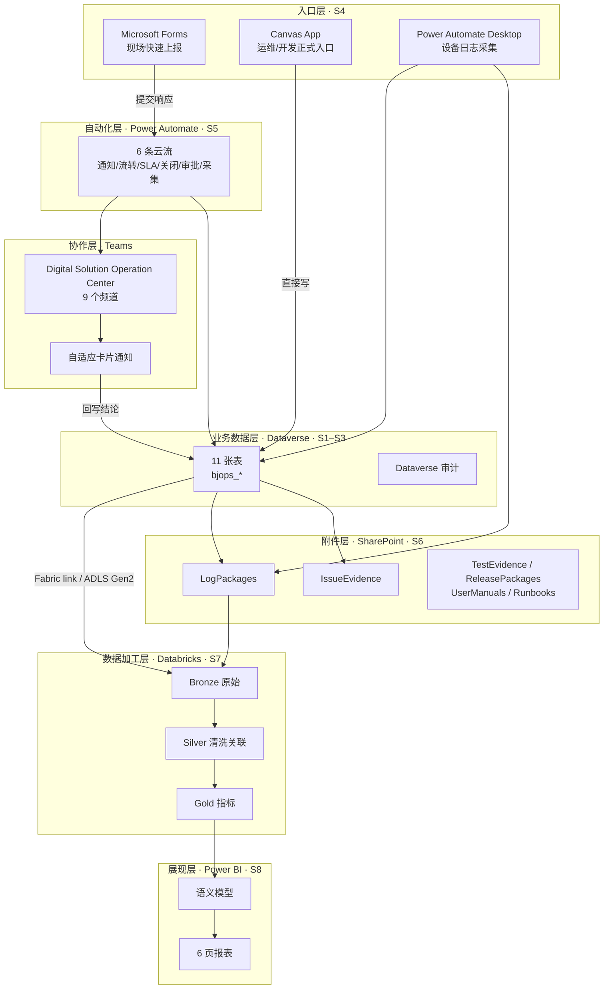
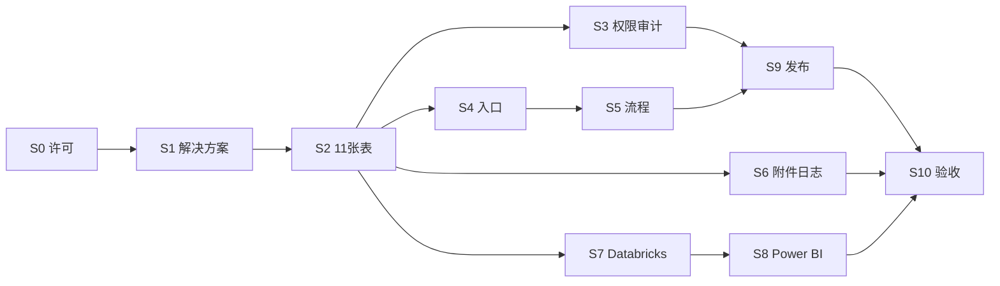

# 00 方案总览

> 配套阅读：[`README.md`](README.md)（无代码边界与两套方案对比）、[`../docs/Phase1-实施方案.md`](../docs/Phase1-实施方案.md)（代码化版本的对应章节）

---

## 1. 目标

用**纯门户手工配置**的方式，搭起一套完整的现场设备与系统运维数字化平台，覆盖：

1. **统一问题入口**——现场用户能用表单提交问题，含系统、设备、环境、版本、发生时间、现场图片。
2. **一条工单**——运维与开发看同一条记录，状态、负责人、处理结论可更新且保留完整历史。
3. **版本与发布可追溯**——开发登记修复版本，测试登记 Pass/Fail 与证据，生产发布关联版本、测试、回退版本。
4. **日志可关联**——现场日志包能打包、算 Hash、上传到受控位置，并把日志包 ID 写回问题单。
5. **数据分析闭环**——数据入湖加工后，用 Power BI 输出 6 页报表，支撑管理决策。

## 2. 范围

### 2.1 表范围：11 张（Phase 1 + Phase 2 一次建齐）

设计稿 §12.1 列了 12 个 Lists。本方案**一次建齐 11 张**，去掉 `KnowledgeBase`（知识库留到 Phase 4）：

| # | 表（逻辑名） | 中文名 | 设计稿原名 | 用途 |
|---|---|---|---|---|
| 1 | `bjops_application` | 应用注册表 | ApplicationRegistry | 应用/系统主数据 |
| 2 | `bjops_equipment` | 设备注册表 | EquipmentRegistry | 设备主数据 |
| 3 | `bjops_issue` | 问题主表 | IssueRegister | 问题工单主记录 |
| 4 | `bjops_issuehistory` | 问题历史 | IssueHistory | 状态变更与处理记录（append-only） |
| 5 | `bjops_version` | 版本注册表 | VersionRegistry | 版本台账 |
| 6 | `bjops_release` | 发布注册表 | ReleaseRegister | 发布与回退记录 |
| 7 | `bjops_testplan` | 测试计划 | TestPlan | 测试计划 |
| 8 | `bjops_testcase` | 测试用例 | TestCase | 测试用例 |
| 9 | `bjops_testexecution` | 测试执行 | TestExecution | 执行结果与证据 |
| 10 | `bjops_logpackage` | 日志包注册表 | LogPackageRegister | 日志包与 Hash |
| 11 | `bjops_slaconfig` | SLA 配置 | SLAConfig | 响应/解决目标配置 |

**为什么不一次建 12 张**：知识库（KnowledgeBase）的价值依赖"相似问题匹配"，属于 Phase 4 的智能扩展；在只有几十条历史问题时，手工维护知识库只会变成负担。**留字段位，不建表。**

### 2.2 与设计稿 §18 阶段划分的差异

设计稿 §18 把工作切成四期。本方案**把建设顺序重排**，因为无代码路径下的依赖关系与代码路径不同：

| 设计稿 | 设计稿内容 | 本方案的处理 |
|---|---|---|
| Phase 1 | Application/Equipment/Issue 三张表、Forms 入口、图片上传、Issue ID 自动生成、Teams 通知、基本状态流转、**Power BI 问题总览** | 表一次建齐 11 张（含 Phase 2 的表）；Forms 入口保留；**Power BI 问题总览下移到 S8**（见 §7 关键风险 R1） |
| Phase 2 | Version Registry、Test Case/Execution、Release Register、环境规则、审批与回退记录、版本质量看板 | 表与字段并入 S2 一次建齐；流程与看板放在 S5 / S8 |
| Phase 3 | 设备端采集器/Agent、Log Package Register、日志库/数据湖、Bronze/Silver/Gold、日志↔问题自动关联、健康指标 | 采集器改用 **Power Automate Desktop**；管道并入 S6–S7 |
| Phase 4 | 相似问题匹配、日志摘要、根因候选、自动周报、知识库、Copilot 辅助查询 | **不在本期范围**，仅预留字段与接口 |

### 2.3 明确不在范围内

- 自研设备端 Agent / 采集器程序（用 Power Automate Desktop 替代）
- Databricks 向 Dataverse 的自动回写（Phase 4 议题，见 §7 关键风险 R4）
- 知识库与相似问题匹配
- Copilot / 大模型辅助
- 多租户、多语言、多工厂推广
- Dataverse 的备份与还原（属租户管理员职责，本方案只做"导出归档"）

## 3. 总体架构



**关键结构判断**：请特别注意图中 **Dataverse → 湖 → Bronze → Silver → Gold → 语义模型 → 报表** 是**一条串行链**，不是并行的两条路。这是决策 11（Power BI 只读 Gold 层）的直接后果，详见 §7 R1。

## 4. 技术选型

| 层次 | 选型 | 理由 | 手册 |
|---|---|---|---|
| 业务数据 | **Dataverse** | 有真关系、真事务、真权限、真审计；SharePoint 列表做不到 | `02` |
| 附件与文件 | **SharePoint 文档库** | 大文件不放 Dataverse；库有版本历史与权限继承 | `06` |
| 现场入口 | **Microsoft Forms**（Phase 1 快速起步）→ **Canvas App**（正式入口） | Forms 零门槛、当天可用；Canvas App 才能做联动与条件显示 | `04` |
| 自动化 | **Power Automate 云流** | 全部在浏览器里配，无代码 | `05` |
| 日志采集 | **Power Automate Desktop 桌面流** | 唯一能"读本机文件 + 打包 + 算 Hash + 上传"且不写代码的手段 | `06` |
| 通知与协作 | **Teams 自适应卡片** | 卡片内可直接更新结论并回写 Dataverse | `05` |
| 数据入湖 | **Databricks 直连（Fabric link 或 ADLS Gen2）** | 见 §4.1 链路选型 | `07` |
| 数据加工 | **Databricks Notebook**（Bronze/Silver/Gold） | 浏览器内开发，属分析资产 | `07` |
| 报表 | **Power BI**（连 Databricks SQL Warehouse） | 只有一处取数来源，口径统一 | `08` |
| 发布 | **手工导出 zip → 导入**（主）；**Pipelines in Power Platform**（可选第二条路） | 手工路径零门槛；Pipelines 更方便但有前置条件 | `09` |

### 4.1 入湖链路选型（S7 开工前必须定，二选一）

| 维度 | **Fabric link** | **ADLS Gen2 link** |
|---|---|---|
| 落地形态 | Delta Parquet（低延迟同步） | **CSV 快照 + `model.json`**（Common Data Model 目录） |
| 前置许可 | **必须有 Power BI Premium 或 Fabric 容量**，且**与 Dataverse 环境同区域** | **只需** ADLS Gen2 存储账号，**零额外许可** |
| 前置权限 | Fabric 工作区权限 | 存储账号 **Owner** + **Storage Blob Data Contributor**；账号需开启**分层命名空间** |
| 快照保留 | 增量 Delta，历史基本不丢 | **每小时快照只保留最近 5 份**，更早的永久丢失 |
| 初次同步 | 最长 60 分钟 | 取决于数据量 |
| 适合 | 已有 Fabric/Premium 容量，或希望简化读法 | 只想先跑通、不想增加许可成本 |
| 代价 | 需要容量成本 | **只保留 5 份快照**，必须在 5 小时内至少跑一次作业；读 CSV+CDM 的推荐读法**待实测** |

**建议**：如果组织已有 Power BI Premium 或 Fabric 容量，**优先 Fabric link**（Delta 格式下游最省事）。若没有，走 **ADLS Gen2 link**，并把 Databricks 作业调度设为**每小时 1 次**。

> ⚠️ **待实测项**：ADLS 链路只保留最近 5 份快照对增量 Silver 计算的实际影响、CSV+CDM 导出的推荐 Databricks 读法（是否需要 `spark.read.json(".../model.json")` 类操作、是否需要处理删除向量）。这些必须在 S7 开工时用真实数据验证后回填本手册。

## 5. 与设计稿的主要差异

以下差异**不是笔误**，是无代码约束作用于原设计的结果。所有涉及差异的章节都需要按本方案执行。

### 5.1 差异清单

| # | 设计稿位置 | 设计稿原文/原意 | 本方案的处理 | 原因 |
|---|---|---|---|---|
| D1 | §5.1 | "**SharePoint 生成唯一 Issue ID**" | 改为 **Dataverse 自动编号列**生成 Issue ID | 数据层从 SharePoint 换成 Dataverse，编号应由主表生成 |
| D2 | §12.1 | 12 个 SharePoint Lists | 11 张 **Dataverse 表**（去掉 KnowledgeBase） | 见 §2.1；`bjops_` 前缀 |
| D3 | §12.3 | 6 个文档库 | **保留为 SharePoint 文档库**（这部分原设计就是对的） | 大文件不应放 Dataverse |
| D4 | §6.1 入口 4 类 | Forms / Power Apps / 系统内嵌按钮 / 设备桌面采集工具 | 本期做 **Forms + Canvas App + Power Automate Desktop**；"系统内嵌反馈按钮"**不做**（需要改被测系统源码） | 无代码边界 |
| D5 | §14 | 只写了 8 类数据源与 Bronze/Silver/Gold 分层，**没写作业名、调度、引擎、目标表名、输出格式、回写路径** | 全部由本方案 `07` 补齐并明确 | 设计稿是构想层 |
| D6 | §15 | 39 个指标名，**零公式** | 由本方案 `08` 补齐 8 个核心 KPI 的 DAX 公式；其余指标给出取数口径 | 设计稿是构想层 |
| D7 | §18 | "Phase 1 包含 Power BI 问题总览" | **下移到 S8**，Phase 1 不含任何 Power BI 交付 | 见 §7 R1，串行链导致 |
| D8 | §21.2 | `logPackageId` 例为 `LOG-20260917-K106-001`（含设备号） | 统一为 **`LOG-{yyyyMMdd}-{4位}`**，设备号单独字段 | 原示例与 §7.3 命名规则冲突 |
| D9 | §21.3 | `ReleaseCompleted` 事件**没有时间戳** | 补 `completedTime` | 原 schema 缺字段 |
| D10 | §21 全部 | 三个事件都缺 `eventId` / `correlationId` / `schemaVersion` | 补上 | 幂等与追踪需要 |
| D11 | §6.2 B 组 | "发生时间（必须支持准确时间）" | Dataverse **日期时间列支持"仅日期"与"日期和时间"两种行为**，必须选**"日期和时间"**，并注意**用户本地时区**行为 | 见 `02` 第 6 章 |
| D12 | §8.4 | 6 条版本自动识别路径 | 全部**做不到**（Forms 入口拿不到客户端版本）。手工选择时必须写 `VersionSource = Manual` | 无代码边界 + Forms 能力所限 |
| D13 | §7.2 | 采集器需读 CPU/内存/磁盘/网络/关键进程 | **降级**：Power Automate Desktop 能读应用日志、事件日志、服务状态、文件信息；性能计数器需另行验证 | Desktop 流能力边界，标注**待实测** |
| D14 | §20 Epics | 25 个任务，以"建 SharePoint Lists"为前提 | 任务清单按本方案 S0–S10 重排，见 §6 | 平台变了 |

### 5.2 需要改口径的设计稿章节

以下章节在阅读设计稿时**必须同时对照本方案**，否则会被误导：

`§5.1`（Issue ID 生成方）、`§6.1`（入口第 3/4 类）、`§8.4`（版本自动识别）、`§12.1`（Lists → 表）、`§13.1`（第 2 步生成 Issue ID 的实现方式）、`§14.1`（数据源第 1 项"SharePoint 台账"→ Dataverse）、`§18`（Phase 1 不含 Power BI）、`§20`（任务清单重排）、`§21`（事件 schema 补字段）。

## 6. 实施阶段与关键路径

### 6.1 阶段表

| 阶段 | 内容 | 产出手册 | 前置 | 建议工期 |
|---|---|---|---|---|
| **S0** | 许可与前置条件确认 | `01` | — | 3 天（含采购审批） |
| **S1** | 发布者、解决方案、12 个全局选项集 | `02` 第 1–3 章 | S0 | 2 天 |
| **S2** | 11 张表、列、关系、自动编号、视图、业务规则 | `02` 第 4–9 章 | S1 | **10 天**（最重） |
| **S3** | 安全角色、列级安全、审计、托管环境 | `03` | S2 | 3 天 |
| **S4** | Forms 表单、Forms→Dataverse 云流 | `04` | S2 | 4 天 |
| **S5** | 6 条 Power Automate 流程 | `05` | S2、S4 | 8 天 |
| **S6** | SharePoint 6 文档库、桌面采集流 | `06` | S2 | 4 天 |
| **S7** | 入湖链路、Bronze/Silver/Gold Notebook、调度 | `07` | S2 | **8 天** |
| **S8** | 语义模型、8 个 DAX、6 页报表 | `08` | S7 | **10 天** |
| **S9** | 导入 DEV→TEST、发布后必做项、归档 | `09` | S3、S5 | 3 天 |
| **S10** | 冒烟、UAT、巡检、备份、故障表 | `10` | S4–S9 | 5 天 |

**合计约 60 个工作日**。S1→S2→S3 必须串行；S4、S5、S6 可在 S2 完成后并行推进；**S7→S8 必须串行**。

### 6.2 关键路径



**关键路径 = S0 → S1 → S2 → S7 → S8 → S10**。

注意 **S2 是几乎所有工作的瓶颈**：S3、S4、S6、S7 都等它。因此 `02` 手册能否按天推进，决定整个项目能否按期。建议 S2 开工前先把 `02` 全文读完一遍再动手，避免建到一半发现选项集少了一个。

## 7. 关键风险

按严重度排序。**R1–R4 是本方案特有的，旧方案里不存在。**

### R1 —— Power BI 与 Databricks 串行，Phase 1 拿不到任何报表 🔴

**背景**：决策 11 定了"Power BI 只读 Databricks 加工后的 Gold 层，不直连 Dataverse"。

**后果**：数据链变成

```
Dataverse 11 张表 → 入湖 → Bronze → Silver → Gold → 语义模型 → 报表
```

这条链**任何一环没通，报表就是 0 页**。设计稿 §18 说"Phase 1 包含 Power BI 问题总览"——**在无代码方案下做不到**。业务方在 S8 之前看不到任何图表。

**缓解**：

1. **必须提前告知业务方**：前 8 周只有表单和工单，没有报表。这一点要写进项目启动会材料。
2. 如需早期可视化，**临时办法**：在 Dataverse 里建 2–3 个**模型驱动应用视图**（`02` 第 8 章）作为替代，能看列表和简单筛选，但不是图表。
3. **若业务方强烈要求 Phase 1 有报表**，只能改决策 11——让 Power BI 直连 Dataverse（`08` 附录给出该路径的做法与代价：TDS 端点、约 500 行/秒、5 分钟超时、建议仅作过渡）。

### R2 —— ADLS Gen2 只保留 5 份快照 🔴

**背景**：走 ADLS Gen2 链路时，服务**每小时写一份 CSV 快照，只保留最近 5 份**。

**后果**：`bjops_issuehistory` 是 append-only 的，历史记录不受影响；但 **`bjops_issue` 主表是"全量覆盖"式快照**——如果作业间隔超过 5 小时，中间状态**永久丢失**，Silver 层再也算不出正确的状态停留时间。

**缓解**（`07` 强制要求）：

1. Databricks 作业调度设为**每小时 1 次**。
2. Silver 层按**累计快照**设计——每次从快照读增量并 append 到自己的历史表，**不做原地 UPDATE**。
3. 加一个"新鲜度检查"：若相邻两次快照时间差 > 5 小时，往运维频道发告警。
4. 若走 Fabric link（Delta），本风险不存在——这也是 §4.1 建议优先 Fabric 的原因之一。

### R3 —— 列级安全在数据湖里失效 🟠

**背景**：`bjops_hostname` 与 `bjops_ipaddress` 在 Dataverse 里受**列级安全**保护（很多人看不到）。但入湖时是**整列搬运**。

**后果**：一旦进了湖，**任何能看 Power BI 报表的人都看得到主机名和 IP**。列级安全只在 Dataverse 内有效，跨不过湖。

**缓解**（三选一，S7 开工前必须定）：

| 方案 | 做法 | 代价 |
|---|---|---|
| A | **入湖时不选这两列** | 设备和 IP 相关信息在报表里彻底没有 |
| B | 接受，但在报表层用行级安全（RLS）限制可见人群 | 需要维护 RLS 成员表 |
| C | 接受，不做额外限制 | 信息暴露面扩大 |

**默认建议选 A**（报表里用"设备号"足够定位，主机名/IP 不是必需）。

### R4 —— Databricks 无法回写 Dataverse 🟠

**背景**：设计稿 §14 只设计了**单向读取**，没有回写路径。

**后果**：如果 Phase 4 想做"把根因候选建议写回问题单"，需要额外组件（如 Azure 函数、Dataverse Web API 调用），**这些超出无代码边界**。届时只能改由 **Power Automate** 承担回写。

**缓解**：本期不回写。在 `07` 里注明"Phase 4 回写路径的评估结论：优先用 Power Automate 云流实现"。

### R5 —— 没有变更历史与回滚能力 🟠

见 [`README.md`](README.md) 的"最重要的代价"一节。核心缓解是**每次发布后导出并归档解决方案 zip（托管版 + 非托管版）**，写入 `09` 手册作为强制步骤。

### R6 —— Forms 不是解决方案组件 🟠

**后果**：解决方案导出/导入**不会带上 Forms 表单**。导入到 TEST/PROD 后，流程里引用的 `FormId` 指向一个**在新环境里不存在的表单**——流程会在运行时失败，而且是在**用户提交时才暴露**。

**缓解**（`04` 第 5 章与 `09` 第 4 章）：

1. **在每个环境各建一份表单**，表单问题结构必须完全一致（照 `04` 的分区表逐项核对）。
2. 迁移后**必须重建或重指向** `IntakeFormId` 环境变量。
3. 把"表单重建 + 变量重指向 + 提交一次测试"列入**发布后必做清单**。

### R7 —— 自动编号的种子不随解决方案走 🟡

**背景**：自动编号列的"种子"值**不包含在导出/导入的解决方案里**。

**后果**：DEV 用 `1000` 起始、TEST 用 `300000`、PROD 用 `600000` 的分段设计，导入后不会自动生效——TEST/PROD 会从自己的（默认或上次遗留的）种子继续。

**缓解**（`02` 第 7 章与 `09` 第 4 章）：

1. 每次导入后**手工检查并修改种子**。
2. 该操作**待实测**：需在生产验证"导入后修改种子是否生效、是否需要重新激活列"。
3. 若实测发现种子不可改，退化方案是**接受编号跨环境重叠**，改用"环境前缀"区分（如 TEST 编号加 `T-` 前缀），或干脆不看编号只看 GUID。

### R8 —— 手工操作的失误风险 🟡

**后果**：11 张表、上百个列、几十条流程全部手工建，**键错一个选项集值就可能让流程静默失效**。

**缓解**：

1. S2 完成后先做一次**结构核对**：用视图把每个表的列清单导出核对（`02` 第 9 章给出核对方法）。
2. 每个阶段结束做一次**冒烟**（`10` 第 2 章）。
3. **一人操作、一人核对**，核对人在 `10` 的检查表上签字。

## 8. 权威文档对照表

为避免两套方案互相矛盾，以下内容**以 `../docs/` 为准**，本方案只引用不重写：

| 内容 | 权威文档 | 本方案中的对应手册 |
|---|---|---|
| 字段名、选项集值、关系、KPI 口径 | `../docs/data-dictionary.md` | `02`、`08`、`附录A` |
| 权限设计 | `../docs/rbac-matrix.md` | `03` |
| Forms 字段映射 | `../docs/intake-forms.md` | `04` |
| 环境校验、导入后必做项、故障排查 | `../docs/alm-runbook.md` | `09`、`10`（**去掉 CLI 与服务主体部分**） |
| UAT 模板 | `../docs/uat-phase1.md` | `10` |
| 文档库设计与容量限制 | `../infra/sharepoint/README.md` | `06` |
| 数据模型设计 | `../docs/Phase1-实施方案.md` §6 | `02`（**转成点击步骤**） |

**不复用**（这些只属于代码化方案）：`../.github/`、`../infra/bootstrap/`、`../infra/scripts/`、`../solution/DeploymentSettings/`。

## 9. 待决策事项

| # | 事项 | 影响 | 建议 | 决策时点 |
|---|---|---|---|---|
| 1 | 入湖链路选 Fabric link 还是 ADLS Gen2 | 决定是否要买 Fabric 容量，决定 R2 是否存在 | 有 Premium/Fabric 容量则选 Fabric | S7 前 |
| 2 | `bjops_hostname` / `bjops_ipaddress` 是否入湖 | 决定 R3 的处理方式 | 不入湖（方案 A） | S7 前 |
| 3 | Phase 1 是否需要任何形式的可视化 | 决定 R1 缓解措施 2 是否执行 | 用模型驱动应用视图过渡 | S4 前 |
| 4 | 是否启用 Pipelines in Power Platform | 决定是否要把三个环境转为托管环境（需 premium 许可） | 先用手工导出导入，稳定后再评估 | S9 前 |
| 5 | TEST/PROD 的自动编号种子 | 影响编号唯一性 | 待实测后决定 | S9 前 |

---

**相关文档**：[`README.md`](README.md) · [`01-前置条件与许可检查.md`](01-前置条件与许可检查.md) · [`../docs/data-dictionary.md`](../docs/data-dictionary.md)
