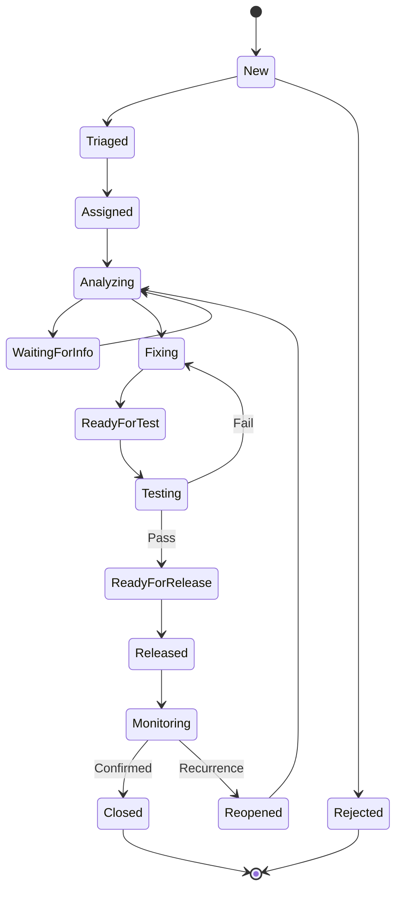

# 02 Dataverse 台账搭建手册

> **本手册是全部方案中最重的一本。** 11 张表、约 200 个列、20 个全局选项集全部在这里手工建成。S2 阶段能否按天推进，决定整个项目能否按期（见 [`00-方案总览.md`](00-方案总览.md) §6.2）。
>
> **执行前请先读完本手册第 0 章**，再从头开始动手。**不要边看边做第 4 章**——选项集漏建一个，后面所有表都要回头补。
>
> **字段权威来源**：[`../docs/data-dictionary.md`](../docs/data-dictionary.md)。本手册中的字段名、类型、长度、选项集值**必须与之逐字一致**，不得自行改写。
>
> **需手工新建的部分**：第 5 章的 5 张 Phase 2 表（version / release / testplan / testcase / testexecution）数据字典未定义，本手册依据设计稿 `§8.1`–`§8.4`、`§9.2`–`§9.4`、`§10.2`–`§10.3` 定义，是**本方案新增的设计内容**。

---

## 0. 开始前必读

### 0.1 三条铁律

| # | 铁律 | 违反后果 |
|---|---|---|
| 1 | **所有选项集必须是「全局选项集」** | 用成"本地选项集"后，同一个概念在不同表里是两套独立值，改一处不会同步，Power BI 里也合并不了 |
| 2 | **绝不用 `状态` / `状态描述`（`statecode` / `statuscode`）承载业务状态** | 这两个是平台记录生命周期字段（启用/停用），业务状态一律用自定义的 `bjops_status` |
| 3 | **一切在解决方案内创建** | 在"默认解决方案"里创建的东西**导出时带不走**，等于白做 |

### 0.2 操作的三个入口，别搞混

| 入口 | URL | 用来做什么 |
|---|---|---|
| **制造者门户** | `make.powerapps.com` | **本手册 95% 的操作在这里**。表、列、选项集、关系、视图、业务规则 |
| **管理门户** | `admin.powerplatform.microsoft.com` | 环境、容量、许可、安全角色、审计设置、托管环境 |
| **经典解决方案资源管理器** | 从 `make.powerapps.com` 打开解决方案后点 ⋯ → 切换到经典 | ❌ **本方案基本不用**。自动编号列**只能在新版门户创建** |

> 进入 `make.powerapps.com` 后，**右上角环境选择器**要确认在 **`SysOps-DEV`**。这里选错环境是最高频的低级错误。

### 0.3 建表顺序（有依赖，不能乱）

```
第 1 章  发布者 + 解决方案
第 2 章  20 个全局选项集
第 3 章  主数据表：application、equipment
第 4 章  核心表：issue、issuehistory
第 5 章  版本与测试表：version、release、testplan、testcase、testexecution
第 6 章  日志与配置表：logpackage、slaconfig
第 7 章  关系与删除行为   ← 必须在所有表建完后统一做
第 8 章  自动编号列
第 9 章  日期时间行为检查
第 10 章 备用键与索引
第 11 章 视图
第 12 章 业务规则
第 13 章 列级安全（在此章勾选）
第 14 章 结构核对（S2 出口条件）
```

**顺序依赖说明**：
- 选项集（2）必须在建任何列之前完成，否则要回头改列。
- `issue`（4）引用 `application`（3）和 `equipment`（3），所以 3 必须在 4 之前。
- 关系（7）在**所有表建完后统一做**，避免建表时反复弹窗。
- 自动编号（8）**必须在建表时一起建**（见 §8.1 说明），此处单独成章是为了强调其限制。

### 0.4 命名规范速查

| 项 | 规则 | 示例 |
|---|---|---|
| 表逻辑名 | `bjops_` + 小写名词（单数） | `bjops_issue` |
| 列逻辑名 | `bjops_` + 小写名词，不带表名前缀 | `bjops_issuenumber` |
| 显示名 | **中文** | 问题编号 |
| 全局选项集 | `bjops_` + 小写名词 | `bjops_severity` |
| 主键 | `bjops_<表名>id`（自动生成，不手改） | `bjops_issueid` |

> **新建列时，制造者门户会自动填一个逻辑名（如 `bjops_newcolumn`），必须手工改。** 这个字段一旦保存**不可更改**，改逻辑名只能删列重建（会丢数据）。

---

## 1. 发布者与解决方案

### 1.1 为什么要先建发布者

发布者决定了所有自定义项的**前缀**。前缀一旦确定**不可更改**，且会写进每个表和列的物理名里。

### 1.2 步骤

1. 打开 `make.powerapps.com`，确认右上角环境 = **`SysOps-DEV`**
2. 左侧导航选 **Solutions**
3. 顶部点 **+ New solution**
4. 在 **Display name** 填 `现场设备与系统运维数字化平台`
5. **Name** 字段系统会按显示名自动生成，**手工改为** `SysOpsStandard`
   > 这个"名称"是解决方案的**唯一名称**，导出导入时用它识别。**必须手工改成英文**，中文唯一名在导入向导里显示会乱码。
6. **Publisher** 下拉 → 点 **+ New publisher**，在新窗口填：

| 字段 | 填什么 | 注意 |
|---|---|---|
| **Display name** | `北京运维平台` | 任意可读名称 |
| **Name** | `bjops` | ⚠️ **必须小写、无空格、无中文**。这是发布者唯一名 |
| **Prefix** | `bjops` | ⚠️ **最关键的一个字段**。决定所有自定义项的前缀，**创建后不可更改** |
| **Choice value prefix** | `10000` | ⚠️ 决定选项集**数值**的起始段。多个发布者共存时靠它避免数值冲突 |
| **Description** | `现场设备与系统运维数字化平台的解决方案发布者` | 可选 |

7. 保存发布者 → 回到解决方案新建窗口
8. **Version** 填 `1.0.0.0`
9. 点 **Create**

### 1.3 ⚠️ 关于前缀的三个提醒

| 提醒 | 说明 |
|---|---|
| **前缀不可更改** | 若发现写错了，只能**删掉发布者重建**。但此时若已有表，表的前缀也一起错了，需要把所有表删掉重建 |
| **为什么选 `bjops`** | 与 [`../docs/data-dictionary.md`](../docs/data-dictionary.md) §1 一致。两套方案必须用同一个前缀，否则导出的解决方案无法互相参考 |
| **Choice value prefix 的作用** | 选项集的**数值**默认从 10000 段开始分配。同一租户里若有其他发布者也从 10000 开始，两个发布者的选项集数值会**冲突**，迁移时会串值。若租户里已有其他应用，请为发布者申请一个**独家号段**（见下） |

**若租户内已有其他 Power Platform 应用**：需要向管理员申请一个**唯一的 Choice value prefix 号段**。可用的号段是 10000–99999，每个号段占 10000 个值。请先确认哪些号段已被占用再填。

### 1.4 自检

- [ ] 解决方案 **`SysOpsStandard`** 已创建，且在 `Solutions` 列表里可见
- [ ] 打开它能看到 **Publisher** = `bjops`，**Prefix** = `bjops`
- [ ] 已确认第 1.3 条"前缀不可更改"的风险
- [ ] 后续所有表/列/流程/应用 **都在这个解决方案内创建**

> **如何确认自己在解决方案内创建**：`make.powerapps.com` → Solutions → 打开 `SysOpsStandard` → 点 **+ New** → 选 **Table** / **Automation** / **App**。**从解决方案里点 New 创建的东西才归属该解决方案。** 直接从左侧导航栏 Tables 里建的表会进入"默认解决方案"，导出时带不走。

---

## 2. 全局选项集（20 个）

### 2.1 全局选项集的创建路径

1. `make.powerapps.com` → **Solutions** → 打开 `SysOpsStandard`
2. **+ New** → **More** → **Choice**（有的界面显示为 **Option set**）
3. 填：

| 字段 | 填什么 |
|---|---|
| **Display name** | 中文名，如 `严重度` |
| **Name** | 逻辑名，如 `bjops_severity` |
| **Description** | 用途说明 |
| （类型） | 选 **Choice**（单值）。**不要选 Multi-select** |

4. 在标签区逐行 **+ New choice** 添加选项：

| 列 | 填什么 |
|---|---|
| **Label** | 中文显示名，如 `严重度 - Critical` |
| **Value** | ⚠️ **数值。必须与数据字典一致，不要用默认自动值** |

> ⚠️ **数值必须手工填**。制造者门户默认会从发布者的 choice value prefix 段（10000）自动分配。**本方案要求所有选项集的数值从 1 开始，与 [`../docs/data-dictionary.md`](../docs/data-dictionary.md) §2 一致**，便于跨环境核对和 Power BI 里按数值排序。
>
> 若界面不允许填小于 10000 的值，则**全部按界面自动分配，并把这些自动值回填到数据字典**——关键是**三个环境必须一致**（靠同一个解决方案导出导入保证）。

5. 保存

### 2.2 基础 12 个（来自数据字典 §2，逐字照抄）

#### ① `bjops_environment` — 环境

| 值 | 显示名 |
|---|---|
| 1 | DEV |
| 2 | TEST |
| 3 | UAT |
| 4 | PROD |

#### ② `bjops_issuetype` — 问题类型

| 值 | 显示名 |
|---|---|
| 1 | Incident |
| 2 | Bug |
| 3 | Request |
| 4 | Enhancement |

#### ③ `bjops_category` — 分类

| 值 | 显示名 |
|---|---|
| 1 | 功能 |
| 2 | 数据 |
| 3 | 性能 |
| 4 | 通信 |
| 5 | 权限 |
| 6 | 界面 |
| 7 | 其他 |

#### ④ `bjops_severity` — 严重度

| 值 | 显示名 | 判定口径（设计稿 §6.3） |
|---|---|---|
| 1 | Critical | 生产中断 / 数据错误 / 安全事件，无绕过方案 |
| 2 | High | 主要功能不可用，有临时绕过方案 |
| 3 | Medium | 功能受影响但不阻塞，有替代方案 |
| 4 | Low | 体验问题、优化建议 |

#### ⑤ `bjops_reproducibility` — 可复现性

| 值 | 显示名 |
|---|---|
| 1 | Always |
| 2 | Intermittent |
| 3 | Once |
| 4 | Unknown |

#### ⑥ `bjops_issuestatus` — 问题状态 ⚠️ **最关键的选项集**

| 值 | 显示名 |
|---|---|
| 1 | New |
| 2 | Triaged |
| 3 | Assigned |
| 4 | Analyzing |
| 5 | WaitingForInfo |
| 6 | Fixing |
| 7 | ReadyForTest |
| 8 | Testing |
| 9 | ReadyForRelease |
| 10 | Released |
| 11 | Monitoring |
| 12 | Closed |
| 13 | Reopened |
| 14 | Rejected |

> ⚠️ **这 14 个值被四处引用**：选项集定义、状态机设计、视图筛选条件、流程条件分支。
> **任一处拼写不一致都会静默失效**——流程不报错，但分支不进，且极难排查。
> 请在保存前**逐字核对大小写**：`WaitingForInfo`（不是 `WaitingForInformation`）、`ReadyForTest`（不是 `ReadyToTest`）、`ReadyForRelease`（不是 `ReadyForDeploy`）。

**状态机**（设计稿 §11，供第 12 章业务规则与第 11 章视图参考）



#### ⑦ `bjops_closecode` — 关闭代码

| 值 | 显示名 |
|---|---|
| 1 | Fixed |
| 2 | Workaround |
| 3 | Accepted |
| 4 | Rejected |
| 5 | Duplicate |
| 6 | NoRepro |
| 7 | Cancelled |

#### ⑧ `bjops_rootcause` — 根本原因

| 值 | 显示名 |
|---|---|
| 1 | 需求理解偏差 |
| 2 | 设计缺陷 |
| 3 | 编码缺陷 |
| 4 | 配置错误 |
| 5 | 数据问题 |
| 6 | 环境问题 |
| 7 | 网络/通信故障 |
| 8 | 硬件故障 |
| 9 | 第三方组件问题 |
| 10 | 其他/未确定 |

#### ⑨ `bjops_waitingreason` — 等待原因

| 值 | 显示名 |
|---|---|
| 1 | 等待请求人补充信息 |
| 2 | 等待现场配合 |
| 3 | 等待厂商支持 |
| 4 | 等待环境可用 |
| 5 | 等待窗口期 |
| 6 | 等待其他问题解决 |

#### ⑩ `bjops_apptype` — 应用类型

| 值 | 显示名 |
|---|---|
| 1 | 上位机软件 |
| 2 | SCADA |
| 3 | 数据采集 |
| 4 | 报表分析 |
| 5 | 接口服务 |
| 6 | 其他 |

#### ⑪ `bjops_versionsource` — 版本来源

| 值 | 显示名 |
|---|---|
| 1 | 自动读取 |
| 2 | 手工选择 |

#### ⑫ `bjops_issuesource` — 问题来源

| 值 | 显示名 |
|---|---|
| 1 | Forms |
| 2 | Power Apps |
| 3 | 系统内嵌 |
| 4 | 日志工具 |
| 5 | 邮件 |
| 6 | 其他 |

### 2.3 扩展 8 个（本方案为 Phase 2 表新增）

> 数据字典 §2 只定义了 12 个（对应 Phase 1 的 6 张表）。本方案把 Phase 2 的 5 张表也建了，因此需要 8 个新选项集。**这 8 个是本方案新增的设计，需在评审时确认中文显示名。**

#### ⑬ `bjops_changesource` — 变更来源

| 值 | 显示名 | 说明 |
|---|---|---|
| 1 | 人工 | 用户在应用/表单里改的 |
| 2 | 流程 | Power Automate 改的 |

用于 `bjops_issuehistory.bjops_changesource`，也是**防死循环的关键判据**（`05` §7）。

#### ⑭ `bjops_versiontype` — 版本类型

| 值 | 显示名 | 说明 |
|---|---|---|
| 1 | Test | 测试版 |
| 2 | RC | 候选发布版 |
| 3 | Production | 正式版 |
| 4 | Hotfix | 紧急修复版 |

依据设计稿 §8.3 Version Type。

#### ⑮ `bjops_versionstatus` — 版本状态

| 值 | 显示名 | 说明 |
|---|---|---|
| 1 | Draft | 草稿 |
| 2 | DevelopmentBuild | 开发构建 |
| 3 | TestBuild | 测试构建 |
| 4 | ReleaseCandidate | 候选发布 |
| 5 | Approved | 已批准 |
| 6 | Production | 生产中 |
| 7 | Retired | 已退役 |
| 8 | RolledBack | 已回退 |

依据设计稿 §8.1 的 7 个状态 + `RolledBack`（设计稿把 Retired 与 RolledBack 写在同一行，本方案拆成两个取值以便区分）。

#### ⑯ `bjops_testtaskstatus` — 测试任务状态

| 值 | 显示名 | 说明 |
|---|---|---|
| 1 | Planned | 已计划 |
| 2 | Ready | 已就绪 |
| 3 | InTest | 测试中 |
| 4 | Failed | 未通过 |
| 5 | Blocked | 被阻塞 |
| 6 | Retest | 待复测 |
| 7 | Passed | 已通过 |
| 8 | Approved | 已批准 |

依据设计稿 §10.3。设计稿把 `Failed/Blocked` 写在一起，本方案拆开——因为**阻塞和失败的责任人不同**（失败找开发，阻塞找环境/依赖）。

#### ⑰ `bjops_testresult` — 测试结果

| 值 | 显示名 | 说明 |
|---|---|---|
| 1 | NotTested | 未测试 |
| 2 | Pass | 通过 |
| 3 | Fail | 未通过 |
| 4 | Blocked | 被阻塞 |

依据设计稿 §10.2 Result 字段（Pass、Fail、Blocked、Not Run）。

#### ⑱ `bjops_approvalstatus` — 审批状态

| 值 | 显示名 | 说明 |
|---|---|---|
| 1 | Pending | 待审批 |
| 2 | Approved | 已批准 |
| 3 | Rejected | 已驳回 |

依据设计稿 §8.3 Approval Status 与 §9.2 发布门禁。

#### ⑲ `bjops_releaseresult` — 发布结果

| 值 | 显示名 | 说明 |
|---|---|---|
| 1 | Success | 成功 |
| 2 | Failed | 失败 |
| 3 | RolledBack | 已回退 |
| 4 | InProgress | 进行中 |

> ⚠️ 设计稿 §21.3 的 `result` 字段**只定义了 "Success"** 一个值。本方案补齐为 4 个值。这与 `00-方案总览.md` §5.1 的 **D9/D10** 差异条目对应。

#### ⑳ `bjops_testtype` — 测试类型

| 值 | 显示名 | 说明 |
|---|---|---|
| 1 | 单元测试 | |
| 2 | 接口测试 | |
| 3 | 集成测试 | |
| 4 | 设备联机测试 | |
| 5 | 数据正确性测试 | |
| 6 | 权限测试 | |
| 7 | 性能测试 | |
| 8 | 异常恢复测试 | |
| 9 | 断线重连测试 | |
| 10 | 回归测试 | |
| 11 | UAT | |
| 12 | SmokeTest | 发布后冒烟测试 |

依据设计稿 §10.1 的 12 种测试类型。

### 2.4 选项集自检

- [ ] 20 个全局选项集全部创建完毕
- [ ] 全部在 `SysOpsStandard` 解决方案内（不是默认解决方案）
- [ ] 全部是**全局**（能在任意表里复用），**没有一个是本地选项集**
- [ ] `bjops_issuestatus` 的 **14 个值逐字核对**（大小写、拼写）
- [ ] `bjops_severity` / `bjops_testresult` 等的数值与数据字典一致，或已回填实际值
- [ ] 没有创建任何 Multi-select 选项集

---

## 3. 主数据表：`bjops_application` 与 `bjops_equipment`

### 3.1 建表通用步骤（后面所有表都一样）

1. `make.powerapps.com` → **Solutions** → 打开 `SysOpsStandard`
2. **+ New** → **Table** → **Table**（不是 *Table from Excel* / *Table from external data*）
3. 在弹窗里：

| 字段 | 填什么 |
|---|---|
| **Display name** | 中文表名，如 `应用台账` |
| **Plural name** | 复数名。**建议与单数一致**，避免界面出现奇怪的英文复数 |
| （**Name** 逻辑名） | 点 **Advanced options** 展开后可见。填 `bjops_application` |

4. 勾选 **Enable attachments**？
   → ❌ **不要勾**。本方案的附件走 SharePoint 文档库与 Dataverse 文件列，"附件"功能是老式机制，会和文件列混淆，且**不能被 Power BI 读取**。
5. 在 **Primary column**（主列）区填主列信息：

| 字段 | 填什么 |
|---|---|
| **Display name** | 主列显示名 |
| **Name** | 主列逻辑名 |

> ⚠️ **主列是每张表必有的"名称"列**，**不可删除、不可改类型**，且**必须是文本**。我们让它承担业务编码列的角色（如 `bjops_appcode`），因此**主列的逻辑名就是 §3.2 表格里标注"主列"的那一列**。

6. **Save** 保存表
7. 保存后进入表设计器（列列表），继续 **+ New column** 添加其余列

### 3.2 `bjops_application` — 应用台账

**建表时**：

| 项 | 值 |
|---|---|
| Display name | `应用台账` |
| Plural name | `应用台账` |
| Name | `bjops_application` |
| Primary column Display name | `应用编码` |
| Primary column Name | `bjops_appcode` |

**其余列（逐列新建）**：

| # | 显示名 | Name（逻辑名） | 数据类型 | 必填 | 补充说明 |
|---|---|---|---|---|---|
| 1 | 应用编码 | `bjops_appcode` | **（主列，建表时已有）** 单行文本 | ✅ | 最大长度 20 |
| 2 | 应用名称 | `bjops_name` | 单行文本 | ✅ | 最大长度 100 |
| 3 | 应用类型 | `bjops_apptype` | 选项集 → **`bjops_apptype`（全局）** | ✅ | 不要新建本地选项集 |
| 4 | 负责团队 | `bjops_ownergroup` | 单行文本 | ✅ | 最大长度 100。**流程据此决定通知对象** |
| 5 | 负责人 | `bjops_owner` | 用户（User） | | 单选用户 |
| 6 | 默认环境 | `bjops_defaultenvironment` | 选项集 → `bjops_environment` | | |
| 7 | 当前生产版本 | `bjops_currentprodversion` | 单行文本 | | 最大长度 50。**Phase 2 已建 version 表，见 §5.1 的收敛说明** |
| 8 | 数据模型版本 | `bjops_datamodelversion` | 单行文本 | | 最大长度 50 |
| 9 | 状态 | `bjops_status` | 单行文本 | | 最大长度 20。**填"启用"/"停用"** |
| 10 | 说明 | `bjops_description` | 多行文本 | | 最大长度 2000 |

**添加列的界面操作**（后面所有列都一样）：

1. 在表设计器的列列表点 **+ New column**
2. 填 **Display name** 与 **Name**
3. **Data type** 下拉选择
4. 单行文本/多行文本 → 展开 **Advanced options** 设置 **Maximum length**
5. 选项集 → **Data type** 选 **Choice** → **Sync this choice with** 选 **`bjops_apptype`**（这就是选择全局选项集的关键操作）
6. 需要必填 → 展开 **Advanced options** → **Required** 选 **Business required**
7. **Save**

> ⚠️ **`bjops_status` 是"单行文本"而不是选项集**，这一点看着奇怪但**必须照做**：它是"启用/停用"这种简单标志，用文本便于后续扩展（如"试用中"），且不与 `statecode` 混淆。数据字典 §3.1 就是这样定义的。

### 3.3 `bjops_equipment` — 设备台账

**建表时**：

| 项 | 值 |
|---|---|
| Display name | `设备台账` |
| Name | `bjops_equipment` |
| Primary column Display name | `设备编码` |
| Primary column Name | `bjops_equipmentcode` |

**其余列**：

| # | 显示名 | Name | 数据类型 | 必填 | 补充说明 |
|---|---|---|---|---|---|
| 1 | 设备编码 | `bjops_equipmentcode` | **（主列）** 单行文本 | ✅ | 最大长度 30 |
| 2 | 设备名称 | `bjops_name` | 单行文本 | ✅ | 最大长度 100 |
| 3 | 所属应用 | `bjops_application` | **查找（Lookup）** → `应用台账` | ✅ | ⚠️ **建关系见 §7.1**。此处可先跳过，在 §7.1 统一建 |
| 4 | 生产线 | `bjops_productionline` | 单行文本 | | 最大长度 50。创建 Issue 时由流程带出 |
| 5 | 区域 | `bjops_area` | 单行文本 | | 最大长度 50 |
| 6 | 主机名 | `bjops_hostname` | 单行文本 | | 最大长度 100。🔒 **敏感，见 §13** |
| 7 | IP 地址 | `bjops_ipaddress` | 单行文本 | | 最大长度 45（容纳 IPv6）。🔒 **敏感，见 §13** |
| 8 | 客户端版本 | `bjops_clientversion` | 单行文本 | | 最大长度 50 |
| 9 | 操作系统版本 | `bjops_osversion` | 单行文本 | | 最大长度 100 |
| 10 | 状态 | `bjops_status` | 单行文本 | | 最大长度 20 |
| 11 | 最后上报时间 | `bjops_lastreporttime` | **日期时间** | | 见 §9 日期时间行为 |

### 3.4 主数据表自检

- [ ] `应用台账` / `设备台账` 两张表已创建
- [ ] 两张表都在 `SysOpsStandard` 解决方案内
- [ ] 主列分别为 `bjops_appcode`（20）与 `bjops_equipmentcode`（30）
- [ ] 所有选项集列都**同步到了全局选项集**（不是本地选项集）
- [ ] 已确认**没有勾选 Enable attachments**
- [ ] `bjops_hostname` / `bjops_ipaddress` 已标记为待做列级安全（§13）

---

## 4. 核心表：`bjops_issue` 与 `bjops_issuehistory`

### 4.1 `bjops_issue` — 问题主表（最大的一张表）

**建表时**：

| 项 | 值 |
|---|---|
| Display name | `问题` |
| Name | `bjops_issue` |
| Primary column Display name | `标题` |
| Primary column Name | `bjops_title` |

> **注意**：`bjops_issue` 的**主列是"标题"**（`bjops_title`），不是编号。因为自动编号列**不能作为主列**（自动编号在记录创建前没有值）。编号单独建列，见 §8。

**A 组 · 身份与范围（11 列）**

| # | 显示名 | Name | 数据类型 | 必填 | 补充说明 |
|---|---|---|---|---|---|
| 1 | 标题 | `bjops_title` | **（主列）** 单行文本 | ✅ | 最大长度 200 |
| 2 | 问题编号 | `bjops_issuenumber` | **自动编号（Autonumber）** | ✅ | ⚠️ **见 §8**。备用键，格式 `INC-{yyyy}-{6位}` |
| 3 | 所属应用 | `bjops_application` | 查找 → `应用台账` | ✅ | 见 §7.2 |
| 4 | 模块 | `bjops_module` | 单行文本 | | 最大长度 100 |
| 5 | 发生环境 | `bjops_environment` | 选项集 → `bjops_environment` | ✅ | |
| 6 | 关联设备 | `bjops_equipment` | 查找 → `设备台账` | ⚠️ 条件 | **静态必填留空**，用业务规则实现条件必填（§12.2） |
| 7 | 生产线 | `bjops_productionline` | 单行文本 | | 最大长度 50。流程从设备台账带出 |
| 8 | 发现版本 | `bjops_detectedversion` | 单行文本 | | 最大长度 50。**Phase 2 已建 version 表，见 §5.1 收敛说明** |
| 9 | 版本来源 | `bjops_versionsource` | 选项集 → `bjops_versionsource` | | |
| 10 | 客户端版本 | `bjops_clientversion` | 单行文本 | | 最大长度 50 |
| 11 | 数据管道版本 | `bjops_datapipelineversion` | 单行文本 | | 最大长度 50 |

**B 组 · 问题描述（10 列）**

| # | 显示名 | Name | 数据类型 | 必填 | 补充说明 |
|---|---|---|---|---|---|
| 12 | 问题类型 | `bjops_issuetype` | 选项集 → `bjops_issuetype` | ✅ | |
| 13 | 分类 | `bjops_category` | 选项集 → `bjops_category` | ✅ | |
| 14 | 严重度 | `bjops_severity` | 选项集 → `bjops_severity` | ✅ | 表单填的是初始建议值，受理人核定 |
| 15 | 事件发生时间 | `bjops_eventtime` | **日期时间** | ✅ | ⚠️ **必须选"日期和时间"行为**，见 §9 |
| 16 | 影响范围 | `bjops_impactscope` | 多行文本 | ✅ | 最大长度 4000 |
| 17 | 复现步骤 | `bjops_steps` | 多行文本 | | 最大长度 4000 |
| 18 | 实际结果 | `bjops_actualresult` | 多行文本 | | 最大长度 4000 |
| 19 | 期望结果 | `bjops_expectedresult` | 多行文本 | | 最大长度 4000 |
| 20 | 可复现性 | `bjops_reproducibility` | 选项集 → `bjops_reproducibility` | | |
| 21 | 临时措施 | `bjops_temporarymeasure` | 多行文本 | | 最大长度 2000 |

**C 组 · 证据与关联（6 列）**

| # | 显示名 | Name | 数据类型 | 必填 | 补充说明 |
|---|---|---|---|---|---|
| 22 | 证据文件夹 | `bjops_evidencefolderurl` | **超链接（URL）** | | 类型选 **URL**，格式必须含协议头 `https://` |
| 23 | 日志包编号 | `bjops_logpackageid` | 单行文本 | | 最大长度 50 |
| 24 | 日志包链接 | `bjops_logpackagelink` | 超链接（URL） | | |
| 25 | 批次号 | `bjops_lotbatch` | 单行文本 | | 最大长度 50 |
| 26 | 关联问题 | `bjops_relatedissue` | 查找 → `问题`（**自引用**） | | 见 §7.3 |
| 27 | 关联发布 | `bjops_relatedrelease` | 单行文本 | | 最大长度 50。**Phase 2 已建 release 表，见 §5.1 收敛说明** |

**D 组 · 状态与处理（12 列）**

| # | 显示名 | Name | 数据类型 | 必填 | 补充说明 |
|---|---|---|---|---|---|
| 28 | 状态 | `bjops_status` | 选项集 → `bjops_issuestatus` | ✅ | **默认值设为 `New`** |
| 29 | 负责人 | `bjops_assignee` | 用户 | | 单选用户 |
| 30 | 状态变更时间 | `bjops_statusupdatetime` | 日期时间 | | 流程维护。⚠️ **会被覆盖，KPI 不要依赖它** |
| 31 | 状态变更人 | `bjops_statuschangedby` | 用户 | | 流程维护 |
| 32 | 等待原因 | `bjops_waitingreason` | 选项集 → `bjops_waitingreason` | | `状态 = WaitingForInfo` 时必填（业务规则 §12.3） |
| 33 | 下一步动作 | `bjops_nextaction` | 单行文本 | | 最大长度 200 |
| 34 | 目标日期 | `bjops_targetdate` | **日期（仅日期）** | | 流程按 SLA 计算写入 |
| 35 | 关闭代码 | `bjops_closecode` | 选项集 → `bjops_closecode` | | 关闭时必填（业务规则 §12.4） |
| 36 | 根本原因 | `bjops_rootcause` | 选项集 → `bjops_rootcause` | | |
| 37 | 解决方案 | `bjops_solution` | 多行文本 | | 最大长度 4000 |
| 38 | 永久措施 | `bjops_permanentmeasure` | 多行文本 | | 最大长度 2000。**必须与"临时措施"分列**（设计稿 §11.2） |
| 39 | 修复版本 | `bjops_fixversion` | 单行文本 | | 最大长度 50。见 §5.1 收敛说明 |

**E 组 · 流程控制（10 列）**

| # | 显示名 | Name | 数据类型 | 必填 | 补充说明 |
|---|---|---|---|---|---|
| 40 | 自动化更新 | `bjops_automationupdate` | **两选项（Yes/No）** | ✅ | **默认值 = 否**。⚠️ **防循环标志**，绝不能省 |
| 41 | 表单响应 ID | `bjops_formsresponseid` | 单行文本 | | 最大长度 100。**建唯一索引**，见 §10 |
| 42 | 关联 ID | `bjops_correlationid` | 单行文本 | | 最大长度 36 |
| 43 | 最后通知时间 | `bjops_lastnotifiedon` | 日期时间 | | |
| 44 | SLA 截止 | `bjops_sladeadline` | 日期时间 | | 流程计算 |
| 45 | 解决截止 | `bjops_resolutiondeadline` | 日期时间 | | 流程计算 |
| 46 | 升级层级 | `bjops_escalationlevel` | **整数（Whole Number）** | | **默认值 = 0** |
| 47 | 报告人 | `bjops_reporter` | 用户 | ✅ | |
| 48 | 报告人邮箱 | `bjops_reporteremail` | 单行文本 | | 最大长度 200。**用于通知，且可避开非委派查询** |
| 49 | 来源 | `bjops_issuesource` | 选项集 → `bjops_issuesource` | ✅ | |

**合计 49 列**（含 4 个查找列与 1 个自动编号列）。

> **为什么"报告人"要同时存用户和邮箱？**
> `bjops_reporter` 是用户列（带 GUID），能精确关联；`bjops_reporteremail` 是文本，用于 **Power Automate 里发邮件、以及 Canvas App 里"我的问题"筛选**。用户列的邮箱属性在 Canvas App 里是**非委派**的（会在数据量大时静默截断），用文本列可以避开这个坑（详见 [`04-问题入口手册.md`](04-问题入口手册.md) §4.4）。

### 4.2 `bjops_issuehistory` — 变更历史

**建表时**：

| 项 | 值 |
|---|---|
| Display name | `问题历史` |
| Name | `bjops_issuehistory` |
| Primary column Display name | `变更字段` |
| Primary column Name | `bjops_fieldname` |

**其余列**：

| # | 显示名 | Name | 数据类型 | 必填 | 补充说明 |
|---|---|---|---|---|---|
| 1 | 变更字段 | `bjops_fieldname` | **（主列）** 单行文本 | ✅ | 最大长度 100。**存逻辑名**，如 `bjops_status` |
| 2 | 所属问题 | `bjops_issue` | 查找 → `问题` | ✅ | 见 §7.4 |
| 3 | 原值 | `bjops_oldvalue` | 多行文本 | | 最大长度 2000 |
| 4 | 新值 | `bjops_newvalue` | 多行文本 | | 最大长度 2000 |
| 5 | 变更人 | `bjops_changedby` | 用户 | ✅ | |
| 6 | 变更时间 | `bjops_changedon` | 日期时间 | ✅ | |
| 7 | 变更来源 | `bjops_changesource` | 选项集 → `bjops_changesource` | ✅ | |
| 8 | 备注 | `bjops_comment` | 多行文本 | | 最大长度 2000 |
| 9 | 关联 ID | `bjops_correlationid` | 单行文本 | | 最大长度 36。可追溯是哪次流程运行写入 |

> **记录粒度：一字段一记录。** 一次修改 3 个关键字段产生 **3 条**历史行，而不是 1 条含 JSON 的记录。
> 理由：便于按字段筛选（"所有严重度变更"），且**不需要在 Power BI 里解析 JSON**。
> ⚠️ 但这也意味着 `bjops_issuehistory` 的行数会快速增长。**好消息**：它是 append-only 的，不受 ADLS 5 份快照限制（见 `00` §7 R2）。

### 4.3 核心表自检

- [ ] `问题` 表已创建，主列 = `bjops_title`（标题）
- [ ] `bjops_issue` 的 **49 列**全部建齐（对照 `../docs/data-dictionary.md` §3.3 逐行核对）
- [ ] `bjops_automationupdate` 默认值为**否**，`bjops_escalationlevel` 默认值为 **0**，`bjops_status` 默认值为 **New**
- [ ] `问题历史` 表已创建，主列 = `bjops_fieldname`
- [ ] 两张表都在 `SysOpsStandard` 解决方案内

---

## 5. 版本与测试表（本方案新增设计）

> ⚠️ **重要说明**：[`../docs/data-dictionary.md`](../docs/data-dictionary.md) 只定义了 Phase 1 的 6 张表。本章的 5 张表依据**设计稿 `§8.3`（版本）、`§9.2`/`§9.4`（发布）、`§10.2`（测试用例）、`§10.3`（测试状态）** 定义。
> **这是本方案在数据字典之外新增的设计内容**，字段名由本手册命名，**需评审确认**。评审通过后**应回填到 `../docs/data-dictionary.md`**，保持两套方案一致。

### 5.1 关于"降级字段"的收敛说明（重要）

数据字典 §6 提到 4 个"降级字段"（用文本承载，Phase 2 改查找）：

| 字段 | 原计划 |
|---|---|
| `bjops_issue.bjops_detectedversion` | Phase 2 改查找 → VersionRegistry |
| `bjops_issue.bjops_fixversion` | Phase 2 改查找 → VersionRegistry |
| `bjops_issue.bjops_relatedrelease` | Phase 2 改查找 → ReleaseRegister |
| `bjops_application.bjops_currentprodversion` | Phase 2 改查找 → VersionRegistry |

**本方案的处理建议**：

| 方案 | 做法 | 建议 |
|---|---|---|
| **A（推荐）** | **保持文本**。不做查找改造 | ✅ 理由：Dataverse **不能把已有的简单文本列改成查找列**，只能删列重建（丢数据）。11 张表一次建齐的情况下，改造收益有限，而**重建列的风险很高** |
| B | 删列改建查找列 | 仅在"必须按版本号做关系型下钻"时才做。代价：删列会**丢失该列所有历史数据** |

**如果选 A**，则在 `05` 流程手册里增加一步：流程在写入 `bjops_fixversion` 时，**同时校验该值在 `bjops_version` 表中存在**（用一个"列出记录"动作 + 条件），以保证文本值与版本表不脱节。这让文本方案也有约束力。

> **这是本方案与原设计的一处有意偏离，已记录在 `00-方案总览.md` §5.1 的差异清单精神之下（D5 类）。** 请在评审时明确决策并记录。

### 5.2 `bjops_version` — 版本台账

**建表时**：

| 项 | 值 |
|---|---|
| Display name | `版本台账` |
| Name | `bjops_version` |
| Primary column Display name | `版本号` |
| Primary column Name | `bjops_versionnumber` |

**其余列**（依据设计稿 §8.3 的 15 个字段）：

| # | 显示名 | Name | 数据类型 | 必填 | 依据 |
|---|---|---|---|---|---|
| 1 | 版本号 | `bjops_versionnumber` | **（主列）** 单行文本 | ✅ | 长度 50。§8.2 语义化版本，如 `2.3.1.104` |
| 2 | 所属应用 | `bjops_application` | 查找 → `应用台账` | ✅ | Application ID |
| 3 | 版本类型 | `bjops_versiontype` | 选项集 → `bjops_versiontype` | ✅ | Version Type |
| 4 | 环境 | `bjops_environment` | 选项集 → `bjops_environment` | ✅ | Environment |
| 5 | 版本状态 | `bjops_versionstatus` | 选项集 → `bjops_versionstatus` | ✅ | Status |
| 6 | 源码标签 | `bjops_sourcetag` | 单行文本 | | 长度 100。Source Tag/Commit |
| 7 | 构建编号 | `bjops_buildid` | 单行文本 | | 长度 100。Build ID |
| 8 | 发布包位置 | `bjops_packagelocation` | 超链接（URL） | | Package Location |
| 9 | 变更说明 | `bjops_releasenotes` | 多行文本 | | 长度 4000。Release Notes |
| 10 | 关联问题 | `bjops_relatedissues` | 多行文本 | | 长度 2000。Related Issues（存问题编号列表，用分号分隔） |
| 11 | 测试结果 | `bjops_testresult` | 选项集 → `bjops_testresult` | | Test Result |
| 12 | 审批状态 | `bjops_approvalstatus` | 选项集 → `bjops_approvalstatus` | | Approval Status |
| 13 | 回退版本 | `bjops_rollbackversion` | 单行文本 | | 长度 50。Rollback Version |
| 14 | 发布日期 | `bjops_releasedate` | **日期（仅日期）** | | Release Date |
| 15 | 版本负责人 | `bjops_versionowner` | 用户 | | Owner |

> **`bjops_relatedissues` 为什么用多行文本而不是查找**：一个版本通常修复多个问题，需要 N:N 关系。Dataverse 的 N:N 关系配置繁琐且**在 Power BI 里连不上**（N:N 会在中间表里，Power BI 需要额外展开）。用"分号分隔的问题编号文本"更简单，代价是**不能在 Dataverse 里按关系筛选**——但报表在 Power BI 侧处理（`08` 手册）。数据字典未定义这张表，此为本方案的选择。

### 5.3 `bjops_release` — 发布台账

**建表时**：

| 项 | 值 |
|---|---|
| Display name | `发布台账` |
| Name | `bjops_release` |
| Primary column Display name | `发布编号` |
| Primary column Name | `bjops_releasenumber` |

**其余列**（依据设计稿 §9.2 十条门禁 + §9.4 Hotfix 八步）：

| # | 显示名 | Name | 数据类型 | 必填 | 依据 |
|---|---|---|---|---|---|
| 1 | 发布编号 | `bjops_releasenumber` | **（主列）** 单行文本 | ✅ | 长度 50。格式 `REL-{yyyy}-{4位}`，如 `REL-2026-0098` |
| 2 | 所属应用 | `bjops_application` | 查找 → `应用台账` | ✅ | |
| 3 | 发布版本 | `bjops_versionnumber` | 单行文本 | ✅ | 长度 50 |
| 4 | 目标环境 | `bjops_targetenvironment` | 选项集 → `bjops_environment` | ✅ | |
| 5 | 发布结果 | `bjops_result` | 选项集 → `bjops_releaseresult` | | ⚠️ 设计稿 §21.3 只定义了 Success，本方案补齐（§2.3 ⑲） |
| 6 | 回退版本 | `bjops_rollbackversion` | 单行文本 | | 长度 50。设计稿 §9.4 第 5 步"备份当前生产版本" |
| 7 | 是否 Hotfix | `bjops_ishotfix` | 两选项 | ✅ | 默认否。设计稿 §9.4 |
| 8 | 风险接受人 | `bjops_riskacceptor` | 用户 | | 设计稿 §9.4 第 4 步 |
| 9 | 审批人 | `bjops_approver` | 用户 | | 设计稿 §9.2 第 10 条 |
| 10 | 审批状态 | `bjops_approvalstatus` | 选项集 → `bjops_approvalstatus` | | |
| 11 | 发布窗口开始 | `bjops_windowstart` | 日期时间 | | 设计稿 §9.2 第 8 条 |
| 12 | 发布窗口结束 | `bjops_windowend` | 日期时间 | | 同上 |
| 13 | 发布完成时间 | `bjops_completedtime` | 日期时间 | | ⚠️ **设计稿 §21.3 的 ReleaseCompleted 事件缺时间戳**，本方案补上（`00` §5.1 D9） |
| 14 | 发布后验证结论 | `bjops_postverification` | 多行文本 | | 长度 4000。设计稿 §9.3 第 I 步 |
| 15 | 门禁检查结果 | `bjops_gatecheckresult` | 多行文本 | | 长度 4000。设计稿 §9.2 十条门禁的逐条结论 |
| 16 | 关联测试执行 | `bjops_testexecutionref` | 多行文本 | | 长度 2000。存 `bjops_testexecution` 的编号列表 |
| 17 | 说明 | `bjops_description` | 多行文本 | | 长度 2000 |

### 5.4 `bjops_testplan` — 测试计划

**建表时**：

| 项 | 值 |
|---|---|
| Display name | `测试计划` |
| Name | `bjops_testplan` |
| Primary column Display name | `计划名称` |
| Primary column Name | `bjops_planname` |

**其余列**：

| # | 显示名 | Name | 数据类型 | 必填 | 补充说明 |
|---|---|---|---|---|---|
| 1 | 计划名称 | `bjops_planname` | **（主列）** 单行文本 | ✅ | 长度 200 |
| 2 | 所属应用 | `bjops_application` | 查找 → `应用台账` | ✅ | |
| 3 | 被测版本 | `bjops_versionnumber` | 单行文本 | | 长度 50 |
| 4 | 目标环境 | `bjops_environment` | 选项集 → `bjops_environment` | ✅ | |
| 5 | 计划开始 | `bjops_plannedstart` | 日期 | | |
| 6 | 计划结束 | `bjops_plannedend` | 日期 | | |
| 7 | 测试范围 | `bjops_scope` | 多行文本 | | 长度 4000 |
| 8 | 测试负责人 | `bjops_testowner` | 用户 | | |
| 9 | 计划状态 | `bjops_testtaskstatus` | 选项集 → `bjops_testtaskstatus` | | |
| 10 | 说明 | `bjops_description` | 多行文本 | | 长度 2000 |

### 5.5 `bjops_testcase` — 测试用例

**建表时**：

| 项 | 值 |
|---|---|
| Display name | `测试用例` |
| Name | `bjops_testcase` |
| Primary column Display name | `用例编号` |
| Primary column Name | `bjops_casecode` |

**其余列**（依据设计稿 §10.2 的 15 个字段）：

| # | 显示名 | Name | 数据类型 | 必填 | 对应设计稿字段 |
|---|---|---|---|---|---|
| 1 | 用例编号 | `bjops_casecode` | **（主列）** 单行文本 | ✅ | 长度 50。Test Case ID |
| 2 | 所属应用 | `bjops_application` | 查找 → `应用台账` | ✅ | Application |
| 3 | 模块 | `bjops_module` | 单行文本 | | 长度 100。Module |
| 4 | 被测版本 | `bjops_versionnumber` | 单行文本 | | 长度 50。Version |
| 5 | 目标环境 | `bjops_environment` | 选项集 → `bjops_environment` | | Environment |
| 6 | 测试类型 | `bjops_testtype` | 选项集 → `bjops_testtype` | | §10.1 的 12 种类型 |
| 7 | 前置条件 | `bjops_preconditions` | 多行文本 | | 长度 4000。Preconditions |
| 8 | 测试数据 | `bjops_testdata` | 多行文本 | | 长度 4000。Test Data |
| 9 | 操作步骤 | `bjops_steps` | 多行文本 | ✅ | 长度 4000。Steps |
| 10 | 期望结果 | `bjops_expectedresult` | 多行文本 | ✅ | 长度 4000。Expected Result |
| 11 | 所属测试计划 | `bjops_testplan` | 查找 → `测试计划` | | |
| 12 | 用例状态 | `bjops_testtaskstatus` | 选项集 → `bjops_testtaskstatus` | | Status |
| 13 | 说明 | `bjops_description` | 多行文本 | | 长度 2000 |

> **设计稿 §10.2 的 `Actual Result`、`Result`、`Evidence`、`Tester`、`Execution Time`、`Related Issue` 放在 `bjops_testexecution`**（见 §5.6），而不在用例上——因为**一个用例会被执行多次**（不同版本、不同轮次），这些字段是"每次执行的"，不是"用例本身的"。这是对设计稿 §10.2 的一处**结构性改进**。

### 5.6 `bjops_testexecution` — 测试执行记录

**建表时**：

| 项 | 值 |
|---|---|
| Display name | `测试执行` |
| Name | `bjops_testexecution` |
| Primary column Display name | `执行编号` |
| Primary column Name | `bjops_executioncode` |

**其余列**：

| # | 显示名 | Name | 数据类型 | 必填 | 对应设计稿字段 |
|---|---|---|---|---|---|
| 1 | 执行编号 | `bjops_executioncode` | **（主列）** 单行文本 | ✅ | 长度 50。**格式 `EXE-{yyyyMMdd}-{4位}`** |
| 2 | 测试用例 | `bjops_testcase` | 查找 → `测试用例` | ✅ | |
| 3 | 被测版本 | `bjops_versionnumber` | 单行文本 | ✅ | 长度 50。Version |
| 4 | 目标环境 | `bjops_environment` | 选项集 → `bjops_environment` | ✅ | Environment |
| 5 | 实际结果 | `bjops_actualresult` | 多行文本 | | 长度 4000。Actual Result |
| 6 | 测试结果 | `bjops_testresult` | 选项集 → `bjops_testresult` | ✅ | Result（Pass/Fail/Blocked/NotTested） |
| 7 | 证据链接 | `bjops_evidencelink` | 超链接（URL） | | Evidence。指向 SharePoint `TestEvidence` 库 |
| 8 | 测试人 | `bjops_tester` | 用户 | ✅ | Tester |
| 9 | 执行时间 | `bjops_executiontime` | 日期时间 | ✅ | Execution Time |
| 10 | 关联问题 | `bjops_issue` | 查找 → `问题` | | Related Issue。**§10.4 要求每个 Fail 必须关联一个 Bug** |
| 11 | 测试执行状态 | `bjops_testtaskstatus` | 选项集 → `bjops_testtaskstatus` | | 设计稿 §10.3 |
| 12 | 备注 | `bjops_comment` | 多行文本 | | 长度 2000 |

### 5.7 版本与测试表自检

- [ ] 5 张表全部创建完毕
- [ ] 张表中所有"版本号"字段（`bjops_versionnumber`）**命名一致**（便于流程与报表按同一字段名取值）
- [ ] `bjops_testexecution.bjops_issue` 关系已建（§7.6）
- [ ] 已阅读并决策 §5.1 的"降级字段是否收敛"
- [ ] 本手册新增的 8 个选项集 + 5 张表**已提交评审**

---

## 6. 日志与配置表：`bjops_logpackage` 与 `bjops_slaconfig`

### 6.1 `bjops_logpackage` — 日志包登记

**建表时**：

| 项 | 值 |
|---|---|
| Display name | `日志包` |
| Name | `bjops_logpackage` |
| Primary column Display name | `日志包编号` |
| Primary column Name | `bjops_packagecode` |

> ⚠️ **注意这里有个命名冲突陷阱**：`bjops_logpackage` 表的**主键**叫 `bjops_logpackageid`（自动生成），而**编码列**叫 `bjops_packagecode`。数据字典 §3.5 就是这样定义的：主键 `bjops_logpackageid`，编码列 `bjops_packagecode`。**不要搞混**——`bjops_issue` 表里的 `bjops_logpackageid` 是**文本列**（存编号字符串），不是查找。

**其余列**：

| # | 显示名 | Name | 数据类型 | 必填 | 补充说明 |
|---|---|---|---|---|---|
| 1 | 日志包编号 | `bjops_packagecode` | **（主列）** 自动编号 | ✅ | ⚠️ 见 §8。格式 `LOG-{yyyyMMdd}-{4位}` |
| 2 | 关联问题 | `bjops_issue` | 查找 → `问题` | | 见 §7.5 |
| 3 | 关联设备 | `bjops_equipment` | 查找 → `设备台账` | | |
| 4 | 应用版本 | `bjops_applicationversion` | 单行文本 | | 长度 50 |
| 5 | 采集环境 | `bjops_environment` | 选项集 → `bjops_environment` | | |
| 6 | 采集时间 | `bjops_collectiontime` | 日期时间 | | |
| 7 | 事件时间 | `bjops_eventtime` | 日期时间 | | |
| 8 | 存储位置 | `bjops_storagelocation` | 超链接（URL） | ✅ | SharePoint `LogPackages` 路径 |
| 9 | 文件名 | `bjops_filename` | 单行文本 | ✅ | ⚠️ 长度 **260**。**保留设计稿 §7.3 命名（含设备号）** |
| 10 | 文件大小 | `bjops_filesize` | **整数** | | 字节。⚠️ 最大约 2.1 GB；若日志包更大见 §6.3 |
| 11 | SHA256 | `bjops_sha256` | 单行文本 | | ⚠️ 长度 **64**。**不能少于 64**，否则被截断 |
| 12 | 采集工具版本 | `bjops_collectorversion` | 单行文本 | | 长度 20 |
| 13 | 清单 | `bjops_manifest` | **多行文本** | | ⚠️ 长度 **100000**。存 JSON（设计稿 §7.4 结构） |
| 14 | 上传人 | `bjops_uploadedby` | 用户 | | |
| 15 | 上传时间 | `bjops_uploadedtime` | 日期时间 | | |
| 16 | 状态 | `bjops_status` | 单行文本 | | 长度 20 |

> ⚠️ **`bjops_filename` 的命名规则**（设计稿 §7.3）：
> `{IssueID}_{EquipmentID}_{Application}_{Version}_{yyyyMMdd_HHmmss}.zip`
> 例：`INC-2026-000123_K106_ScannerTool_V1.2.5_20260917_092000.zip`
> **这个文件名里含设备号**，但表上的 `bjops_packagecode`（自动编号）**不含设备号**——两者不要混（`00` §5.1 D8 记录的正是这个冲突）。

### 6.2 `bjops_slaconfig` — SLA 配置

**建表时**：

| 项 | 值 |
|---|---|
| Display name | `SLA 配置` |
| Name | `bjops_slaconfig` |
| Primary column Display name | `配置名称` |
| Primary column Name | `bjops_name` |

**其余列**：

| # | 显示名 | Name | 数据类型 | 必填 | 补充说明 |
|---|---|---|---|---|---|
| 1 | 配置名称 | `bjops_name` | **（主列）** 单行文本 | ✅ | 长度 100 |
| 2 | 适用严重度 | `bjops_severity` | 选项集 → `bjops_severity` | ✅ | |
| 3 | 适用应用 | `bjops_application` | 查找 → `应用台账` | | ⚠️ **留空 = 全局默认**，见 §7.7 |
| 4 | 响应时限 | `bjops_responsehours` | **小数（Decimal）** | ✅ | 精度 2。单位：小时 |
| 5 | 解决时限 | `bjops_resolutionhours` | 小数 | ✅ | 精度 2。单位：小时 |
| 6 | 升级对象 | `bjops_escalationrole` | 单行文本 | | 长度 100 |
| 7 | 升级触发时限 | `bjops_escalationhours` | 小数 | | 精度 2 |
| 8 | 通知频道 | `bjops_notifychannel` | 单行文本 | | 长度 100。⚠️ **填环境变量逻辑名，不填频道 ID** |
| 9 | 是否启用 | `bjops_isactive` | 两选项 | ✅ | **默认值 = 是** |

**小数精度的设置方法**：新建列时 Data type 选 **Decimal** → 展开 **Advanced options** → **Precision** 填 **2**。⚠️ 默认精度可能不是 2，必须手工确认。

**查找优先级**（`05` 流程手册要实现）：

```
1. 精确匹配：bjops_severity = 本次严重度 且 bjops_application = 本问题所属应用
2. 全局默认：bjops_severity = 本次严重度 且 bjops_application 为空
3. 无匹配   → 记录告警，不要静默失败
```

> ⚠️ **第 3 条很重要**。若 `bjops_slaconfig` 里漏配了某个严重度，流程拿不到时限就**什么都算不出来**。必须在流程里加"未匹配到配置"的分支，往运维频道发一条告警，而不是让问题单没有 SLA 截止时间。

### 6.3 关于"文件大小"列的类型

`bjops_filesize` 用**整数（Whole Number）**，最大约 2,147,483,647 字节 ≈ 2.1 GB。

**这个够用吗？** 设计稿 §7.2 要求日志包收集应用日志 + 事件日志 + 服务状态 + 性能数据，**可能超过 2 GB**。

| 情形 | 处理 |
|---|---|
| 日志包 < 2 GB | 整数列够用，不用改 |
| 日志包可能 ≥ 2 GB | **改类型为"十进制（Decimal）"**，精度设 0，可支持远超 2 GB 的值 |

> ⚠️ **列类型可以在创建后修改**，但**改成精度更低的类型会丢数据或报错**。**建议现在就决策**：如果预期有大日志包，**直接用 Decimal（精度 0）**。此项**需在 S6 开工前确认**。

### 6.4 日志与配置表自检

- [ ] `日志包` / `SLA 配置` 两张表已创建
- [ ] `bjops_packagecode` 是**自动编号**列（不是文本）
- [ ] `bjops_sha256` 长度 = **64**（不能少）
- [ ] `bjops_manifest` 长度 = **100000**
- [ ] `bjops_filename` 长度 = **260**
- [ ] `bjops_filesize` 类型已按 §6.3 决策
- [ ] `bjops_responsehours` / `bjops_resolutionhours` 精度 = **2**
- [ ] `bjops_isactive` 默认值 = **是**

---

## 7. 关系与删除行为

> ⚠️ **本章要在所有表建完后统一做。**
> ⚠️ **关系一旦建立，删除行为不可更改**（只能删关系重建）。请在创建每个关系时**当场设好删除行为**，不要留默认值。

### 7.1 关系的两种建法

**方法 A（推荐）**：在**主表**设计器里
1. 打开主表（如 `应用台账`）→ 上方 **Relationships** 标签
2. **+ New relationship** → **Many-to-one**（多对一）→ 选目标表
3. 界面里的方向是"从当前表看过去"：
   - 在 `应用台账` 里建 **One-to-many** = `应用台账` 1 : N `设备台账`
4. 填查找列信息：

| 字段 | 填什么 |
|---|---|
| **Lookup column Display name** | 从表上的中文名，如 `所属应用` |
| **Lookup column Name** | `bjops_application` |

5. 展开 **Advanced options** → 设 **Relationship behavior**（删除行为）
6. **Save**

**方法 B（更直观）**：在**子表**里新建列时选 **Lookup**，然后：
- **Related table** 选主表
- **Relationship name** 系统自动生成
- **Relationship behavior** 在下拉里选

### 7.2 关系清单与删除行为

| # | 主表 | 从表 | 查找列（从表上的逻辑名） | 类型 | **删除行为** | 理由 |
|---|---|---|---|---|---|---|
| 1 | `bjops_application` | `bjops_equipment` | `bjops_application` | 1:N | **限制删除** | 有设备的应用不可删 |
| 2 | `bjops_application` | `bjops_issue` | `bjops_application` | 1:N | **限制删除** | 有问题单的应用不可删 |
| 3 | `bjops_equipment` | `bjops_issue` | `bjops_equipment` | 1:N | **限制删除** | 有问题单的设备不可删 |
| 4 | `bjops_issue` | `bjops_issuehistory` | `bjops_issue` | 1:N | **级联删除** | 删问题则历史无意义 |
| 5 | `bjops_issue` | `bjops_logpackage` | `bjops_issue` | 1:N | **限制删除** | 避免丢失文件引用 |
| 6 | `bjops_issue` | `bjops_issue` | `bjops_relatedissue` | 1:N（**自引用**） | **限制删除** | 见 §7.3 |
| 7 | `bjops_application` | `bjops_slaconfig` | `bjops_application` | 1:N | **限制删除** | 有 SLA 配置的应用不可删 |
| 8 | `bjops_application` | `bjops_version` | `bjops_application` | 1:N | **限制删除** | 本方案新增 |
| 9 | `bjops_application` | `bjops_release` | `bjops_application` | 1:N | **限制删除** | 本方案新增 |
| 10 | `bjops_application` | `bjops_testplan` | `bjops_application` | 1:N | **限制删除** | 本方案新增 |
| 11 | `bjops_application` | `bjops_testcase` | `bjops_application` | 1:N | **限制删除** | 本方案新增 |
| 12 | `bjops_testplan` | `bjops_testcase` | `bjops_testplan` | 1:N | **限制删除** | 本方案新增 |
| 13 | `bjops_testcase` | `bjops_testexecution` | `bjops_testcase` | 1:N | **限制删除** | 本方案新增 |
| 14 | `bjops_issue` | `bjops_testexecution` | `bjops_issue` | 1:N | **限制删除** | 本方案新增。§10.4 要求 Fail 关联 Bug |
| 15 | `bjops_equipment` | `bjops_logpackage` | `bjops_equipment` | 1:N | **限制删除** | 本方案新增 |

> **设计稿 §12.2 定义了 10 个关系**，本方案有 15 个（多出的是 Phase 2 五张表带来的 5 个）。**这是范围扩大的自然结果**，已记录在 `00-方案总览.md`。

### 7.3 自引用关系（`bjops_relatedissue`）

"关联问题"指向同一张表，用于表达"重复问题""父子问题"。

**建法**：

1. 打开 `问题` 表 → **Relationships** → **+ New relationship**
2. 类型选 **Many-to-one** → **Related table** 选 **`问题`（自己）**
3. 查找列的 Name 填 `bjops_relatedissue`，显示名 `关联问题`
4. **删除行为**：**限制删除**
5. 展开 **Advanced options** → 找到 **Menu behavior** / 显示相关项的设置 → **建议关闭"在此记录上显示关联列表"**，因为自引用关系会在表单上产生一个自己指向自己的列表，容易误导用户

> ⚠️ **自引用关系的两个已知坑**：
> 1. 界面上可能出现**两个"关联问题"**相关列表（本记录关联的 / 关联到本记录的），容易混淆。
> 2. **不能在业务规则或计算列里跨这个关系取值**（会报循环引用）。

### 7.4 `问题` → `问题历史`（级联删除）

这是**唯一一个级联删除**的关系。建法：

1. 打开 `问题` 表 → **Relationships** → **+ New relationship**
2. **One-to-many** → **Related table** 选 `问题历史`
3. 查找列 Name = `bjops_issue`，显示名 = `所属问题`
4. **Relationship behavior** 选 **Parental**（即级联）
   > 在 Dataverse 的界面里，"级联"表现为一系列行为下拉（**删除**、**分配**、**共享**、**取消共享**、**重设父项**）。
   > 对"删除"这一项，**Parental 的含义是：删除父记录时删除所有子记录**。
   > 界面上可能是 **Cascade All** / **Parental** 等标签，**看到"删除父记录时删除子记录"即选它**。

### 7.5 `问题` → `日志包`（限制删除）

查找列名 `bjops_issue`，显示名 `关联问题`，删除行为 = **Restrict（限制）**。

### 7.6 `测试用例` → `测试执行` 与 `问题` → `测试执行`

这两条是 Phase 2 新增：

| 关系 | 查找列 | 删除行为 |
|---|---|---|
| `测试用例` 1:N `测试执行` | `bjops_testcase` | **限制删除** |
| `问题` 1:N `测试执行` | `bjops_issue` | **限制删除** |

**为什么 `问题` → `测试执行` 是"限制删除"而不是"级联"**：级联会把测试执行记录一起删掉。但**测试结果是质量证据，不应随问题单删除而消失**。设计稿 §10.4 要求"每个 Fail 结果必须关联一个 Bug"——这个关联本身是审计证据。**限制删除迫使操作人先处理关联关系**。

### 7.7 `应用台账` → `SLA 配置`（可空的关系）

"适用应用"**留空 = 全局默认**，所以这条关系的查找列**必须允许为空**。建关系时不要勾选必填。

⚠️ **特别注意**：一个严重度可能同时存在"某应用的专用配置"和"全局默认配置"两条记录。这**不是数据错误**，是设计意图。`05` 流程手册的查询逻辑必须能正确处理"两条都查到了，选更具体的那条"。

### 7.8 关系自检

- [ ] 15 条关系全部创建完毕
- [ ] 每条关系的**删除行为已按 §7.2 设置**（尤其"级联"只用在 1 处）
- [ ] 自引用关系已建，且已考虑是否关闭自引用列表显示
- [ ] `SLA 配置.适用应用` **允许为空**
- [ ] 检查方法：打开 `问题` 表 → **Relationships** 标签，应看到 6 条（application / equipment / relatedissue / issuehistory / logpackage / testexecution）

---

## 8. 自动编号列

> ⚠️ **自动编号有两个必须记住的限制**：
> 1. **只能在新版制造者门户创建**（经典解决方案资源管理器不支持）
> 2. **seed（种子）不随解决方案导出导入**

### 8.1 两个自动编号列的规格

| 表 | 列 | 格式 | 示例 | 默认 seed |
|---|---|---|---|---|
| `问题` | `bjops_issuenumber` | `INC-{yyyy}-{6位}` | `INC-2026-000123` | 1000 |
| `日志包` | `bjops_packagecode` | `LOG-{yyyyMMdd}-{4位}` | `LOG-20260917-0042` | 1000 |

### 8.2 创建步骤

1. 打开 `问题` 表（在 `SysOpsStandard` 解决方案内）→ 列列表 → **+ New column**
2. **Display name** 填 `问题编号`
3. **Name** 填 `bjops_issuenumber`
4. **Data type** 选 **Autonumber**
5. 在 **Autonumber type** 下拉里选 **String prefixed number**（字符串前缀 + 序号）
   > 可选项通常有：*String prefixed number* / *Number* / *Custom*。**选 String prefixed number**。
6. 填格式：

| 字段 | 填什么 | 说明 |
|---|---|---|
| **Prefix** | `INC-` | 注意**手工加上短横线**，否则会变成 `INC2026000123` |
| **Date format** | `yyyy` | 下拉里选 **yyyy**（4 位年） |
| **Suffix length** | `6` | 序号位数，不足补零 |
| **Seed** | `1000` | ⚠️ **默认是 1000**。这是**起始值**，从 1001 开始 |

7. 展开 **Advanced options** → **Required** 选 **Business required**
8. **Save** → 回到表设计器 → 点 **Save table**（**必须点这一步**，否则列不会生效）

**再建 `日志包` 表的 `bjops_packagecode`**，格式改为：

| 字段 | 填什么 |
|---|---|
| **Prefix** | `LOG-` |
| **Date format** | `yyyyMMdd` |
| **Suffix length** | `4` |
| **Seed** | `1000` |

### 8.3 三个必须知道的限制

| # | 限制 | 后果 | 应对 |
|---|---|---|---|
| 1 | **seed 不随解决方案导入** | TEST / PROD 导入后序号从各自的 seed 继续，可能与其他环境重号 | 见 §8.4 |
| 2 | **行取消会跳号** | 序号出现空缺（如 ...005, ...007，缺 006） | **这是平台预期行为**。在业务说明里明确口径，避免被误判为数据丢失 |
| 3 | **保存后不可改** | 格式、前缀、位数**都不能改**；seed **可以改**（见 §8.4） | 建之前想清楚格式 |

### 8.4 跨环境的编号分段（⚠️ 待实测）

**问题**：编号只保证在**单个环境内唯一**，跨环境会重复。`INC-2026-000123` 可能在 DEV / TEST / PROD 都存在。

**本方案的分段设计**：

| 环境 | 建议 seed | 说明 |
|---|---|---|
| DEV | `1000` | 默认值即可 |
| TEST | `300000` | 从 30 万开始 |
| PROD | `600000` | 从 60 万开始 |

**操作步骤**（在**导入后**执行）：

1. 打开 `问题` 表 → 点 `bjops_issuenumber` 列 → **Edit column**
2. 找到 **Seed** 字段 → 改成目标值（如 `300000`）
3. **Save** → **Save table**

> ⚠️ **待实测项（务必在 S9 用 TEST 环境验证后再上生产）**：
> - 导入后**能否修改 seed**？
> - 修改 seed 后**是否需要重新保存表 / 是否立即生效**？
> - 若环境里**已有记录**（编号已用到 1005），把 seed 改成 300000 后，下一个编号是 `300001` 还是继续 `1006`？
> - 若**不能修改 seed**，退化方案：接受编号跨环境重叠，改用"环境前缀"区分，或干脆只看 GUID。
>
> **这项验证是 S9 发布的硬性前置条件**（见 [`09-发布迁移与备份手册.md`](09-发布迁移与备份手册.md) §4.1）。

### 8.5 自动编号自检

- [ ] `bjops_issuenumber` 已创建，格式 `INC-` + `yyyy` + 6 位
- [ ] `bjops_packagecode` 已创建，格式 `LOG-` + `yyyyMMdd` + 4 位
- [ ] 两列均设为 **Business required**
- [ ] 两列创建后**都点了 Save table**
- [ ] 已在 `问题` 表里手工新建 1 条测试记录，确认编号形如 `INC-2026-0001001`（或 `INC-2026-001001` / `INC-2026-000001`，取决于 seed 与位数的组合）
- [ ] **已记录实际生成的编号样例**，用于确认格式符合预期（若不符，只能删列重建）

> ⚠️ **关于 seed 与首位编号**：seed = `1000` 时，**第一个编号通常是 1001 或 1000**，取决于平台实现。且 `Suffix length = 6` 会把序号补零到 6 位，因此实际是 `INC-2026-001001`（6 位下的 1001）。**请在第一次建单时就确认实际格式**，因为格式**保存后不可改**。如果业务方要的是 `INC-2026-000123` 这种更长的零填充，需要把 seed 设为 `123` 或把后缀长度加大到 8 位。

---

## 9. 日期时间行为检查

> ⚠️ **这是最容易出错、最难排查的一类问题**：设置错了，用户看到的时间会差几个小时，而且**在 DEV 环境测试时可能看不出来**（如果测试者与开发者在同一时区）。

### 9.1 Dataverse 的三种日期时间行为

新建**日期时间**类型列时，会有一个 **Behavior** 选项：

| 行为 | 含义 | 用途 |
|---|---|---|
| **User Local** | 存 UTC，**按每个用户的时区**显示 | ✅ **本方案要求**。现场上报时间必须与用户所在地一致 |
| **Date Only** | 不含时间部分 | 用于"目标日期"这类纯日期字段 |
| **Time-Zone Independent** | 存的就是字面值，不做时区转换 | 用于"营业时间 9:00–18:00"这类固定时刻 |

### 9.2 本方案的设置要求

| 表 | 列 | 类型 | 要求 |
|---|---|---|---|
| `bjops_equipment` | `bjops_lastreporttime` | 日期时间 | **User Local** |
| `bjops_issue` | `bjops_eventtime` | 日期时间 | ⚠️ **User Local（必须）**。设计稿 §6.2 要求"发生时间必须支持准确时间" |
| `bjops_issue` | `bjops_statusupdatetime` | 日期时间 | **User Local** |
| `bjops_issue` | `bjops_lastnotifiedon` | 日期时间 | **User Local** |
| `bjops_issue` | `bjops_sladeadline` | 日期时间 | **User Local** |
| `bjops_issue` | `bjops_resolutiondeadline` | 日期时间 | **User Local** |
| `bjops_issue` | `bjops_targetdate` | **日期** | **Date Only** |
| `bjops_issuehistory` | `bjops_changedon` | 日期时间 | **User Local** |
| `bjops_logpackage` | `bjops_collectiontime` / `bjops_eventtime` | 日期时间 | **User Local** |
| `bjops_logpackage` | `bjops_uploadedtime` | 日期时间 | **User Local** |
| `bjops_version` | `bjops_releasedate` | **日期** | **Date Only** |
| `bjops_release` | `bjops_windowstart` / `bjops_windowend` / `bjops_completedtime` | 日期时间 | **User Local** |
| `bjops_testplan` | `bjops_plannedstart` / `bjops_plannedend` | **日期** | **Date Only** |
| `bjops_testexecution` | `bjops_executiontime` | 日期时间 | **User Local** |

### 9.3 如何检查与修改

1. 打开表 → 点列名进入 **Edit column**
2. 找到 **Behavior** 下拉
3. 若不是目标行为，改掉 → **Save**
4. ⚠️ **改行为可能会影响已有数据**。若表里已有数据，改行为前请**先在一个测试环境验证**。
5. **Data type 选"日期"还是"日期时间"**：
   - 选 **Date**（仅日期）→ 自动是 Date Only 行为
   - 选 **Date and Time** → 需要再选 Behavior

### 9.4 ⚠️ 时区故障的典型表现与排查

| 表现 | 可能原因 |
|---|---|
| 用户看到的时间比实际早/晚几小时 | Behavior 设成了 **Time-Zone Independent**，或用户个人时区设置不对 |
| DEV 测试正常，PROD 差 8 小时 | **三个环境的 Region 不一致**（见 `01` §3.3） |
| Power BI 里时间与 Dataverse 里不一致 | Power BI 用的是 **UTC**，需要在 DAX 里转换（见 [`08-Power-BI报表与DAX手册.md`](08-Power-BI报表与DAX手册.md) §5.4） |
| 流程计算出的 SLA 截止时间不对 | 流程里 `addHours` 的组合顺序问题——**先转 UTC 再加小时，还是先加再转** |

> ⚠️ **Power BI 的时区陷阱**：Dataverse 通过链路入湖后，时间戳通常以 **UTC** 或 **INT64** 存储。**在 Power BI 里必须做时区转换**（+8 小时），否则报表上所有时间都比实际早 8 小时。这一点在 [`08-Power-BI报表与DAX手册.md`](08-Power-BI报表与DAX手册.md) 有专门的处理章节，**不要漏**。

### 9.5 日期时间自检

- [ ] 所有日期时间列的 **Behavior = User Local**（除明确标注 Date Only 的）
- [ ] `bjops_eventtime` 确认是 **User Local**（这是设计稿的硬要求）
- [ ] 已在测试环境用**不同时区的账号**验证过显示是否正确

---

## 10. 备用键与索引

### 10.1 三种"索引"在 Dataverse 里是不同的东西

| 概念 | 在哪配 | 作用 |
|---|---|---|
| **备用键（Alternate Key）** | 表的 **Keys** 标签 | 保证唯一 + 允许按此键 upsert |
| **唯一索引** | 同上（备用键本身就是唯一索引） | 保证唯一 |
| **复合索引** | 列的 **Index** 设置 | 加速筛选，**不保证唯一** |

### 10.2 本方案要建的键

| # | 表 | 列 | 类型 | 目的 |
|---|---|---|---|---|
| 1 | `bjops_application` | `bjops_appcode` | **备用键** | 业务唯一编码 |
| 2 | `bjops_equipment` | `bjops_equipmentcode` | **备用键** | 业务唯一编码 |
| 3 | `bjops_issue` | `bjops_issuenumber` | **备用键** | 外部系统按编号 upsert |
| 4 | `bjops_issue` | `bjops_formsresponseid` | **备用键（唯一）** | ⚠️ **防表单重复建单**，见 §10.4 |
| 5 | `bjops_logpackage` | `bjops_packagecode` | **备用键** | 业务唯一编号 |

### 10.3 创建备用键的步骤

1. 打开表 → 上方 **Keys** 标签
2. **+ New key**
3. **Display name** 填一个可读名，如 `应用编码唯一键`
4. **Name** 填逻辑名，如 `bjops_appcode_key`
5. 在 **Columns** 里选目标列（如 `bjops_appcode`）
6. **Save**

> ⚠️ **两个限制**：
> 1. **备用键列必须有值**（不能有空值）。若历史数据里该列有空值，**创建会失败**——必须先补全。
> 2. **备用键基于哈希索引，可能有极小的碰撞概率**。所以它**适合"业务编码"这类高辨识度的值**，不适合用它做严格的事务性唯一约束。
>
> **若 `bjops_formsresponseid` 有大量为空的历史数据，备用键会建不上。** 应对：**在 S2 建表时就建这个键**（此时表里还没有数据），或者先清空表再建。

### 10.4 ⚠️ 复合索引与"防重复建单"

**创建复合索引的步骤**：

1. 打开 `问题` 表 → 点列 `bjops_status` → **Edit column**
2. 展开 **Advanced options** → 找到 **Index** → 选 **Yes**
3. **⚠️ 单列索引加了之后，还要把第二列也加入同一索引**：在 `bjops_severity` 列上同样勾选 Index，并在 **Index name** 里填**与 `bjops_status` 相同的索引名**（例如都填 `bjops_status_severity_idx`）。这样两列会进同一个复合索引。

> 界面上有时把这一步设计成"**Create index**"按钮 + 一个索引名输入框。**关键点：两列填同一个索引名，才是复合索引。**

**关于"防表单重复建单"的完整方案**：

单个唯一键**不足以**完全避免并发重复（备用键的哈希碰撞 + 并发插入窗口）。`05` 流程手册要求叠加三层防护：

| 层 | 机制 | 位置 |
|---|---|---|
| 1 | `bjops_formsresponseid` 唯一键 | 表结构（本章） |
| 2 | 流程开头先"列出记录"查是否已存在同响应 ID 的单 | `05` 流程手册 |
| 3 | 流程开启**并发控制**（限制同时运行数 = 1） | `05` 流程手册 |

### 10.5 索引自检

- [ ] 5 个备用键全部创建成功（**没有报"存在重复值"错误**）
- [ ] `问题` 表的 `bjops_status` + `bjops_severity` 复合索引已建（两列同一索引名）
- [ ] 已在 `bjops_assignee` 上建非唯一索引
- [ ] 已确认 `bjops_formsresponseid` 的备用键在**建表早期**创建（此时表为空）

---

## 11. 视图

### 11.1 为什么需要视图

视图决定了用户在应用和列表里"默认看到什么"。**没有视图，用户看到的是所有列，一屏都放不下。**

### 11.2 要建的视图清单

#### `bjops_issue` 表的视图（7 个）

| # | 视图名 | 筛选条件 | 排序列 | 显示的列（建议） |
|---|---|---|---|---|
| 1 | **我的待办** | `负责人 = 当前用户` 且 `状态 ∉ {Closed, Rejected}` | 严重度↑, 状态变更时间↓ | 问题编号、标题、严重度、状态、事件发生时间、目标日期 |
| 2 | **新问题待受理** | `状态 = New` | 事件发生时间↑ | 问题编号、标题、所属应用、严重度、发生环境、报告人、事件发生时间 |
| 3 | **Critical 与 High** | `严重度 ∈ {Critical, High}` 且 `状态 ∉ {Closed, Rejected}` | 严重度↑, 事件发生时间↑ | 问题编号、标题、所属应用、设备、严重度、状态、负责人、目标日期 |
| 4 | **等待信息** | `状态 = WaitingForInfo` | 状态变更时间↑ | 问题编号、标题、等待原因、负责人、状态变更时间 |
| 5 | **待测试** | `状态 ∈ {ReadyForTest, Testing}` | 严重度↑ | 问题编号、标题、修复版本、负责人、状态 |
| 6 | **待发布** | `状态 = ReadyForRelease` | 事件发生时间↑ | 问题编号、标题、修复版本、关联发布、负责人 |
| 7 | **未关闭全部** | `状态 ∉ {Closed, Rejected}` | 严重度↑, 创建时间↓ | 问题编号、标题、所属应用、严重度、状态、负责人、目标日期 |

#### 其他表的视图

| 表 | 视图名 | 筛选 |
|---|---|---|
| `bjops_slaconfig` | **启用的配置** | `是否启用 = 是` |
| `bjops_version` | **生产中版本** | `版本状态 = Production` |
| `bjops_release` | **进行中发布** | `发布结果 ∈ {InProgress, (空)}` |
| `bjops_testexecution` | **未通过执行** | `测试结果 ∈ {Fail, Blocked}` |
| `bjops_logpackage` | **按问题** | 按 `关联问题` 分组 |
| 其余表 | 保留默认视图 | — |

### 11.3 创建视图的步骤

1. 打开表 → **Views** 标签 → **+ New view**（或复制一个现有视图）
2. 右上面板分三块：**筛选（Filter by）** / **排序（Sort by）** / **列（Columns）**
3. **筛选**：点 **+ Add** → 选列 → 选运算符 → 填值。多条件时注意每行右侧的 **And/Or** 选择器
   > ⚠️ **And/Or 是逐行累加的**：一旦某行选了 **Or**，通常会让**上面所有行都变成 Or**。创建复杂筛选时**从下往上调**，或者用括号分组（若界面支持）
4. **排序**：点 **+ Add** → 选列 → 选升序/降序。**可加多级排序**
5. **列**：在右侧列列表里拖拽或勾选
6. **Save and publish**（或 **Save**）
7. 建议把**默认视图设为"我的待办"**：打开表 → **Views** → 在"我的待办"上点 ⋯ → **Set as default**

### 11.4 ⚠️ 视图的坑

| 坑 | 说明 |
|---|---|
| **筛选值大小写** | 选项集筛选是按**值（数值）**匹配的，界面显示名改了不影响筛选。但**若两个环境的选项集数值不同，筛选条件迁移后会失效** |
| **"当前用户"筛选** | 用 **`负责人 = 当前用户`** 这类动态条件时，界面会显示为 `等于 当前用户`。**不要误选成某个具体用户** |
| **视图不迁移列宽** | 视图迁移后列宽会重置。这是接受范围内的 |
| **保存后必须 publish** | 改了视图不发布，用户看不到变化 |

### 11.5 视图自检

- [ ] `问题` 表的 7 个视图全部创建
- [ ] "我的待办"已设为默认视图
- [ ] 所有视图的筛选条件已按 §11.2 核对
- [ ] 已确认筛选里用的是**动态的"当前用户"**，不是某个具体人
- [ ] 视图已 **publish**

---

## 12. 业务规则

> ⚠️ **业务规则使用三个必须知道的限制**：
> 1. **修改前必须先"停用（Deactivate）"**。激活状态下无法编辑。
> 2. **不适用于多选选项集（Multi-select）**。本方案因此不用多选选项集。
> 3. **不适用于唯一标识符列和汇总列（Rollup）**。
> 4. ⚠️ **一个常见现象：如果规则里引用的列没有放在表单上，规则可能不触发。** 所以要么把相关列都放上表单，要么用**服务端规则**（见 §12.6）。

### 12.1 要建的业务规则清单

| # | 名称 | 目标表 | 类型 | 作用 |
|---|---|---|---|---|
| BR-01 | 设备条件必填 | `问题` | 服务端 | Incident / Bug 时"关联设备"必填 |
| BR-02 | 等待原因必填 | `问题` | 服务端 | 状态 = WaitingForInfo 时"等待原因"必填 |
| BR-03 | 关闭字段必填 | `问题` | 服务端 | 状态 = Closed 时"关闭代码"必填 |
| BR-04 | 严重度与临时措施 | `问题` | 服务端 | Critical/High 时"临时措施"建议必填 |
| BR-05 | 目标日期默认 | `问题` | 服务端 | 状态 = Assigned 且目标日期为空时，默认 +3 天 |
| BR-06 | 编号只读 | `问题` / `日志包` | 服务端 | 自动编号列只读（平台通常已默认为只读） |

> **BR-06 说明**：自动编号列通常是平台自动设为只读的，**不需要手工建规则**。列出它只是为了提醒：**如果发现编号列可编辑，说明配置有问题**。

### 12.2 BR-01 设备条件必填（详细步骤）

**目标**：`问题类型 ∈ {Incident, Bug}` 时 `关联设备` 必填；`Request / Enhancement` 时可空。

**步骤**：

1. 打开 `问题` 表 → 上方 **Business rules** 标签（有的界面在 **Customizations → Business rules**）
2. **+ New rule**
3. 顶部填 **名称**：`设备条件必填`
4. 展开 **Scope** 下拉 → 选 **Entity**（服务端，对所有入口生效）
   > 选项通常是 **Entity**（服务端）/ **All Forms**（所有表单）/ **Specific form**（指定表单）。
   > **⚠️ 必须选 Entity**，否则只对表单生效，通过 Power Automate 或 API 创建记录时规则不生效。
5. 从右侧 **Condition** 拖到画布
6. 点 **+ Add** 定义条件：
   - 列选 **问题类型**
   - 运算符选 **等于**
   - 值选 **Incident**
7. 再点 **+ Add**，把顶部的 **And** 改成 **Or**（本方案需要 "Incident **或** Bug"），加第二个条件：**问题类型 等于 Bug**
8. 在条件为 **真** 的分支里，拖入 **Show error message**
   - 点它的 **+ Add** → 列选 **关联设备** → 勾选 **必须**（即必填）
   - 填 **错误消息**：`问题类型为 Incident 或 Bug 时，必须指定关联设备`
   - **消息语言**：中文
9. **Save** → **Activate**
10. 保存前**检查**：`关联设备` 列**必须放在表单上**，否则规则可能不触发（见 §12.6）

**画布示意**：

```
IF  问题类型 = Incident   OR   问题类型 = Bug
THEN  关联设备  →  必须
      错误消息：问题类型为 Incident 或 Bug 时，必须指定关联设备
```

### 12.3 BR-02 等待原因必填

```
IF  状态 = WaitingForInfo
THEN  等待原因  →  必须
      错误消息：状态为"等待补充信息"时必须填写等待原因
```

**Scope** = Entity。

### 12.4 BR-03 关闭字段必填

```
IF  状态 = Closed
THEN  关闭代码  →  必须
      错误消息：关闭问题必须填写关闭代码
```

**Scope** = Entity。

> 若希望关闭时连"根本原因"和"解决方案"也必填，可以在同一条规则里加多个 action。但**建议先只强制"关闭代码"**——设计稿 §11.2 的 7 个关闭条件里，硬性字段只有关闭代码。其他条件靠流程引导，**不要用规则硬卡，否则现场人员会绕过系统去发微信**。

### 12.5 BR-04 严重度与临时措施

```
IF  严重度 = Critical   OR   严重度 = High
THEN  临时措施  →  推荐（Set Recommendation）
```

> ⚠️ **这里用"推荐（Recommendation）"而不是"必须"**。原因：Critical 问题发生时，第一要务是**先把单建出来**，不能因为"没填临时措施"而卡住上报。推荐会在界面上高亮提示，但不阻断保存。`05` 流程手册会对 Critical 问题做**事后催办**（24 小时内必须有临时措施）。

### 12.6 ⚠️ 关于"规则不触发"的排查

Dataverse 的业务规则有一个**长期存在的行为**：**如果规则引用的列不在表单上，规则可能不生效**。

| 场景 | 表现 | 应对 |
|---|---|---|
| 规则引用了表单上没有的列 | 表单提交时规则**不报错也不生效** | 把引用的列**加进表单**（哪怕是隐藏的）；或改用 **Scope = Entity** + 通过流程校验 |
| 从 API / 流程创建记录 | 若 Scope 是 All Forms 或 Specific form，**规则完全不生效** | 用 **Scope = Entity** |
| 规则已停用 | 静默不生效 | 打开 **Business rules** 列表，确认状态是 **Activated** |

**`05` 流程手册的要求**：核心字段校验（标题、所属应用、问题类型、严重度、事件发生时间）在 **FL-01 里再做一次服务端校验**，不完全依赖业务规则。这样即便规则没触发，也不会产生脏数据。

### 12.7 业务规则自检

- [ ] 5 条业务规则已创建，**Scope 全部为 Entity**
- [ ] 所有规则状态为 **Activated**
- [ ] `问题` 表单上已包含规则引用的所有列
- [ ] 已用不同账号验证：把 `问题类型` 改成 Incident 而不填设备，**能收到错误提示**
- [ ] 已确认没有使用 Multi-select 选项集

---

## 13. 列级安全（在此章勾选，配置在 `03`）

> ⚠️ **列级安全有一个致命特性，必须先看**：
> **给列开启"列级安全"后，如果没有给任何安全配置文件分配权限，那么除了系统管理员以外的所有人都看不到这一列。**
> 这叫 **fail-closed（失败即关闭）**。配置错了的表现不是"数据泄露"，而是"所有人都看不到"。
>
> 详细配置步骤见 [`03-权限安全与审计手册.md`](03-权限安全与审计手册.md) 第 4 章。**本章只负责在列上勾选开关**。

### 13.1 要开启列级安全的列（2 个）

| 表 | 列 | 理由 |
|---|---|---|
| `设备台账` | `bjops_hostname` | 主机名属敏感信息（`../docs/data-dictionary.md` §7.2） |
| `设备台账` | `bjops_ipaddress` | IP 地址属敏感信息 |

### 13.2 勾选步骤

1. 打开 `设备台账` 表 → 点 `bjops_hostname` 列 → **Edit column**
2. 展开 **Advanced options** → 找到 **Enable column security**（有的界面在 **Data security** 区域）
3. **勾选它**
4. **Save** → **Save table**
5. 对 `bjops_ipaddress` 重复

> ⚠️ **两个时点限制**：
> 1. **必须在创建列时或保存前勾选**。列保存后再想开启列级安全，**有时会失败**（需要删列重建）。**所以建这两列时就要想好。**
> 2. **列级安全开关本身不可撤销**（可以停用，但需要重建列才能彻底移除）。**建之前想清楚。**

### 13.3 ⚠️ 副作用（必须在 S7 开工前重新确认）

| 副作用 | 说明 |
|---|---|
| **fail-closed** | 未分配任何安全配置文件 → **除系统管理员外全员不可见**。见 `03` §4 |
| **Power BI 会绕过它** | 列级安全**只在 Dataverse 内生效**。数据入湖后整列搬运，**报表里所有人都能看到**。见 `00` §7 R3 |
| **系统管理员永远可见** | 系统管理员**不受列级安全约束**。这是平台设计，无法关闭 |
| **不能加密码类列** | 查找列、计算列、公式列、主列、系统列**都不能**开启列级安全 |
| **文件列/图片列可以开启但不能"掩码"** | 与本次无关（本方案列级安全只用在文本列上） |

### 13.4 列级安全自检

- [ ] `bjops_hostname` / `bjops_ipaddress` 已勾选 **Enable column security**
- [ ] 已阅读 §13.3 的四个副作用
- [ ] 已把"这两列是否入湖"提交 S7 决策（见 [`00-方案总览.md`](00-方案总览.md) §9 待决策事项 2）

---

## 14. 结构核对（S2 出口条件）

> ⚠️ **S2 是项目瓶颈，必须做核对才能进入 S3。**
> 手工建 200 个列，**键错一个选项集值就可能让流程静默失效**（`00` §7 R8）。

### 14.1 核对方法（不写代码）

**方法：用"高级查找（Advanced Find）"导出列清单**

1. `make.powerapps.com` → 右上角切到 **经典**（或直接打开 `https://<你的环境URL>/main.aspx?forceUCI=1`）
2. 顶部 **Advanced Find**（漏斗图标）
3. **Look for** 选目标表（如 `问题`）
4. 切到 **Edit columns** → 全选所有列
5. **Results** → 右上角 **Export** → 选 **Excel** 或 **静态工作表**
6. 打开导出的文件，**逐列核对**：

| 核对维度 | 检查什么 |
|---|---|
| **列数量** | 与手册中的数量一致（如 `问题` 表 = 49 列） |
| **显示名** | 中文名与手册逐字一致（区别于错别字） |
| **数据类型** | 选项集 / 文本 / 查找 / 日期时间 / 整数 等是否正确 |
| **长度** | 文本列长度是否与手册一致（尤其 `bjops_sha256`=64、`bjops_manifest`=100000、`bjops_filename`=260） |
| **必填** | 必填列是否设为 Business required |

**方法二：选项集值核对**

1. `make.powerapps.com` → **Solutions** → `SysOpsStandard` → **Objects** 里筛选 **Choice**
2. 逐个打开，**逐值核对**，重点是 `bjops_issuestatus` 的 14 个值
3. ⚠️ 核对**显示名 + 数值**两项

**方法三：关系核对**

1. 打开每张表 → **Relationships** 标签
2. 对照 §7.2 的 15 条关系表
3. **逐个确认删除行为**

### 14.2 S2 出口检查表

**表结构**
- [ ] 11 张表全部创建，均在 `SysOpsStandard` 解决方案内
- [ ] 每张表的主列逻辑名与手册一致
- [ ] `问题` 表 49 列、`设备台账` 11 列、`应用台账` 10 列已逐列核对
- [ ] 5 张 Phase 2 表的列已逐列核对
- [ ] 所有文本列长度与手册一致
- [ ] 所有选项集列**引用的是全局选项集**（不是本地）
- [ ] 已通过 Advanced Find 导出的 Excel 完成核对

**选项集**
- [ ] 20 个全局选项集全部创建
- [ ] `bjops_issuestatus` 的 14 个值**逐字核对**（大小写）
- [ ] 没有 Multi-select 选项集

**关系**
- [ ] 15 条关系全部创建
- [ ] 删除行为逐条核对，**级联只用在 `问题`→`问题历史` 一处**
- [ ] `SLA 配置.适用应用` 允许为空
- [ ] 自引用关系已建

**编号与键**
- [ ] 2 个自动编号列已建，**已建 1 条测试记录确认格式**
- [ ] 5 个备用键创建成功
- [ ] `bjops_status` + `bjops_severity` 复合索引已建

**日期时间**
- [ ] 所有日期时间列 Behavior = **User Local**（Date Only 的除外）
- [ ] `bjops_eventtime` 确认正确

**视图与规则**
- [ ] `问题` 表 7 个视图已建，默认视图 = 我的待办
- [ ] 5 条业务规则已建，Scope = **Entity**，状态 = **Activated**
- [ ] 已实测"设备条件必填"规则生效

**列级安全**
- [ ] 2 个敏感列已勾选 Enable column security

**核对人签字**
- [ ] 操作人：__________ 日期：__________
- [ ] 核对人：__________ 日期：__________
- [ ] 核对方式：Advanced Find 导出 Excel，逐列比对（已留档）

---

**相关文档**：[`00-方案总览.md`](00-方案总览.md) · [`03-权限安全与审计手册.md`](03-权限安全与审计手册.md) · [`附录A-门户速查与字段清单.md`](附录A-门户速查与字段清单.md) · [`../docs/data-dictionary.md`](../docs/data-dictionary.md)
