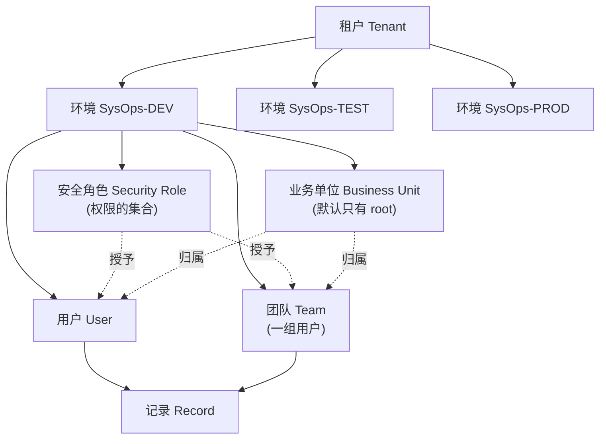

# 03 权限安全与审计手册

> **本手册把 [`../docs/rbac-matrix.md`](../docs/rbac-matrix.md) 的权限矩阵翻译成门户里的逐步点击操作。**
> 矩阵本身**不变**（它已经是评审过的设计），本手册只解决"在哪个页面点哪里才能配出这个矩阵"。
>
> **执行阶段：S3。** 前置条件是 S2 的表结构已完成（[`02-Dataverse台账搭建手册.md`](02-Dataverse台账搭建手册.md) §14 核对通过）。
>
> ⚠️ **本手册第 10 章列出 5 个最容易配错的点，其中 2 个会导致"数据泄露"、2 个会导致"所有人都看不到"、1 个会在半年后炸。请在开工前先读第 10 章。**

---

## 0. 开始前必读

### 0.1 本手册要解决的 5 件事

| # | 事项 | 章节 | 不做的后果 |
|---|---|---|---|
| 1 | 建安全角色，配逐表权限 | §1–§3 | 所有登录用户都是"环境制造者"，能改表结构 |
| 2 | 配列级安全（主机名 / IP） | §4 | 现场操作员能直接看到所有服务器 IP |
| 3 | 配记录级隔离与团队共享 | §5 | Requester 能看到全厂所有人的问题单 |
| 4 | 启用审计并调保留期 | §6 | 出事时拿不出证据；默认保留期通常只有 30 天 |
| 5 | 决定是否启用托管环境 | §7 | 后面 `09` 手册的 Pipelines 用不了 |

### 0.2 三个入口，别搞混

| 入口 | URL | 用来做什么 |
|---|---|---|
| **Power Platform 管理门户** | `admin.powerplatform.microsoft.com` | **本手册 80% 的操作**。环境、安全角色、审计设置、托管环境、容量、保留期 |
| **制造者门户** | `make.powerapps.com` | 表的**审计开关**、表属性、Power Automate Desktop（列级安全的**勾选**在 `02` §13 已做） |
| **SharePoint 站点** | `https://<租户>.sharepoint.com/sites/<站点>` | 文档库权限、站点集审计（§9） |

> ⚠️ **安全角色的编辑界面有两个版本**：经典版（每个表 8 个圆点）和现代简化版（每个表一个 **Permission Settings** 下拉）。
> 两者**改的是同一份数据**，可以互切。本手册**以现代简化版为主**描述，并标注经典版的对应操作。
> 若你的门户打开后是经典版，**不用去找切换开关**——直接按经典版的方式点圆点即可，效果完全一样。

### 0.3 执行顺序

```
§1  概念准备（读，不操作）
§2  创建安全角色（空壳）
§3  逐表配置权限           ← 本手册主体，最耗时
§4  列级安全配置文件
§5  团队与记录共享
§6  审计（环境级 + 表级 + 保留期）
§7  托管环境决策
§8  业务单位（只确认，不改）
§9  SharePoint 权限与审计
§10 五个最容易配错的点（复盘）
§11 S3 出口检查表
```

### 0.4 ⚠️ 为什么权限要"先做"而不是"最后配"

很多人会想"先把功能和流程做完，权限最后再配"。在本方案里这么做**会造成返工**：

| 原因 | 说明 |
|---|---|
| **`bjops_issuehistory` 必须从一开始就不给任何写权限** | 若早期为了让流程跑通而给了写权限，后面关掉时，需要确认历史数据里**有没有人工插入的假记录**——这个核查很痛苦 |
| **列级安全开关最好在建列时就勾** | `02` §13.2 已说明：列保存后再开启列级安全**可能失败**。所以列级安全的**勾选**在 S2 做了，但**配置文件**必须在 S3 紧跟，否则这段时间内**所有人都看不到这两列**（fail-closed） |
| **记录级隔离影响 S4 的表单与流程设计** | 若 Requester 只能看自己的单，那么 `04` 手册的表单和 `05` 手册的流程都必须显式设置 Owner。若先做完流程再改权限，**流程要全部重测** |
| **`ownerid` 归属问题只在真实账号下才暴露** | 用管理员账号自测永远测不出来（`03` §10.3） |

---

## 1. 概念准备

> ⚠️ **本章只读不操作。** 不把这几个概念分清，第 3 章会配错。

### 1.1 五个概念的层级关系



| 概念 | 一句话 | 在本方案里 |
|---|---|---|
| **环境** | 一套独立的 Dataverse 数据库 | 3 个（`01` §3） |
| **安全角色** | **权限的集合**。定义"能对哪些表做什么" | 6 个（§2），Phase 1 用 4 个 |
| **用户** | 被授权的人 | 通过 Entra ID 安全组或直接添加 |
| **团队** | **一组用户**，可整体授予角色，也可整体拥有记录 | 每个业务团队一个「所有者团队」 |
| **业务单位** | 数据归属的分层结构 | **本方案只用根 BU，不新建**（§8） |

> ⚠️ **安全角色不"属于"某个用户，而是"授予"用户或团队。** 一个人可以有多个角色，**权限取并集**。
> 这个特性有陷阱：如果某人不小心同时有 Requester 和 Operator，他**能看到全部问题**（并集），而不是"只看到自己的"。

### 1.2 8 种权限（每个表都有这 8 个）

| 权限 | 英文 | 含义 | 本方案哪里用到 |
|---|---|---|---|
| 创建 | **Create** | 新建记录 | Requester 建问题 |
| 读取 | **Read** | 查看记录 | 全员 |
| 写入 | **Write** | 修改记录 | Operator 改状态 |
| 删除 | **Delete** | 删除记录 | 只有 Admin |
| **附加** | **Append** | **把本表的记录附加到别的记录上** | 建 `问题历史` 时用 |
| **附加到** | **Append To** | **允许别的记录附加到本表记录上** | `问题` 表需要它 |
| **分配** | **Assign** | 把记录**负责人**改成别人 | Operator 转派 |
| **共享** | **Share** | 把记录**共享给**其他用户或团队 | 只有 Admin |

> ⚠️ **`Append` 与 `Append To` 是本方案最容易配漏的一对，且名字极易混淆。**
>
> **规则**：在**从表**上填写**父表**的查找列（例如在 `问题历史` 上填 `所属问题`），等于"把 `问题历史` 附加到 `问题`"，因此需要：
> - **从表（`问题历史`）的 `Append`** ✅
> - **父表（`问题`）的 `Append To`** ✅
>
> **两边都要给，缺一个就会在录入时报错**，而且报错信息通常很含糊（例如"你没有权限执行此操作"），**不告诉你是哪个权限缺了**。
> **排查口诀：附加关系出问题，先查从表的 Append + 父表的 Append To。**
>
> 若不想逐个判断，**在业务可接受时直接用 `Full Access` 预设**（§1.4），它会一次性配齐 8 个权限。

### 1.3 访问级别（权限的"深度"）

同一个权限还要选**范围**。界面里有 4 档（经典版是 5 档，多一个 None）：

| 界面标签 | 别名 | 含义 |
|---|---|---|
| **None** | 无 | 没有任何记录 |
| **User** | **Basic（基本）** | **自己拥有的** + 别人**共享给自己的** |
| **Business Unit** | **Local（本地）** | 本业务单位内**所有人的**记录 |
| **Parent: Child Business Units** | **Deep（深度）** | 本 BU + 所有下级 BU |
| **Organization** | **Global（全局）** | **整个环境的全部记录** |

> ⚠️ **现代简化版编辑器可能只显示 4 档（None / User / Business Unit / Organization）**，把 "Parent: Child" 折叠掉了。
> **本方案不需要 "Parent: Child"**（因为不建下级 BU，见 §8）。**看到它就当成 Business Unit 的同义项**，不要纠结。

**本方案的选择**（重要，别乱选）：

| 场景 | 用哪一档 | 理由 |
|---|---|---|
| Requester 读自己的问题 | **User** | 靠记录归属实现"只看自己的" |
| Operator / Developer 读全部问题 | **Organization** | 运维要横向发现同类问题（`rbac-matrix.md` §3.2） |
| Admin 管主数据 | **Organization** | 主数据是全局的 |
| 所有人都读 `应用台账` / `设备台账` | **Organization** | 主数据要能被引用 |
| 所有人读 `SLA 配置` | **Organization** | 流程要用它算时限 |

> ⚠️ **`Read` 的深度给 `Organization` 不等于"数据泄露"**——因为 Dataverse 的 `Read` **只控制记录本身**，不控制**列**。
> 列级别的保护靠**列级安全**（§4），那是另一套机制。两者要**配合使用**。

### 1.4 现代编辑器的 "Permission Settings" 预设

现代简化版角色编辑器里，每个表右侧有一个下拉，选项大致如下：

| 预设 | 含义（近似） | 谁用得上 |
|---|---|---|
| **No Access** | 8 个权限全为 None | Requester 对 `SLA 配置` |
| **Full Access** | 8 个权限 + Organization 深度 | Admin 对全部表 |
| **Collaborate** | 类似 Full Access 但**不能 Delete**，深度为 Business Unit | 快速给 Operator 配 |
| **Private** | 只有 User 深度，且通常不能 Delete | Requester 对自己创建的表 |
| **Reference** | 只有 Read + Append To（只读引用） | Developer 读主数据 |
| **Custom** | 手工逐项配 8 个权限 | ✅ **本方案多数情况用这个** |

> ⚠️ **待确认**：预设的**准确名称与每个预设的权限组合**随门户版本变化。上面是按当前常见界面的近似描述。
> **本手册的所有配置要求都以"8 个权限 + 深度"的形式给出**，不依赖预设名称。**配置时请展开权限明细逐项核对，不要只看预设名字。**

**如何展开明细**：选中某表的预设下拉后，界面上会出现一个 **＋** / **Show details** / **Expand** 之类的按钮，点开展开 8 个权限和各自的深度下拉。

---

## 2. 创建 6 个安全角色

### 2.1 路径

1. 打开 `admin.powerplatform.microsoft.com`
2. 左侧 **Environments** → 点 **`SysOps-DEV`**
3. 顶部命令栏 **Settings** → **Users + permissions** → **Security roles**
   > 有些版本路径是：环境详情页 → **Users + permissions** → **Security roles**；也可能在 **Settings → Users and permissions**。
4. 点 **+ New role**

> ⚠️ **环境选择器要确认在 `SysOps-DEV`。** 安全角色是**环境内**的，不在环境之间共享。**三个环境都要各配一遍**（§2.4）。

### 2.2 6 个角色的定义

Phase 1 用前 4 个；Phase 2 增加 Tester 与 ReleaseManager。

| # | 角色名（显示名） | 唯一名 | 阶段 | 人员来源 | 对应设计稿业务角色 |
|---|---|---|---|---|---|
| 1 | **请求人** | `SysOps Requester` | Phase 1 | 现场操作员、工艺、质量 | Requester / 现场上报人 |
| 2 | **运维操作员** | `SysOps Operator` | Phase 1 | 现场运维 | Operator / 一线运维 |
| 3 | **开发人员** | `SysOps Developer` | Phase 1 | 系统开发/实施 | Developer / 二线开发 |
| 4 | **平台管理员** | `SysOps Admin` | Phase 1 | 平台管理员 | Admin / 平台负责人 |
| 5 | **测试人员** | `SysOps Tester` | **Phase 2** | 测试工程师 | Tester（设计稿 §4） |
| 6 | **发布经理** | `SysOps ReleaseManager` | **Phase 2** | 发布负责人 | ReleaseManager（设计稿 §4） |

> ⚠️ **唯一名（Name）用英文、不带空格。** 中文唯一名在跨环境导入时会出问题。
> **建议把 `SysOps ` 前缀写进唯一名**，这样在角色列表里一眼能看出哪些是本项目的角色。

### 2.3 创建步骤（以「请求人」为例）

1. **+ New role**
2. **Name** 填 `SysOps Requester`
3. 展开 **Advanced options** / **Business unit**（若有）→ 保持 **根业务单位**（见 §8）
4. 点 **Save**（此时是个空角色，**没有任何权限**——这很重要，默认就是最安全的）
5. 后续在 **§3** 回来逐表配置

**其余 5 个角色同样操作**，只是 Name 不同。

### 2.4 ⚠️ 必须在三个环境各配一遍

安全角色**不随解决方案导入**（它是环境级配置，不属于解决方案组件）。所以：

| 环境 | 要做什么 |
|---|---|
| **DEV** | 本手册从头做一遍 |
| **TEST** | 手工再做一遍（或从 DEV **复制**，见下） |
| **PROD** | 手工再做一遍（或从 TEST 复制） |

**复制角色的方法**：

1. 在**目标环境**打开 **Security roles**
2. 找到该角色 → 点行末 **⋯** → **Copy role**（或 **Copy**）
3. 在弹窗里填**新角色的 Name**，并选择**复制全部权限**
4. 保存

> ⚠️ **复制角色不会复制"角色里的成员"。** 成员（用户/团队）要在每个环境**重新添加**。
>
> **本方案不推荐"从 DEV 复制到 PROD"**：PROD 的权限应当**比 DEV 更严**（例如 PROD 的 Admin 不应有表结构修改权限）。**建议手工配 PROD，并以 PROD 为基线反向校准 DEV。**
>
> 若必须复制，**复制后要逐表核对一遍**——复制功能在不同门户版本里对"列级安全配置文件"和"团队"的处理不一致（**待确认**）。

### 2.5 把角色分配给用户（或团队）

**推荐：分配给团队，而不是逐个用户**（人员变动时只改团队成员）。

1. 在 **Security roles** 里打开某个角色 → **Members** 标签
2. **+ Add people** / **+ Add teams**
3. 选择 Entra ID 安全组或团队
4. 保存

> ⚠️ **批量授权的正确姿势**：先在 **Teams** 里创建「所有者团队」（§5.1），给**团队**授予角色，再把用户加入团队。**不要**给几十个用户单独授角色——离职时容易漏删。

---

## 3. 逐表配置权限

> ⚠️ **本章是全手册主体。** 请**一张表一张表地配**，每配完一张就对照 `rbac-matrix.md` 检查一次。
> 建议顺序：先配 **Admin**（全开，最简单）→ 再 **Operator** → 再 **Developer** → 最后 **Requester**（最复杂，靠"什么都不给"来实现安全）。

### 3.1 配置时的界面操作（通用）

**现代简化版**：
1. 打开角色 → 找到表名所在行
2. 点右侧 **Permission Settings** 下拉 → 选 **Custom**
3. 点 **＋** / **Expand** 展开 8 个权限
4. 每个权限旁边有一个**深度下拉**（None / User / Business Unit / Organization）
5. 逐项设置 → **Save**

**经典版**：
1. 打开角色 → 顶部切到 **Custom Entities** 标签（自定义表在这里）
2. 每张表一行，8 列表头分别是 **Create / Read / Write / Delete / Append / Append To / Assign / Share**
3. 每个单元格是一个**圆点**。**点击会在 None → User → Business Unit → Parent:Child → Organization 之间循环**
4. ⚠️ **圆点很容易点过头**。点的时候**看着形状变化**：空心 = None，实心单圆点 = 较低的深度，实心多层 = 更高的深度（具体图形随版本不同）
5. **最稳的做法**：点中单元格后，用**表头下方的"深度选择"**或**右键**来精确选，而不是盲点
6. 配完点 **Save and Close**

> ⚠️ **两种界面的一个共同陷阱**：**顶部有一行"表级开关"**（例如 `Custom Entities` 标签页的父级勾选）。如果这个总开关是关的，**下面每个表的权限都无意义**。
> **配置前先确认表所在的标签页是激活状态。**

### 3.2 平台管理员 `SysOps Admin`

**最简单，先把这张表配完。**

| 表 | Create | Read | Write | Delete | Append | Append To | Assign | Share |
|---|---|---|---|---|---|---|---|---|
| `bjops_application` | Organization | Organization | Organization | Organization | Organization | Organization | Organization | Organization |
| `bjops_equipment` | Organization | Organization | Organization | Organization | Organization | Organization | Organization | Organization |
| `bjops_issue` | Organization | Organization | Organization | Organization | Organization | Organization | Organization | Organization |
| `bjops_issuehistory` | **None** | Organization | **None** | **None** | **None** | Organization | **None** | **None** |
| `bjops_logpackage` | Organization | Organization | Organization | Organization | Organization | Organization | Organization | Organization |
| `bjops_slaconfig` | Organization | Organization | Organization | Organization | Organization | Organization | Organization | Organization |
| `bjops_version` | Organization | Organization | Organization | Organization | Organization | Organization | Organization | Organization |
| `bjops_release` | Organization | Organization | Organization | Organization | Organization | Organization | Organization | Organization |
| `bjops_testplan` | Organization | Organization | Organization | Organization | Organization | Organization | Organization | Organization |
| `bjops_testcase` | Organization | Organization | Organization | Organization | Organization | Organization | Organization | Organization |
| `bjops_testexecution` | Organization | Organization | Organization | Organization | Organization | Organization | Organization | Organization |

> ⚠️ **注意 `bjops_issuehistory` 一行——Admin 也不行！**
> `rbac-matrix.md` §2.3 明确规定：**历史表对所有角色均为只读，连 Admin 也不授予写权限。**
> 因为它是**审计证据**。如果 Admin 能改，那它在合规场景下就**不能作为证据**。
>
> **这带来一个必须解决的问题**：流程写入历史表靠谁的身份？
> → 答案见 §3.8「流程连接账号的身份」。
>
> ⚠️ **`bjops_issuehistory` 的 `Append To` 要给 Organization**：流程在**问题**上创建历史记录时，是"把历史附加到问题"，所以 `问题` 需要 `Append To`... 
> **等一下，方向要说清楚**：本行是 `bjops_issuehistory` 表自己的权限。**从表给 Append、父表给 Append To**（§1.2）：
> - `bjops_issuehistory.Append` → 流程"把历史附加出去"，**Admin 那一行给 None 是为了阻止人工通过界面创建历史**——但流程用的是流程账号身份（§3.8），不是 Admin 角色。
> - 因此 **Admin 角色上的 `bjops_issuehistory.Append` 给 None 是安全的**。
> - 此处保留 `Append To = Organization` 是为了让"从问题侧查看历史列表"能正常工作。
>
> **若配完后发现流程写历史失败，第一件事就是检查流程账号的身份与角色（§3.8），而不是打开 Admin 的 Append 权限。**

**快捷方式**：Admin 除了 `bjops_issuehistory` 一行外，**其余 10 张表都可以用 `Full Access` 预设**。

### 3.3 运维操作员 `SysOps Operator`

| 表 | Create | Read | Write | Delete | Append | Append To | Assign | Share |
|---|---|---|---|---|---|---|---|---|
| `bjops_application` | Organization | Organization | Organization | **None** | Organization | Organization | **None** | **None** |
| `bjops_equipment` | Organization | Organization | Organization | **None** | Organization | Organization | **None** | **None** |
| `bjops_issue` | Organization | Organization | Organization | **None** | Organization | Organization | Organization | **None** |
| `bjops_issuehistory` | **None** | Organization | **None** | **None** | **None** | Organization | **None** | **None** |
| `bjops_logpackage` | Organization | Organization | Organization | **None** | Organization | Organization | **None** | **None** |
| `bjops_slaconfig` | **None** | Organization | **None** | **None** | **None** | **None** | **None** | **None** |
| `bjops_version` | **None** | Organization | **None** | **None** | **None** | **None** | **None** | **None** |
| `bjops_release` | **None** | Organization | **None** | **None** | **None** | **None** | **None** | **None** |
| `bjops_testplan` | **None** | Organization | **None** | **None** | **None** | **None** | **None** | **None** |
| `bjops_testcase` | **None** | Organization | **None** | **None** | **None** | **None** | **None** | **None** |
| `bjops_testexecution` | **None** | Organization | **None** | **None** | **None** | **None** | **None** | **None** |

**要点**：

- **`bjops_issue` 的 `Assign` = Organization**：Operator 要能把问题**转派**给别人。这是"分配"权限，**不是"共享"权限**（Share 仍是 None，避免他们把不属于自己的单共享出去）。
- **`bjops_slaconfig` 只给 Read**：`rbac-matrix.md` §2.5 明确"不要给 Operator 创建/更新权限"。
- **Phase 2 五张表 Operator 全部只读**：Operator 需要知道"这个问题在哪个版本修的"（读 `bjops_version`），但**不参与版本与测试管理**。

> ⚠️ **`Assign` 权限的一个副作用**：拥有 `Assign` 的人可以把记录的**负责人改成任何人**，包括改给一个**已离职或已停用的用户**。这会让记录"消失"在所有人的视图里（因为筛选器按"负责人 = 当前用户"）。
> **应对**：`05` 流程手册里，状态变更流程会**校验新负责人是否启用**，不通过则回退。

### 3.4 开发人员 `SysOps Developer`

| 表 | Create | Read | Write | Delete | Append | Append To | Assign | Share |
|---|---|---|---|---|---|---|---|---|
| `bjops_application` | **None** | Organization | **None** | **None** | **None** | **None** | **None** | **None** |
| `bjops_equipment` | **None** | Organization | **None** | **None** | **None** | **None** | **None** | **None** |
| `bjops_issue` | Organization | Organization | Organization | **None** | Organization | Organization | **None** | **None** |
| `bjops_issuehistory` | **None** | Organization | **None** | **None** | **None** | Organization | **None** | **None** |
| `bjops_logpackage` | **None** | Organization | **None** | **None** | **None** | **None** | **None** | **None** |
| `bjops_slaconfig` | **None** | Organization | **None** | **None** | **None** | **None** | **None** | **None** |
| `bjops_version` | Organization | Organization | Organization | **None** | Organization | Organization | **None** | **None** |
| `bjops_release` | **None** | Organization | **None** | **None** | **None** | **None** | **None** | **None** |
| `bjops_testplan` | **None** | Organization | **None** | **None** | **None** | **None** | **None** | **None** |
| `bjops_testcase` | Organization | Organization | Organization | **None** | Organization | Organization | **None** | **None** |
| `bjops_testexecution` | Organization | Organization | Organization | **None** | Organization | Organization | **None** | **None** |

**要点**：

- **`bjops_issue` Developer 有 Write，但只写"技术字段"**（`rootcause` / `solution` / `fixversion` / `permanentmeasure`）。
  ⚠️ **Dataverse 的安全角色做不到"列级写权限"**——`Write` 是**表级**的。要让 Developer **不能改 `bjops_status`**，只能靠：
  1. **业务规则**（`02` §12.6 已提到，但业务规则在"编辑时"限制，**无法按角色区分**）
  2. **表单设计**（`04` 手册）——把 `bjops_status` 放在表单上但设为**只读**
  3. **应用层控制**（用 Canvas App 代替模型驱动表单，精确控制每个角色的可编辑列）
  4. **列级安全**——⚠️ 列级安全**只管"读取"和"更新"两个动作，且是全局的**，**不能按角色给不同的列写权限组合**（只能"能改/不能改"两态）

  → **本方案的决策**：**接受表级 Write**，靠**表单只读 + `05` 流程的字段白名单校验**来控制。**这是本方案的一处能力边界，已在 `00-方案总览.md` §7 记录（R5）。**

- **`bjops_version` / `bjops_testcase` / `bjops_testexecution` Developer 可写**：设计和执行测试是开发工作的一部分。
- **`bjops_release` Developer 只读**：发布要审批，不能让开发自己改发布记录。

### 3.5 请求人 `SysOps Requester`（最关键的一个）

> ⚠️ **这个角色的设计哲学是"什么都不给"**。Requester 的权限几乎全部来自"**默认的自我创建记录所有权**"，而不是来自显式授权。

| 表 | Create | Read | Write | Delete | Append | Append To | Assign | Share |
|---|---|---|---|---|---|---|---|---|
| `bjops_application` | **None** | Organization | **None** | **None** | **None** | **None** | **None** | **None** |
| `bjops_equipment` | **None** | Organization | **None** | **None** | **None** | **None** | **None** | **None** |
| `bjops_issue` | **User** | **User** | **User** | **None** | User | **None** | **None** | **None** |
| `bjops_issuehistory` | **None** | **User** | **None** | **None** | **None** | **None** | **None** | **None** |
| `bjops_logpackage` | **User** | **User** | **None** | **None** | User | **None** | **None** | **None** |
| `bjops_slaconfig` | **None** | **None** | **None** | **None** | **None** | **None** | **None** | **None** |
| `bjops_version` | **None** | Organization | **None** | **None** | **None** | **None** | **None** | **None** |
| `bjops_release` | **None** | **None** | **None** | **None** | **None** | **None** | **None** | **None** |
| `bjops_testplan` | **None** | **None** | **None** | **None** | **None** | **None** | **None** | **None** |
| `bjops_testcase` | **None** | **None** | **None** | **None** | **None** | **None** | **None** | **None** |
| `bjops_testexecution` | **None** | **None** | **None** | **None** | **None** | **None** | **None** | **None** |

**要点（逐条解释，别跳过）**：

| 配置 | 为什么 |
|---|---|
| `bjops_issue` 全部用 **User** 深度 | **这是"只看自己的单"的实现机制**。`Read = User` 意味着只能读**自己拥有**的 + **被共享给自己**的（`rbac-matrix.md` §3.1 方案 A） |
| `bjops_issue` 的 `Read = User`，**不是 None** | 若给 None，Requester **连自己建的单都看不到** |
| `bjops_issue` 的 `Create = User` | Create 的深度决定"能创建什么样的记录"。**User** = 只能创建自己拥有的记录 |
| `bjops_issue` 的 `Append = User` | Requester 要能在自己的单上**加历史/关联**（否则表单提交会失败） |
| `bjops_issue` 的 `Append To = None` | 不允许别人把自己的单附加到别处。⚠️ **若配完后 Requester 建单报错，先检查这一项** |
| `bjops_slaconfig` **Read = None** | `rbac-matrix.md` §2.5：**Requester 完全不接触 SLA 配置**，避免用响应时限来博弈优先级 |
| `bjops_version` 给 **Read = Organization** | 版本号是**非敏感**信息，且 Requester 需要知道"我报的问题在哪个版本修的"。**这是本方案相对 `rbac-matrix.md` 的一处补充**（原矩阵未定义该表） |
| `bjops_release` / 测试三表 **全 None** | 发布与测试是内部过程，**不对 Requester 开放**。⚠️ 若业务方希望"让上报人看到修复进度"，应通过 `05` 流程的**通知卡片**提供，而**不是**开这些表的读权限 |

> ⚠️ **Requester 的 `bjops_issuehistory.Read = User`**：
> `Read = User` 意味着 Requester 能读**自己拥有的历史记录**。但事实是：**历史记录的 `ownerid` 是流程账号**，不是 Requester。
> → **所以 Requester 实际读不到历史记录。** 这**通常是可以接受的**（历史是内部处理过程）。
> → **若业务方要求 Requester 能看处理进度**，必须改成：
> - 方案 A：`bjops_issuehistory.Read = Organization`（**放弃隔离**，所有 Requester 能看到所有人的处理历史——**不推荐**）
> - **方案 B（推荐）**：**不给表的读权限**，改为 `05` 流程在状态变更时**推送 Teams 消息**给 Reporter。**这样既不泄露，又能满足需求。**
>
> **这一项需要在 S3 开工前与业务方确认。**

### 3.6 测试人员 `SysOps Tester`（Phase 2）

| 表 | Create | Read | Write | Delete | Append | Append To | Assign |
|---|---|---|---|---|---|---|---|
| `bjops_application` | None | Organization | None | None | None | None | None |
| `bjops_equipment` | None | Organization | None | None | None | None | None |
| `bjops_issue` | Organization | Organization | Organization | None | Organization | Organization | None |
| `bjops_issuehistory` | None | Organization | None | None | None | Organization | None |
| `bjops_logpackage` | None | Organization | None | None | None | None | None |
| `bjops_slaconfig` | None | None | None | None | None | None | None |
| `bjops_version` | None | Organization | None | None | None | None | None |
| `bjops_release` | None | Organization | None | None | None | None | None |
| `bjops_testplan` | Organization | Organization | Organization | None | Organization | Organization | None |
| `bjops_testcase` | Organization | Organization | Organization | None | Organization | Organization | None |
| `bjops_testexecution` | Organization | Organization | Organization | None | Organization | Organization | None |

**要点**：

- **`bjops_issue` 给 Write**：设计稿 §10.4 要求"测试发现失败必须关联一个 Bug"。Tester 需要能**新建 Bug**（所以 Create = Organization）并在 Bug 上写测试现象。
- **`bjops_testexecution` 是 Tester 的主战场**：Full Access（除删除）。
- **⚠️ `bjops_testcase` 给 Tester Write 是一处设计取舍**：严格地说，**用例应由 Developer 写、Tester 执行**。但现实中两者常是同一批人。**若组织上要严格分离，把 Tester 的 `bjops_testcase.Write` 改成 None**，并保持 `bjops_testplan` 也只读。

### 3.7 发布经理 `SysOps ReleaseManager`（Phase 2）

| 表 | Create | Read | Write | Delete | Append | Append To | Assign |
|---|---|---|---|---|---|---|---|
| `bjops_application` | None | Organization | None | None | None | None | None |
| `bjops_equipment` | None | Organization | None | None | None | None | None |
| `bjops_issue` | None | Organization | **Organization** | None | Organization | Organization | None |
| `bjops_issuehistory` | None | Organization | None | None | None | Organization | None |
| `bjops_logpackage` | None | Organization | None | None | None | None | None |
| `bjops_slaconfig` | None | Organization | None | None | None | None | None |
| `bjops_version` | Organization | Organization | Organization | None | Organization | Organization | None |
| `bjops_release` | Organization | Organization | Organization | None | Organization | Organization | None |
| `bjops_testplan` | None | Organization | None | None | None | None | None |
| `bjops_testcase` | None | Organization | None | None | None | None | None |
| `bjops_testexecution` | None | Organization | None | None | None | None | None |

**要点**：

- **`bjops_release` 与 `bjops_version` 是发布经理的主战场**。
- **`bjops_issue.Write` = Organization**：发布经理要能**批量把问题的状态推到 `Released`**（`05` 流程的"发布完成"流程会做批量更新，但需要有人触发）。
- **测试三表全部只读**：发布经理要**检查**测试结果，但**不能修改测试结论**（否则"测试通过"就失去意义——设计稿 §10.4 第 5 条）。

> ⚠️ **注意一个潜在冲突**：`bjops_issue.Write` 给 ReleaseManager，而 Developer 也有 Write。**两个角色都能改 `bjops_status`。**
> 这是**表级权限的必然结果**（§3.4 的能力边界）。**靠 `05` 流程维护"合法状态迁移表"来控制**：流程只接受合法的迁移（依据 `../docs/data-dictionary.md` §2.6 的 14 个状态转换），**非法迁移直接拒绝并记录**。

### 3.8 ⚠️ 流程连接账号的身份（无代码方案的特有风险）

> ⚠️ **这是无代码方案与代码方案差异最大的一点，也是最大的运维风险。**

**代码方案的解法**：用**服务主体**（应用注册 + 客户端密钥）跑 CI/CD，密钥可轮换、权限可控、与个人无关。
**无代码方案的现实**：**Power Automate 的云流程由"连接的拥有者"身份运行。**

| 问题 | 后果 |
|---|---|
| 流程的拥有者**离职 / 调岗 / 账号被停用** | **该人拥有的所有流程全部停跑**。包括建单流程、通知流程、SLA 流程。**系统静默瘫痪，没人收到报错** |
| 流程拥有者的权限**决定流程能做什么** | 若拥有者只有 Requester 角色，**流程写不了历史表、改不了状态** |
| 流程的"运行身份"在审计日志里是**个人账号** | 审计时看到"张三点改了 47 条记录"，容易误判为违规操作 |

**本方案的处理**（**必须在 S3 与 IT/安全一起决策**）：

| 选项 | 做法 | 优点 | 风险 |
|---|---|---|---|
| **A（推荐，若允许）** | 申请一个**专用共享账号**（如 `svc-sysops-flow@<租户>`），把**所有**云端流程的连接都建在这个账号下，并给它**一个专用安全角色** | 与个人无关，交接简单 | ⚠️ 许多企业**禁止共享账号**；需要单独许可；共享账号的**条件访问策略**可能阻止登录（如要求 MFA/合规设备）→ **会导致无人能登录维护流程** |
| **B（退路）** | 由**两个在职人员**作为"连接共同拥有者"，把流程**同时共享**给他们，并建立**季度检查** | 不需要共享账号 | 依赖人员在职；**交接必须走流程** |
| **C（下策）** | 全部流程建在**管理者账号**下 | 权限足够 | 单点风险最大。**仅在 A/B 都不可行时使用，且必须写入交接清单** |

**给流程账号的角色定义（若用选项 A）**：

| 表 | 权限 |
|---|---|
| `bjops_issue` | Create / Read / Write / Append / Append To = **Organization** |
| `bjops_issuehistory` | **Create** / Read / Append = **Organization**（⚠️ **只有流程账号这一个角色给 Create**） |
| `bjops_logpackage` | Create / Read / Write / Append / Append To = Organization |
| `bjops_slaconfig` | Read = Organization |
| `bjops_application` / `bjops_equipment` | Read = Organization |
| `bjops_version` / `bjops_release` | Read = Organization（若流程要更新发布状态则加 Write） |
| `bjops_testexecution` | Create / Read / Write = Organization（若流程要回写测试结论） |

> ⚠️ **这个角色是本方案里唯一拥有 `bjops_issuehistory.Create` 的角色。** 它**必须**是专用的、**不授予任何自然人**。
> **验收时的一个硬检查**：用一个普通 Admin 账号在界面上试着新建一条历史记录，**必须失败**（§11 检查表）。

**必须建立的运维动作**（写入 [`10-验收与日常运维手册.md`](10-验收与日常运维手册.md)）：

- [ ] 记录**每个流程的连接拥有者**（一张清单：流程名 → 拥有者 → 连接类型）
- [ ] 每个流程**至少共享给 2 个在职人员**
- [ ] **每季度**检查一次：所有流程的拥有者是否仍在职、连接是否仍有效
- [ ] 拥有者离职时的**交接清单**（见 `10` 手册）
- [ ] ⚠️ 在 `admin.powerplatform.microsoft.com` → 环境 → **Resources → Flow**（或 `make.powerautomate.com` → **Solutions** → 查看流程所有者）里可以核对

### 3.9 权限配置自检（§3）

- [ ] 6 个安全角色已创建（Phase 1 用前 4 个）
- [ ] **`bjops_issuehistory` 对 6 个角色全部没有 Create / Write / Delete**（唯一例外是流程专用角色，§3.8）
- [ ] 所有角色的 `Append` / `Append To` 已按"从表 Append + 父表 Append To"检查
- [ ] `bjops_slaconfig` 对 Requester 是 **No Access**（Create/Read/Write/Delete 全 None）
- [ ] `bjops_issue` 的 Requester 全部是 **User** 深度（不是 Organization）
- [ ] `bjops_issue` 的 Operator / Developer / Tester / ReleaseManager 的 Read 是 **Organization**
- [ ] 所有角色的配置都已 **Save**（不是只改了不保存）
- [ ] 已**在 DEV 完成**，且已规划 TEST / PROD 的配置方式（手工 or 复制）

---

## 4. 列级安全（Field Security Profile）

> ⚠️ **第 0 步是最重要的**：`02` §13 已经在列上**勾选了 Enable column security**。
> **从勾选那一刻起，除了系统管理员，所有人都看不到 `bjops_hostname` 和 `bjops_ipaddress`。**
> **S2 到 S4 之间这段时间，这两列对所有人是空白的。这是预期行为，不是故障。**
> **本章要做的就是"把该看到的人加回来"。**

### 4.1 要解决的两个问题

| # | 问题 | 解法 |
|---|---|---|
| 1 | 开启列级安全后，`bjops_hostname` / `bjops_ipaddress` **对除系统管理员外所有人不可见**（fail-closed） | 建列级安全配置文件，把 Operator / Developer / Admin 加进去 |
| 2 | **Admin 也看不到**（除非显式加入） | 把 Admin 的**用户或团队**明确加入配置文件 |

### 4.2 创建列级安全配置文件

**路径**：`admin.powerplatform.microsoft.com` → Environments → `SysOps-DEV` → **Settings** → **Users + permissions** → **Field security profiles**

> ⚠️ 有些版本这个入口叫 **Column security profiles**（新版术语把 "field" 改成了 "column"）。**两者是同一个东西。**
> 也可能在 **Settings → Security → Field security profiles**。

**步骤**：

1. **+ New profile**
2. **Name** 填 `运维设备敏感字段`
3. **Description** 填 `允许运维与开发人员查看设备的主机名与 IP 地址`
4. **Save**
5. 打开刚建好的配置文件 → **Column Permissions**（或 **Field Permissions**）标签
   > ⚠️ **打开这个标签时，会要求先选一张表**（因为配置文件是按表组织的）。
6. 在 **Entity** 下拉里选 **`设备台账`（`bjops_equipment`）**
7. 在列清单里，对目标列设置权限：

| 列 | 允许读取（Read） | 允许创建（Create） | 允许更新（Update） |
|---|---|---|---|
| `bjops_hostname` | ✅ 勾选 **Read** | ❌ 不勾（用表单/流程写） | ❌ 不勾 |
| `bjops_ipaddress` | ✅ 勾选 **Read** | ❌ 不勾 | ❌ 不勾 |

> ⚠️ **为什么 Create / Update 都不勾？**
> 因为**设备的这两列是由主数据维护流程（`06` 手册的日志采集流程会写回设备信息）写入的**，不需要人工在界面上改。
> **若业务方要求运维人员能手工维护设备的主机名**，则把 Operator 所在的**团队**加入另一个"可写"的配置文件（一个配置文件只能给一套权限，所以要么让所有成员都可写，要么分成"只读配置文件"和"读写配置文件"两个）。
>
> **本方案的建议**：**只读**。修改主机名/IP 走 `05` 流程的"设备信息更新"入口，留痕。

8. **Save**

### 4.3 把成员加进配置文件

1. 打开配置文件 → **Teams** 标签（或 **Users** 标签）
2. **+ Add team** → 选 **运维操作员** 所在的**所有者团队**（§5.1）
3. 重复添加 **开发人员**团队
4. **⚠️ 再单独添加 Admin**：
   - 方式一：把「平台管理员」团队加进来（推荐）
   - 方式二：把具体的管理员用户加进来
5. **Save**

> ⚠️ **两种成员的语义不同**：
> - 加 **Teams** = 团队**所有成员**都有权限，**人员变动自动生效**（推荐）
> - 加 **Users** = 只有这一个人，**离职后要手工清**
>
> **推荐全部用 Teams。** 唯一的例外是**配置文件的创建者/维护者本人**——建议也通过团队加，不要单独加个人。

### 4.4 ⚠️ 列级安全的 5 个已知行为（必须知道）

| # | 行为 | 后果 | 应对 |
|---|---|---|---|
| 1 | **fail-closed** | 未在**任何**配置文件中的用户 → 该列**完全不可见** | 每加一个涉及设备运维的角色，**都要同步加进配置文件** |
| 2 | **系统管理员始终可见** | 系统管理员**不受**列级安全约束 | 无法关闭。做验收测试时**不要用系统管理员账号**，否则会误判"配置生效了" |
| 3 | **Power BI / 入湖会绕过它** | 数据一旦被搬运到 ADLS / Databricks，**整列原样过去**，报表里所有人可见 | 见 §10.4。**这是本方案最大的一个"看起来安全其实不安全"的坑** |
| 4 | **计算列 / 汇总列 / 查找列 / 主列 / 系统列不能开列级安全** | 配不上 | 本方案只用在 2 个纯文本列上，无影响 |
| 5 | **同一列在不同配置文件里可以有不同权限，取并集** | 一个用户同时属于"只读"和"读写"两个配置文件 → **可写** | 设计配置文件时**想清楚谁在哪个组里**。**宁可多建几个配置文件，不要让人同时进两个** |

### 4.5 列级安全自检

- [ ] 列级安全配置文件 `运维设备敏感字段` 已创建
- [ ] `设备台账` 的 `bjops_hostname` / `bjops_ipaddress` 已授予 **Read**
- [ ] **Admin 已明确加入**配置文件（通过团队）
- [ ] Operator / Developer 团队已加入
- [ ] **已用一个非系统管理员的 Requester 账号验证**：打开设备台账，这两列**显示为空白**
- [ ] **已用一个 Operator 账号验证**：能看到实际值
- [ ] 已确认所有"需要看设备信息"的角色**都已加入**（否则会有角色"看不到设备 IP"却以为系统坏了）

---

## 5. 团队与记录共享

### 5.1 为什么要建"所有者团队"

| 用团队的理由 | 说明 |
|---|---|
| 权限授给团队，人员变动只改成员 | 离职/入岗只需增删团队成员 |
| 团队可以**拥有记录**（`ownerid` = 团队） | 用于"这个单属于运维组，而不是某个人" |
| 与 SharePoint / Teams 的成员管理可以复用同一套 Entra 组 | 减少两套权限体系的漂移 |

### 5.2 建所有者团队的步骤

**路径**：`admin.powerplatform.microsoft.com` → Environments → `SysOps-DEV` → **Settings** → **Users + permissions** → **Teams** → **+ New team**

1. **Team type** 选 **Owner**（所有者团队）
   > ⚠️ 另一种类型是 **Access team**（访问团队），用于**动态共享记录**。本方案**不使用**访问团队（它会按记录数量增长，且需要额外配置）。
2. **Team name** 填中文，如 `运维操作员组`
3. **Business unit** 保持**根业务单位**
4. **Administrator** 填团队负责人
5. **Members** → 添加成员
6. **Security roles** → 勾选 `SysOps Operator`
7. **Save**

**要建的团队**：

| 团队名 | 类型 | 授予的角色 | 成员来源 |
|---|---|---|---|
| `请求人组` | Owner | SysOps Requester | 现场操作员 / 工艺 / 质量 |
| `运维操作员组` | Owner | SysOps Operator | 现场运维 |
| `开发人员组` | Owner | SysOps Developer | 系统开发/实施 |
| `平台管理员组` | Owner | SysOps Admin | 平台管理员 |
| `测试人员组` | Owner | SysOps Tester | 测试工程师 |
| `发布经理组` | Owner | SysOps ReleaseManager | 发布负责人 |

> ⚠️ **团队是环境级的**，三个环境各建一遍。**团队名要保持一致**，便于 `09` 手册核对。

### 5.3 ⚠️ 团队、业务单位、安全角色的优先级陷阱

**一个用户的实际权限 = 他所有角色（含团队授予的）的并集。**

因此：

| 危险场景 | 结果 |
|---|---|
| 某人既在 `运维操作员组` 又在 `请求人组` | 他能看到**全部问题**（Operator 的 Read=Organization 覆盖了 Requester 的 Read=User） |
| 某人同时在 `平台管理员组` 和 `开发人员组` | Admin 的 Delete 让他**能删记录**（Developer 没有 Delete） |
| ⚠️ **任何人被误加进 `平台管理员组`** | **他能删任何记录、改表结构**。这是最严重的一类配置错误 |

**应对**：

- **建立"一人一角色"的原则**（除管理员外，一个人只进一个组）
- **每季度在管理门户导出一次角色成员清单核对**（`10` 手册的日常检查项）
- ⚠️ **管理门户的 "Security roles" 页面有一个 "Members" 视图**，能看到每个角色下有哪些用户和团队。**这是唯一能发现"重复授权"的地方**

### 5.4 记录共享（Share）

`rbac-matrix.md` 里只有 Admin 有 `Share` 权限。**这意味着只有 Admin 能把某条问题单共享给额外的人**（例如让另一个部门的专家看一眼）。

**操作**（在模型驱动应用或经典界面里）：

1. 打开一条问题记录 → 命令栏 **Share**（或 **共享**）
2. 选择用户或团队
3. 设置权限：**Read** / **Write** / **Delete** / **Append To** / **Assign** / **Share**
4. **Share**

> ⚠️ **共享是"逐条记录"的**，没有批量。**若业务上经常需要"临时让某人看某组问题"，说明应该建团队而不是靠共享。**
>
> ⚠️ **共享在 `05` 流程手册里没有自动化**（无代码方案下，云流程可以调用"共享"动作，但**配置复杂且易错**）。**本方案的建议：不自动化共享，靠团队解决。**

### 5.5 团队与共享自检

- [ ] 6 个所有者团队已创建，各授予对应角色
- [ ] **没有任何用户属于两个以上团队**（管理员例外）
- [ ] 已确认**没有把普通用户误加进 `平台管理员组`**
- [ ] 已确认**没有使用 Access team**
- [ ] 已记录"一人一角色"原则，并告知管理员

---

## 6. 审计

### 6.1 三层审计（必须都在）

| 层 | 层级 | 记录什么 | 谁需要看 |
|---|---|---|---|
| **Dataverse 审计** | 平台级、防篡改 | 谁创建/修改/删除/分派了哪条记录、哪个字段从什么变成什么 | 合规、审计 |
| **`bjops_issuehistory`** | 业务级 | 业务状态与关键字段的变更（业务可读） | 日常追溯、Power BI |
| **SharePoint 库审计** | 文件级 | 谁下载/修改/删除了哪个日志包或证据文件 | 安全事件调查 |

> **为什么三层都要**：`rbac-matrix.md` §6.2 已说明——Dataverse 审计与业务历史**可能不一致**（例如**通过数据导入绕过流程的修改**只会进审计、不会进业务历史）。**这个差异本身就是发现异常操作的线索。**
>
> ⚠️ **无代码方案下还有一个第四层隐含风险**：**Dataverse 审计不记录"通过 Power Automate 流程发生的数据变更"的行为人**——它记录的是**流程连接账号**（§3.8），不是触发流程的人。所以"谁让这条记录变了"要**结合流程的运行历史**才能还原。这一点必须写进运维手册。

### 6.2 环境级启用审计

1. `admin.powerplatform.microsoft.com` → Environments → `SysOps-DEV`
2. **Settings** → **Audit and logs** → **Audit settings**（或 **Auditing**）
3. 把 **Start Auditing** 打开（滑块/开关）
4. **Save**

> ⚠️ **三个环境都要开。** 尤其 **PROD 必须开**（DEV 可以后开）。
> ⚠️ **启用审计会消耗环境存储容量**（审计日志计入环境容量）。**容量紧张的租户要提前算**（见 `01` 手册的容量检查）。

### 6.3 表级启用审计

**要在制造者门户逐表开启。**

1. `make.powerapps.com` → Solutions → `SysOpsStandard`
2. 打开表（如 `问题`）→ 上方 **Properties** 标签（或表详情里的 **Properties**）
3. 找到 **Auditing** 下拉 → 选 **Audit changes to its data**（审计其数据的变更）
4. **Save**

**要开启审计的表**（`rbac-matrix.md` §6.1 的 6 张 + 本方案新增 5 张）：

| 表 | 审计 | 说明 |
|---|---|---|
| `bjops_issue` | ✅ | 核心 |
| `bjops_issuehistory` | ✅ | 审计表自己也要被审计（防篡改） |
| `bjops_logpackage` | ✅ | 日志包引用 |
| `bjops_slaconfig` | ✅ | ⚠️ **改 SLA 配置会直接影响 KPI，必须留痕** |
| `bjops_application` | ✅ | 主数据 |
| `bjops_equipment` | ✅ | 主数据 |
| `bjops_version` | ✅ | 本方案新增 |
| `bjops_release` | ✅ | 本方案新增。⚠️ **发布记录是最重要的合规证据** |
| `bjops_testplan` | ✅ | 本方案新增 |
| `bjops_testcase` | ✅ | 本方案新增 |
| `bjops_testexecution` | ✅ | 本方案新增。⚠️ **测试结果不能被偷偷改** |

> ⚠️ **审计与"列级安全"的交互**：**被列级安全保护的列的变更也会进审计日志**，且审计日志里**明文记录了新旧值**。
> → 意味着**审计日志本身是敏感数据**。**能看审计日志的人必须被限制**（默认只有系统管理员和"审计"相关角色）。

### 6.4 审计保留期

**这是本手册最容易漏、代价最大的一项。**

| 项 | 说明 |
|---|---|
| 默认保留期 | 通常 **30 天**（随门户/许可不同可能有差异） |
| 为什么不够 | 设计稿 §16.3 的审计要求远超 30 天。**现场问题从上报到复盘可能跨月甚至跨季** |
| 代价 | **延长保留期会占用额外的环境存储容量**。容量不足时会**无法延长** |

**设置路径**：

1. `admin.powerplatform.microsoft.com` → Environments → `SysOps-DEV`
2. **Settings** → **Audit and logs** → **Audit log retention**（或 "Retention" 区块）
3. 设置保留期天数
4. **Save**

> ⚠️ **待确认**：可延长到的上限、以及"超过默认值是否需要额外购买容量"这两点，**随许可与门户版本变化**。
> **请在 S3 时打开这个页面，记录实际的默认值与可设范围**，然后填入下表。
>
> | 项 | DEV 实测值 | TEST 实测值 | PROD 实测值 |
> |---|---|---|---|
> | 默认保留期（天） | | | |
> | 可设最大值（天） | | | |
> | 是否需要额外容量 | | | |
>
> **这张表要填完并留档**——它是 `01` 手册 S0 容量决策的输入。

### 6.5 SharePoint 站点集审计

1. 打开 SharePoint 站点 → 齿轮 → **Site information** → **View all site settings**
2. **Site collection administration** → **Site collection audit settings**
3. 勾选要审计的事件（至少：**Opening or downloading documents, viewing items in lists, or viewing item properties** / **Editing items** / **Deleting items**）
4. 设置 **Audit log trimming**（日志保留期）
5. **OK**

> ⚠️ **站点集审计需要"网站集管理员"权限**，通常要 IT 配合。**这一项要提前申请**（见 `01` 手册的 S0 清单）。

### 6.6 审计自检

- [ ] 三个环境的 **Start Auditing** 已打开
- [ ] **11 张表**的表级 Auditing 已设为 "Audit changes to its data"
- [ ] 审计保留期已调整，且**实测值已填进 §6.4 的表格并留档**
- [ ] SharePoint 站点集审计已启用（需 IT 配合）
- [ ] **已记录"审计日志能看的人有谁"**，并确认范围最小
- [ ] 已确认**审计日志中的列级安全字段是明文**，并已评估泄露风险

---

## 7. 托管环境（Managed Environments）

> ⚠️ **这个决定会影响 `09` 手册能否使用 Pipelines。必须在 S3 决策，不能拖到 S9。**

### 7.1 什么是托管环境

托管环境是 Power Platform 在环境之上叠加的**一组治理策略**（管理门户里的开关）。

| 策略 | 作用 |
|---|---|
| 共享限制 | 限制用户能把应用/流程共享给多少人（"仅特定安全组"） |
| 解决方案检查器强制 | 导入解决方案时强制跑最佳实践检查，有严重问题就阻断 |
| 数据导出限制 | 限制把环境数据导出到非托管位置 |
| **可用于 Pipelines** | ✅ **这是本方案关心的那一条**。只有**托管环境**才能作为 Pipeline 的源或目标 |
| 用量洞察 | 提供环境的用量分析 |

### 7.2 启用方式

1. `admin.powerplatform.microsoft.com` → **Environments**
2. 在环境列表里找到 `SysOps-DEV`，**Managed** 列的状态
3. 选中该环境 → 命令栏 **Managed environments**（或行末 **⋯** → **Managed environments**）→ **Enable**（**Turn on**）
4. 阅读并确认条款 → 提交

> ⚠️ **待确认**：具体入口名称随门户版本变化（可能是环境详情页的一个按钮，也可能是列表里的一列可点击）。**以"环境 → Managed environments → Enable"为准。**
>
> ⚠️ **2026 年 2 月起，Power Platform 会为满足条件的租户自动启用托管环境**（本次调研中的 A5 事实）。**这意味着"不启用"可能不是长期选项。**
> → **本方案的建议：不要在 S3 抗拒它，而是主动启用并规划影响。**

### 7.3 启用的代价（必须提前评估）

| 代价 | 影响 | 应对 |
|---|---|---|
| **需要付费许可** | 托管环境需要 **Power Apps Premium / Power Automate Premium / Power BI Premium 或 Fabric 容量**之一 | 见 `01` 手册的许可检查（**这是 S0 就该确认的事**） |
| **解决方案检查器强制开启** | 导入时会阻断"有严重问题"的解决方案。**手工搭的解决方案很可能有警告** | 在 DEV 里先跑一次检查（见 `09` 手册），**把严重问题清干净**再启用 |
| **共享限制可能影响现有共享** | 若已有大量共享，启用后可能被要求"收敛到安全组" | **本方案用团队而非逐个共享**（§5），影响小 |
| **数据导出限制** | 可能影响 `09` 手册的"手工导出 zip"路径 | ⚠️ **需实测**：托管环境是否阻止"导出解决方案 zip"。**这是本方案发布路径的关键前提** |
| **无法关闭 Policy 例外** | 托管环境的策略是**环境级强制**，不能给单个表例外 | 接受 |

### 7.4 ⚠️ 决策矩阵（请在 S3 填表）

| 环境 | 是否启用托管环境 | 理由 | 决策人 | 日期 |
|---|---|---|---|---|
| `SysOps-DEV` | ⬜ 启用 / ⬜ 不启用 | 为了让 DEV→TEST 的 Pipeline 可用 | | |
| `SysOps-TEST` | ⬜ 启用 / ⬜ 不启用 | **Pipeline 的目标环境必须也是托管的** | | |
| `SysOps-PROD` | ⬜ 启用 / ⬜ 不启用 | **若 PROD 不托管，Pipeline 无法部署到 PROD** | | |

> ⚠️ **Pipelines 的限制（本次调研确认）**：
> - **一个 Pipeline 最多 3 个环境**
> - **所有目标环境都必须是托管环境**（且都需要付费许可）
> - **不能覆盖或删除**已部署的组件
> - **不搬运表数据**（只搬结构）
> - **不支持跨租户**
>
> → **这些限制意味着 Pipelines 在本方案里是"结构部署的辅助手段"，而不是"完整发布方案"。** 数据与配置（环境变量、连接）仍需手工处理（`09` 手册）。

### 7.5 托管环境自检

- [ ] §7.4 的决策矩阵已填完
- [ ] 若决定启用：已确认**许可到位**（`01` 手册）
- [ ] 若决定启用：已**先在 DEV 跑过解决方案检查器**，确认没有严重问题
- [ ] 已实测**托管环境是否影响解决方案导出 zip**（并记录结论）
- [ ] 已把结论同步给 `09-发布迁移与备份手册.md` 的编写者

---

## 8. 业务单位（Business Unit）

### 8.1 本方案的决策：**不新建业务单位**

| 项 | 决策 |
|---|---|
| 业务单位结构 | **只用环境的根业务单位（root）** |
| 是否新建 | ❌ 不新建 |
| 原因 | 所有角色都需要"看到全部问题"（`rbac-matrix.md` §3.2），**分 BU 反而增加复杂度** |

### 8.2 ⚠️ 但必须在 S3 确认一次

> ⚠️ **业务单位结构一旦变更是"牵一发动全身"的**：所有记录都归属某个 BU，**改 BU 结构会导致记录的归属重新计算**，进而**影响所有角色的权限生效范围**。
>
> **事后调整的代价极高。**（这是 `rbac-matrix.md` §3.2 明确提示的。）

**本阶段要做的确认（只确认，不改）**：

- [ ] 打开 `admin.powerplatform.microsoft.com` → 环境 → **Settings → Users + permissions → Business units**
- [ ] 确认**只有根业务单位**（通常名为 `<组织名>`）
- [ ] 确认所有**用户、团队、记录**都归属在根 BU
- [ ] **书面确认业务方未来 12 个月内不会要求"按工厂/区域隔离数据"**
  - ⚠️ 若业务方**有可能**要求隔离，**必须现在就把 BU 结构规划进去**（成本：多一个 BU 层级 + 所有角色权限深度要重配）
  - **这个决策要签字留档**

### 8.3 如果业务方要求按区域隔离（备选方案）

**不要现场临时设计**，遵循 `rbac-matrix.md` §3.2 的指引：

| 方案 | 做法 | 代价 |
|---|---|---|
| 更轻量 | **不改 BU，改用"区域"字段 + 视图/应用层过滤** | 只能"看不见"（靠视图），不能"读不到"（靠权限）。⚠️ **不是真隔离** |
| 真正隔离 | 建 BU 层级（工厂 → 区域），把角色的 Read 深度降到 **Business Unit** | 需要重配所有角色；跨区域协作要靠团队共享 |

> **本方案的推荐**：**先做"轻量方案"**（区域字段 + 视图），把"真正隔离"列为 Phase 3 的候选项。理由：Phase 1–2 的团队规模小，**真隔离带来的配置复杂度会拖慢整个项目**。

---

## 9. SharePoint 权限与审计

> ⚠️ **Dataverse 权限与 SharePoint 权限是两套独立体系**（`rbac-matrix.md` §5）。
> **必须分别配置。** 配错的典型表现：**看不到问题记录，但能看到附件**（或反之）。**这个错位很难排查，因为两边看起来都"配了"。**

### 9.1 权限模型

| 文档库 | 谁能访问 | 实现方式 |
|---|---|---|
| `IssueEvidence` | Operator / Developer / Admin **全量**；Requester **仅自己提交的** | SharePoint 权限组 + **文件夹级**权限继承 |
| `LogPackages` | Operator / Developer / Admin | **文档库级**权限，**不向 Requester 开放** |
| `TestEvidence` | Tester / Developer / Admin | 文档库级权限 |
| `ReleasePackages` | ReleaseManager / Admin | 文档库级权限 |
| `UserManuals` | **全员只读** | 站点级读取 |
| `Runbooks` | Operator / Developer / Admin | 文档库级权限 |

> ⚠️ **6 个文档库的设计与限制**见 [`../infra/sharepoint/README.md`](../infra/sharepoint/README.md)。

### 9.2 建立 SharePoint 权限组

1. 打开站点 → 齿轮 → **Site permissions**（或 **Site information → View all site settings → Site permissions**）
2. **Advanced permissions settings**（进入经典权限页）
3. **+ New** → **Group**，逐个创建：

| 组名 | 权限级别 | 成员 |
|---|---|---|
| `SysOps-Ops-Full` | Contribute（参与） | Operator / Developer / Admin 团队 |
| `SysOps-Release` | Contribute | ReleaseManager / Admin |
| `SysOps-Test` | Contribute | Tester / Developer / Admin |
| `SysOps-ReadAll` | Read | 全员（用于 `UserManuals`） |

> ⚠️ **不要用 SharePoint 的默认组**（`<站点名> 成员` / `访问者` / `所有者`）。默认组的成员管理松散，**容易误授权**。

### 9.3 为文档库断开继承并授权

**每个需要独立权限的文档库都要做这一步。**

1. 打开文档库 → 齿轮 → **Library settings**
2. **Permissions for this document library**
3. 点 **Stop Inheriting Permissions**（停止继承权限）
   > ⚠️ **点之前想清楚**：断开继承后，**站点级的权限变更不再自动生效**。这是**双向**的——将来站点加了新组，这个库不会自动获得。
4. 在权限页 **Grant Permissions** → 添加 §9.2 的组 → 选权限级别
5. **移除** `Everyone` / `Everyone except external users` 之类的宽泛条目
6. 对 `IssueEvidence` **额外配置**：
   - 打开库设置 → **Versioning settings** → 确认开启版本历史（防止误覆盖）
   - **不在这里做文件夹级权限**（见 §9.4）

### 9.4 ⚠️ `IssueEvidence` 的"Requester 只看自己的"怎么实现

**这是 SharePoint 权限体系的一个根本限制，必须讲清楚：**

| 事实 | 说明 |
|---|---|
| **SharePoint 无法读取 Dataverse 的记录权限** | 两套体系没有同步机制 |
| 除非**逐个文件夹**手工断继承 + 授权 | 成本随问题单数量线性增长 |
| 或者用流程**在创建文件夹时同步授权** | **无代码方案下可做**（Power Automate 有 SharePoint 的"授予访问权限"动作），但**复杂且易错** |

**`rbac-matrix.md` §5 的既定策略**：

> Requester 的访问通过 Teams 卡片中的**直接文件链接**实现，不依赖库级权限。
> **代价：链接一旦外泄即可访问。**

**本方案的处理**：

| 方案 | 做法 | 何时用 |
|---|---|---|
| **A（Phase 1–2 采用）** | **`IssueEvidence` 不向 Requester 开放文件夹权限**。Requester 通过 Teams 通知里的**直接链接**看图 | 默认 |
| B | 用 `05` 流程在创建问题文件夹时**自动授予 Reporter 该文件夹的 Contribute 权限** | ⚠️ 当**业务方对"链接外泄"有明确反对意见**时。**代价：流程复杂度上升，且要处理"Reporter 离职"的清理** |

> ⚠️ **方案 A 有一个必须告知业务方的隐含风险**：**只要拿到链接，任何人都能看图。** SharePoint 的共享链接**默认是"组织内可访问"**。
> **应对**：在创建共享链接时选 **"特定人员"** 而不是 **"组织中的所有人"**。这一步在 `05` 流程里配置。

### 9.5 SharePoint 权限自检

- [ ] 4 个自定义权限组已创建
- [ ] 6 个文档库中，需要独立权限的**已断开继承**
- [ ] 已移除 `Everyone` 类宽泛条目
- [ ] `LogPackages` 确认**未向 Requester 开放**
- [ ] `IssueEvidence` 的共享链接策略已确认为 **"特定人员"**
- [ ] 站点集审计已启用（§6.5）
- [ ] **已用 Requester 账号实测**：打开 `LogPackages` 链接**应被拒绝**

---

## 10. ⚠️ 五个最容易配错的点

> **请在 S3 完成后逐条核对。这 5 条是本手册最有价值的部分。**

### 10.1 未分配列级安全配置文件 = 全员不可见（fail-closed）

| 项 | 内容 |
|---|---|
| **错误认知** | "开了列级安全，只有我能看，别人看不到" |
| **实际行为** | **不只是"别人看不到"——如果没有任何配置文件，除了系统管理员，所有人都看不到，包括你希望能看到的人** |
| **后果** | 现场运维**看不到设备的 IP** → **无法排查问题** → **业务立刻停摆** |
| **检测方法** | 用一个 Operator 账号打开设备台账，看这两列是否空白 |
| **修复** | 建配置文件（§4.2），把 Operator/Developer/Admin 团队加进去（§4.3） |

### 10.2 系统管理员永远可见（测不出来）

| 项 | 内容 |
|---|---|
| **错误认知** | "我用管理员账号试过了，配置生效了" |
| **实际行为** | **系统管理员绕过所有列级安全约束**。用管理员测试**永远会显示值**，看起来像"没生效" |
| **后果** | 误以为配置失败 → **反复折腾 → 最后反而把配置改坏**。或者相反：以为"只有我能看"，实际**所有 Operator 都能看** |
| **检测方法** | **必须用一个非系统管理员的真实账号测试**。而且**至少测两种账号**（应该看不到的 + 应该看到的） |
| **修复** | 无（平台设计）。**把"用非管理员账号验收"写进检查表** |

### 10.3 流程创建的记录，Owner 是流程账号（Requester 看不到自己的单）

| 项 | 内容 |
|---|---|
| **错误认知** | "表单提交后问题建出来了，业务说没看到——一定是视图配错了" |
| **实际行为** | 流程**以连接拥有者的身份**创建记录。若未显式设置，`ownerid` = **流程账号**，而不是填表的人。Requester 的 `Read = User` 深度 → **看不到不属于自己的记录** → **他自己刚提交的单，他看不到** |
| **后果** | 现场人员**填完表单什么也看不到** → **认为系统坏了** → **回到微信群报障**。这是**最容易让项目被判"失败"的一个坑** |
| **检测方法** | 用 Requester 账号提交一条真实表单，然后用同一账号查看"我的待办" |
| **修复** | **`05` 流程手册的 FL-01 必须显式设置 Owner** = 提交人的账号。⚠️ 且**表单里必须有"报告人邮箱/账号"字段**，流程才能知道是谁（`04` 手册的表单设计） |
| **⚠️ 附加陷阱** | 若"报告人"是通过**邮箱字符串**匹配用户，**匹配失败时会回退到流程账号**。流程必须**在匹配失败时告警**，不能静默 |

### 10.4 列级安全管不住 Power BI（最隐蔽的一个）

| 项 | 内容 |
|---|---|
| **错误认知** | "主机名和 IP 有列级安全保护，报表里不会有" |
| **实际行为** | **列级安全只在 Dataverse 内生效。** 数据一旦通过链路 / 同步进入 **ADLS / Databricks / Power BI**，**整列原样过去**，在报表里**所有能看报表的人都看得到** |
| **后果** | **数据泄露**，且**看起来一切正常**（Dataverse 里确实受保护） |
| **检测方法** | 在 Power BI 里检查语义模型**是否包含这两列**。若包含，打开报表看看：**Requester 能不能看到** |
| **修复（三种，选一个）** | ① **入湖时排除这两列**（最彻底）— 见 `07` 手册<br/>② **Power BI 模型里不入模这两列**（简单，但数据仍在库里）<br/>③ **Power BI 的行级安全（RLS）**（只在启用 Premium/Fabric 时可用） |
| **本方案建议** | **①（入湖排除）**。理由：数据不入湖，就不存在任何下游泄露路径。**这个决策要在 S7（Databricks）开工前确认**（见 `00-方案总览.md` §9 待决策事项 2） |

### 10.5 业务单位的变更代价会在半年后出现

| 项 | 内容 |
|---|---|
| **错误认知** | "现在不用分区域，以后需要了再加个 BU 就行" |
| **实际行为** | 加 BU **不是"加一个分类"**，而是**改变所有记录的归属**，进而**改变所有角色的权限生效范围**。所有角色要重配、所有记录要重新归属、所有流程要重测 |
| **后果** | 半年后业务方说"我们要按工厂隔离数据"，**代价是重做整个 S3** |
| **检测方法** | 无法检测，只能**提前决策** |
| **修复** | **在 S3 阶段与业务方书面确认"未来 12 个月不要求按工厂/区域隔离"**（§8.2），并**签字留档**。若无法确认，**现在就规划 BU 结构**（成本：多一层 BU + 所有 Read 深度降级） |

---

## 11. S3 出口检查表

> **S3 完成的定义：以下全部打勾 + 已用真实账号验证。**
> ⚠️ **只有最后三条是"证明权限真的生效"的检查，前面的都是配置层面的自证。配置正确 ≠ 行为正确。**

### 安全角色

- [ ] 6 个安全角色已创建（Phase 1 的 4 个必须完成）
- [ ] 每个角色的**每张表**的 8 个权限 + 深度**已逐表核对**（对照 §3）
- [ ] **`bjops_issuehistory` 对 6 个角色均无 Create / Write / Delete**
- [ ] **流程专用角色**已创建（§3.8），且**未授予任何自然人**
- [ ] 所有配置已 **Save**（不是改完就关窗口）

### 团队

- [ ] 6 个所有者团队已创建并授予角色
- [ ] **无用户属于两个以上团队**（管理员除外）
- [ ] **无普通用户误入 `平台管理员组`**
- [ ] 未使用 Access team

### 列级安全

- [ ] 配置文件已创建，`bjops_hostname` / `bjops_ipaddress` 授予 Read
- [ ] Operator / Developer / **Admin** 团队均已加入配置文件
- [ ] ✅ **用非系统管理员的 Requester 账号实测：两列空白**
- [ ] ✅ **用 Operator 账号实测：两列可见**

### 审计

- [ ] 三个环境 **Start Auditing** 已开
- [ ] **11 张表**的表级审计已开
- [ ] 审计保留期已调整，**实测值已留档**（§6.4）
- [ ] SharePoint 站点集审计已启用
- [ ] 已记录"谁能看审计日志"

### 托管环境与业务单位

- [ ] 托管环境决策矩阵已填完（§7.4）
- [ ] 已实测**托管环境是否影响解决方案导出 zip**，结论已同步给 `09` 手册
- [ ] 业务单位确认只有根 BU，且业务方**书面确认 12 个月内不要求隔离**

### SharePoint

- [ ] 4 个权限组已建，需要独立的库已断继承
- [ ] `LogPackages` 未向 Requester 开放
- [ ] ✅ **用 Requester 账号实测：打开 `LogPackages` 链接被拒绝**

### ✅ 三项行为验证（必须做，不能省）

| # | 验证项 | 方法 | 结果 |
|---|---|---|---|
| 1 | **Requester 看不到别人的问题** | 用 A 账号建一条单，用 B 账号（也是 Requester）查"我的待办" → 应查不到 | ⬜ 通过 / ⬜ 不通过 |
| 2 | **Requester 能看到自己的问题**（§10.3） | A 账号提交表单后，用 **A 账号**查"我的待办" → **应查得到** | ⬜ 通过 / ⬜ 不通过 |
| 3 | **Admin 也改不了历史表** | 用 Admin 账号在界面上试着新建一条历史记录 → **应失败** | ⬜ 通过 / ⬜ 不通过 |

> ⚠️ **第 2 项如果不通过，不要继续往下做**。它是 `04`（表单）与 `05`（流程）的联合前提。**整个方案的用户体验都建立在"用户能看到自己报的单"之上。**

### 签字

- 配置人：__________ 日期：__________
- 验证人（**必须用非管理员账号操作的见证人**）：__________ 日期：__________

---

**相关文档**：[`02-Dataverse台账搭建手册.md`](02-Dataverse台账搭建手册.md) · [`04-问题入口手册.md`](04-问题入口手册.md) · [`05-Power-Automate流程手册.md`](05-Power-Automate流程手册.md) · [`10-验收与日常运维手册.md`](10-验收与日常运维手册.md) · [`../docs/rbac-matrix.md`](../docs/rbac-matrix.md)
