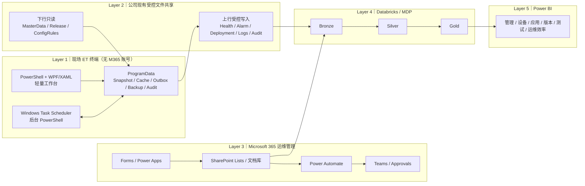
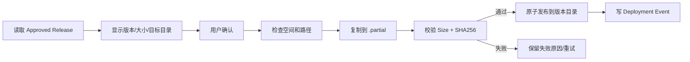
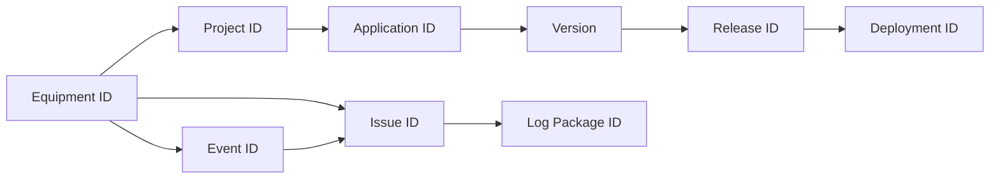
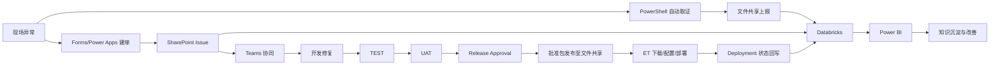

# 现场数字化运维最终方案
## PowerShell ET 工作台 + 文件共享 + Microsoft 365 + Databricks + Power BI

| 文档属性 | 内容 |
|---|---|
| 文档版本 | V1.0 |
| 文档状态 | 最终技术方案 / 开发基线 |
| 适用范围 | BJ Factory 现场 ET 终端及数字化运维平台 |
| 核心原则 | 不新增服务器；ET 无 Microsoft 365 账号；复用公司现有 SMB 文件共享和 Microsoft 平台 |

---

## 1. 项目背景

现场运维对象已覆盖生产设备及控制 PC、ET 客户端、接口工具、Power BI 报表、Databricks 作业、PowerShell/Python 工具、配置文件和日志数据。旧方案以 C#、WPF/MVVM、Windows Service、SQLite、Named Pipe 和潜在自建服务为主要实现方式，能够满足完整桌面软件工程需求，但对当前现场轻量自动化场景而言，开发、部署和后续维护链路较长。

新方案保留旧方案已经确认的业务能力：设备识别、工程加载、软件入口、软件下载、配置更新、Windows 健康检测、日志采集与上传、问题闭环、版本管理、TEST/UAT、发布与回退、数据分析和知识沉淀；同时将技术实现调整为：

- ET 端以 PowerShell 为主要开发语言；
- PowerShell + WPF/XAML 提供轻量图形界面；
- Windows Task Scheduler 承担后台自动任务；
- 公司现有 SMB/UNC 文件共享承担 ET 数据交换；
- Microsoft 365 面向人员承担业务管理、流程与协同；
- Databricks/MDP 承担数据汇聚、加工和治理；
- Power BI 承担管理驾驶舱与分析；
- 不新增 Web Server、API Server 或 Database Server。

---

## 2. 建设目标

建立一套“现场执行轻量化、设备交换标准化、业务流程平台化、数据分析集中化”的数字化运维体系：

1. 让 ET 自动识别设备、工程、应用与批准版本。
2. 为现场提供统一的软件入口、一键下载和受控配置能力。
3. 自动采集 Windows 健康、应用日志和现场证据。
4. 在网络中断时保留本地运行能力，并在恢复后自动重试。
5. 使用 Forms/Power Apps、SharePoint、Power Automate 和 Teams 建立问题、版本、测试、发布与协同闭环。
6. 通过统一主键贯通 ET 文件、SharePoint 台账、Databricks 数据表和 Power BI 报表。
7. 通过最小权限、完整性校验、审计和回退保护生产环境。
8. 最大化复用公司现有基础设施，不额外搭建服务器。

---

## 3. 范围与边界

### 3.1 方案包含

- ET 设备和工程身份识别；
- 工程软件入口和状态展示；
- 批准版本的软件包下载；
- 规则驱动的配置更新；
- CPU、内存、磁盘、网络、服务、进程及 Event Log 健康检测；
- 日志包和状态事件采集；
- 本地 Snapshot、Outbox、Backup 和 Audit；
- SMB 文件上行与下行；
- Forms/Power Apps 问题入口；
- SharePoint 主数据和事务台账；
- Power Automate 流程、通知和审批；
- Teams 协同；
- Databricks Bronze/Silver/Gold；
- Power BI 运维驾驶舱。

### 3.2 方案不包含

- ET Microsoft 365 用户账号；
- ET OneDrive 登录或同步；
- ET Microsoft Graph API 作为核心依赖；
- ET 直接连接 Databricks；
- ET HTTP/API Listener；
- 新建 Web/API/数据库服务器；
- 第一阶段自动结束或重启生产软件；
- 第一阶段自动重启 Windows；
- 未经批准的静默安装、强制覆盖或自动修复系统。

---

## 4. 设计原则

1. **ET 做执行**：本机识别、操作、取证、缓存和回写。
2. **文件共享做设备交换**：ET 不依赖 Microsoft 365 身份。
3. **Microsoft 365 做业务管理**：面向人员承载台账、流程、审批和协同。
4. **Databricks 做数据**：汇聚设备数据与业务数据，形成受治理的数据资产。
5. **Power BI 做洞察**：从 Gold 层和语义模型生成驾驶舱。
6. **离线优先**：文件共享中断时不影响本地入口和检测。
7. **One Event = One File**：避免多设备并发修改共享文件。
8. **下行只读，上行受控写入**：平台发布内容不可由 ET 修改。
9. **任务短生命周期、可重入、状态落盘**：避免长期无限循环脚本。
10. **生产保护优先**：默认不干预运行中的生产程序。

---

## 5. 最终总体架构



### 两条数据通道

```text
设备自动化通道：ET PowerShell → SMB 文件共享 → Databricks
人员业务通道：人员 → Forms/Power Apps → SharePoint → Databricks
统一分析通道：Databricks Gold → Power BI
```

---

# 6. Layer 1：ET PowerShell 工作台

## 6.1 技术结构

```text
ETWorkbench
├─ Start-ETWorkbench.ps1
├─ UI
│  ├─ MainWindow.xaml
│  ├─ SoftwarePage.xaml
│  ├─ ConfigPage.xaml
│  ├─ HealthPage.xaml
│  └─ SupportPage.xaml
├─ Modules
│  ├─ ET.Core.psm1
│  ├─ ET.Identity.psm1
│  ├─ ET.Project.psm1
│  ├─ ET.Software.psm1
│  ├─ ET.Config.psm1
│  ├─ ET.Health.psm1
│  ├─ ET.Log.psm1
│  ├─ ET.Transfer.psm1
│  └─ ET.Audit.psm1
├─ Tasks
│  ├─ Invoke-HealthMonitor.ps1
│  ├─ Sync-PlatformSnapshot.ps1
│  ├─ Publish-Outbox.ps1
│  ├─ Collect-SupportPackage.ps1
│  └─ Invoke-LocalMaintenance.ps1
└─ Config
   ├─ workstation.json
   ├─ health-rules.json
   └─ paths.json
```

## 6.2 GUI 与后台职责

| 功能 | GUI | 后台任务 |
|---|---:|---:|
| 设备、工程、版本状态展示 | ✓ | 生成状态快照 |
| 工程软件入口 | ✓ | - |
| 下载范围预览和确认 | ✓ | 复制、校验和发布 |
| 配置 Old/New 预览和确认 | ✓ | 备份、写入、验证、恢复 |
| 手工收集支持包 | ✓ | 日志采集、打包、入队 |
| CPU/内存/磁盘/网络检测 | 查看 | 周期采集 |
| 服务、进程和 Event Log 检测 | 查看 | 周期采集 |
| Outbox 上传和重试 | 查看状态 | 自动处理 |
| Snapshot 同步 | 查看版本 | 自动处理 |
| 告警展示和确认 | ✓ | 告警生成、去重和恢复 |

GUI 不直接处理长时间下载、配置写入和日志上传。GUI 向本地任务区写入带 RequestId 的命令文件，后台脚本处理后写回结果和状态。

## 6.3 本地目录

```text
C:\ProgramData\ETWorkbench\
├─ Config\
├─ Snapshot\
│  ├─ Equipment.json
│  ├─ Project.json
│  ├─ Application.json
│  ├─ Release.json
│  └─ ConfigRules.json
├─ Cache\
├─ Commands\
├─ Results\
├─ Outbox\
│  ├─ Health\
│  ├─ Alarm\
│  ├─ Deployment\
│  ├─ Logs\
│  └─ Audit\
├─ Packages\
├─ Backup\
├─ Logs\
├─ Audit\
└─ Temp\
```

数据格式优先采用 JSON、CSV、NDJSON、ZIP 和 Manifest。目录设置容量、保留和清理规则，磁盘空间不足时暂停新的下载和采集，不删除业务文件。

## 6.4 设备和工程识别

识别链：

```text
SN → 业务 IP → Equipment ID → Device ID → Project ID → Application → Approved Version
```

处理步骤：

1. 读取 BIOS/设备 Serial Number。
2. 识别活动业务网卡和业务 IP。
3. 读取最近一次已校验的 Equipment Snapshot。
4. 按 SN 查询唯一设备记录。
5. 校验 Allowed IP、Enabled、Project ID 和 Snapshot 版本。
6. 加载应用清单、启动规则、批准版本和配置规则。
7. 生成只读的 Device Context 供其他模块使用。

以下情况不得自动授权：SN 为空或重复、IP 不匹配、设备或工程停用、主数据关联缺失、Snapshot 校验失败或严重过期。

失败时保留本地软件入口、健康检测和日志采集；暂停新的下载、配置写入和未授权发布操作，不干预运行中的业务软件。

## 6.5 软件入口和状态模型

软件入口根据 Project/Application Snapshot 动态生成。每项显示：

- Application ID 和名称；
- Required / Optional；
- Target Version；
- Local Package Version；
- Executable 是否存在；
- Process 是否运行；
- Configuration 状态；
- Release ID 和 Snapshot 时间。

必须区分：

```text
Package Available
Downloaded
Deployed
Executable Found
Running
Configured
Effective
```

“已下载”不能显示为“已安装”或“已生效”。

## 6.6 一键下载



核心要求：

- 只允许批准的 Application/Version/Release；
- 目标目录必须属于批准根路径；
- 不覆盖运行目录；
- 不完整包不可使用；
- 单项失败不能显示整体成功；
- 网络中断时暂停并进入重试；
- Download 不等于 Install/Deploy。

## 6.7 一键配置

配置只能引用已批准 Rule ID，不允许 GUI 直接传递任意路径或命令。

```text
读取规则 → 复核设备/工程/版本 → 路径白名单 → 读取并计算摘要
→ 显示 Old/New → 用户确认 → 备份 → 生成临时文件
→ 语法和值校验 → 原文件冲突复核 → 单文件 Replace
→ 重新读取验证 → Audit → 成功或恢复
```

格式策略：

| 格式 | 处理方法 |
|---|---|
| JSON | 字段路径解析、类型和值校验 |
| XML | 节点/属性定位，处理命名空间 |
| INI | Section/Key 更新 |
| CSV | 结构化读取和写入 |
| 自定义文本 | 每个应用单独开发和测试 Adapter |

禁止整文件无边界字符串替换。运行中不能安全更新的软件标记为 `Pending Maintenance`，不得强制结束进程或解除文件锁。

## 6.8 Windows 健康检测

检测范围：

- CPU 持续高占用；
- 可用内存；
- 业务盘、缓存盘和下载盘空间；
- 业务网卡和文件共享连通性；
- 指定 Windows Service；
- 指定应用进程；
- System/Application 或指定 Event Log；
- ET 工作台任务和 Outbox 状态。

告警模型：

```text
Collect → Evaluate → Duration → Debounce → Deduplicate → Alarm → Recovery
```

阈值、持续时间、恢复条件和冷却时间配置化。无权限或无法取数时为 `Unknown`，不直接判断故障。默认仅检测和提示，不自动执行系统修复、服务重启或进程终止。

## 6.9 日志与支持包

文件命名：

```text
{IssueId}_{EquipmentId}_{ApplicationId}_{Version}_{yyyyMMdd_HHmmss}.zip
```

若尚无 Issue ID，可先使用 Event ID，并在平台建单后建立关联。

包内建议：

```text
manifest.json
health.json
system-info.json
application-logs\
eventlog.json / eventlog.evtx
config-summary.redacted.json
checksums.sha256
```

Manifest 示例：

```json
{
  "packageId": "LOG-2026-000001",
  "eventId": "EVT-K106-20260921-000001",
  "issueId": "INC-2026-000123",
  "equipmentId": "K106",
  "projectId": "PRJ001",
  "applicationId": "APP001",
  "version": "1.2.5",
  "releaseId": "REL-2026-0010",
  "eventTime": "2026-09-21T14:15:00+08:00",
  "collectionTime": "2026-09-21T14:20:00+08:00",
  "collectorVersion": "1.0.0",
  "files": []
}
```

采集范围必须白名单化并限制时间窗口，配置摘要和日志内容应按企业规则脱敏。

## 6.10 Outbox、离线与重试

Outbox 记录：

```text
EventId, EventType, EquipmentId, IssueId, ApplicationId,
Version, ReleaseId, CreatedTime, RetryCount, NextRetry,
Checksum, LocalPath, Status, LastError
```

网络或共享不可用时事件保留本地。重试采用间隔递增和随机抖动，并设置最大自动重试次数；超过上限转人工检查。上传成功以目标文件存在、长度/Hash 符合和 EventId 可识别为准。

## 6.11 工作台自身更新

```text
ETWorkbench\
├─ 1.0.0\
├─ 1.1.0\
└─ Current.json
```

更新步骤：下载已批准包、校验 Manifest/Hash、备份当前版本、切换 Current 指针、运行 Smoke Test；失败时恢复旧版本。更新不自动重启生产程序或 Windows。

## 6.12 审计

关键记录包含：

- Who / Windows Identity；
- When；
- Equipment ID；
- Application ID；
- Version / Release ID；
- Operation；
- Rule ID；
- Old/New 摘要；
- File Hash；
- Result / Error；
- Request ID / Correlation ID。

---

# 7. Layer 2：公司受控 SMB 文件共享

## 7.1 定位

文件共享是 ET 与企业平台之间的受控交换层，不是业务数据库。ET 通过 Windows 身份和 UNC 路径访问，不依赖 O365 账号。

## 7.2 目录结构

```text
\\CompanyShare\ETOperation\
├─ MasterData\
│  ├─ Equipment.json
│  ├─ Project.json
│  ├─ Application.json
│  └─ snapshot-manifest.json
├─ Release\
│  └─ {ApplicationId}\{Version}\
│     ├─ manifest.json
│     ├─ package.zip
│     ├─ checksums.sha256
│     └─ release-notes.json
├─ ConfigRules\
│  ├─ rules.json
│  └─ rule-manifest.json
├─ Upload\
│  └─ {EquipmentId}\{yyyy}\{MM}\{dd}\
│     ├─ Health\
│     ├─ Alarm\
│     ├─ Deployment\
│     ├─ Logs\
│     └─ Audit\
└─ Archive\
```

## 7.3 权限边界

| 目录 | ET Read | ET Create/Write | Rename | Modify/Delete | 原则 |
|---|---:|---:|---:|---:|---|
| MasterData | ✓ | × | × | × | 下行只读 |
| Release | ✓ | × | × | × | 下行只读 |
| ConfigRules | ✓ | × | × | × | 下行只读 |
| Upload\{EquipmentId} | 读取自身 | ✓ | ✓ | 受限/尽量禁止删除 | 上行受控写入 |
| Archive | 原则上无 | × | × | × | 平台内部处理 |

共享权限和 NTFS 权限必须同时满足最小权限。ET 不得修改发布包、Manifest、Hash、主数据或配置规则，也不应读取或修改其他设备目录。

## 7.4 文件契约

### One Event = One File

禁止多台 ET 并发修改公共 `Status.csv` 或 Excel。每次 Health、Alarm、Deployment、Audit 生成独立事件文件，Log Package 生成独立 ZIP。

### 原子发布

```text
生成 file.tmp → 写入完成 → Size/Hash 校验 → Rename 为 file.ready
```

平台 ingestion 只处理 `.ready` 文件。失败的 `.tmp` 不进入处理链。

### 幂等

每个事件携带全局唯一 Event ID：

```text
EVT-{EquipmentId}-{yyyyMMdd}-{SequenceOrGuid}
```

Databricks Bronze/Silver 以 Event ID 去重。重复上传不得重复入库、重复告警或重复生成部署记录。

## 7.5 上下行数据

**平台 → ET：** Equipment、Project、Application、Approved Release、Config Rule、Software Package。

**ET → 平台：** Health、Alarm、Deployment Status、Log Package、Audit Event。

## 7.6 归档

ET 只负责产生和提交文件。已处理文件的归档、保留、清理和隔离由文件平台/Data Platform 侧负责，具体周期、容量和责任以 IT 确认为准。

---

# 8. Layer 3：Microsoft 365 运维管理平台

## 8.1 组件职责

| 组件 | 主要职责 | 边界 |
|---|---|---|
| Microsoft Forms | 快速问题与测试反馈 | 不用于 ET 自动上传 |
| Power Apps | 正式运维入口、查询和状态维护 | 许可和连接器需 IT 确认 |
| SharePoint Lists | 主数据、问题、版本、测试、发布、部署台账 | 不保存大量原始日志 |
| SharePoint 文档库 | 图片、测试证据、发布资料、手册 | ET 原始日志首选走文件共享/数据平台 |
| Power Automate | 编号、分派、通知、审批、催办、关闭 | 不是高频设备流式引擎 |
| Teams | 通知、讨论、审批和回链 | 关键结论必须回写台账 |

## 8.2 SharePoint Lists

建议核心清单：

```text
EquipmentRegistry
ProjectRegistry
ApplicationRegistry
IssueRegister
IssueHistory
VersionRegistry
ReleaseRegister
TestCase
TestExecution
DeploymentRegister
LogPackageRegister
KnowledgeBase
SLAConfig
```

## 8.3 文档库

```text
IssueEvidence
TestEvidence
ReleaseDocuments
UserManuals
Runbooks
KnowledgeDocuments
```

List 保存结构化数据和文件链接；文档库保存文件证据；大量设备原始日志进入文件共享和 Databricks，不进入 List。

## 8.4 问题受理流程


Teams 不是唯一正式记录。负责人、状态、版本、测试结果、发布和关闭结论必须回写 SharePoint。

---

# 9. 统一数据模型与主键

## 9.1 主键

```text
Equipment ID
Project ID
Application ID
Issue ID
Version
Release ID
Deployment ID
Log Package ID
Event ID
```

## 9.2 关系



这些 ID 必须出现在相关文件名、Manifest、SharePoint Lookup、Power Automate 事件、Databricks 表和 Power BI 语义模型中。不得以设备名称、人员姓名或路径替代唯一主键。

---

# 10. 问题、版本、测试、发布、部署和回退

## 10.1 端到端闭环



## 10.2 环境

```text
DEV → TEST → UAT → PROD
```

PROD 仅允许 Approved Version。测试通过不自动等同于生产发布批准。

## 10.3 发布门禁

进入 PROD 前至少确认：

- Version 唯一；
- 源代码/脚本版本可追溯；
- 发布包 Manifest 和 SHA256；
- 测试范围、结果和证据；
- UAT 结论；
- 已知问题和影响范围；
- Rollback Version 和回退步骤；
- 发布审批；
- 发布后 Smoke Test。

## 10.4 回退

回退必须由 Release ID 指向明确的 Rollback Version、包和配置规则。执行前检查当前版本、备份现状和校验回退包；执行后验证并写回 Deployment 状态。若运行中的生产程序不能安全替换，则等待维护窗口，不强制结束程序。

---

# 11. Layer 4：Databricks / MDP 数据架构

## 11.1 输入通道

```text
ET / SMB：Health、Alarm、Deployment、Logs、Audit
Microsoft 365 / SharePoint：Equipment、Application、Issue、Version、Release、Test、SLA
```

ET 不保存 Databricks Token，也不直接调用 Databricks API。

## 11.2 Bronze

保存原始或近原始数据：

- ET 事件文件；
- 日志包元数据；
- Deployment 状态；
- MasterData Snapshot；
- SharePoint 业务表快照/增量；
- 来源路径、摄入时间、文件 Hash、Event ID。

## 11.3 Silver

执行：

- Schema 校验；
- Event ID 去重；
- 时间标准化；
- 状态标准化；
- Equipment/Application/Version/Release/Issue 关联；
- 异常记录隔离；
- 数据质量检查；
- 敏感字段处理。

## 11.4 Gold

形成面向分析的主题模型：

- Equipment Health；
- Application Health；
- Issue KPI；
- SLA；
- Version Quality；
- Release Quality；
- Deployment Coverage；
- Test Quality；
- MTTA / MTTR；
- Repeat Failure；
- Alarm Trend。

Unity Catalog 负责目录、访问控制和审计，具体 Catalog/Schema/Volume 权限依照企业 MDP 标准确认。

---

# 12. Layer 5：Power BI

Power BI 消费 Databricks Gold 和语义模型，建议页面：

1. **Management Overview**：Open Issue、严重度、SLA、MTTA、MTTR、发布、回退、部署覆盖。
2. **Equipment**：健康状态、可用性、告警趋势、重复故障、设备排行。
3. **Application**：当前版本、应用健康、接口异常、事件趋势、部署覆盖。
4. **Version**：生产版本分布、版本缺陷、发布质量、回退情况。
5. **Test**：执行进度、Pass/Fail/Blocked、Regression、UAT。
6. **Operation**：Issue Aging、响应和处理时长、重开率、重复问题率。

报表应支持从管理总览下钻至 Equipment、Application、Version、Issue、Deployment 和 Log Package。

---

# 13. 安全、权限和生产保护

## 13.1 PowerShell 安全

- 企业 Execution Policy；
- 生产脚本签名和 Trusted Publisher（如公司要求）；
- Script/Module/Manifest Hash；
- 代码仓库、版本、测试和批准发布；
- 不在 `.ps1/.psm1/.json/.xml/.ini` 中硬编码密码、Token 或 Client Secret；
- GUI 只提交 ID，后台根据受控规则解析路径和动作。

## 13.2 身份与权限

- 设备权限：设备允许访问哪些工程、应用和版本；
- 人员权限：当前用户允许查看、下载、配置、测试、审批或管理什么；
- 设备校验通过不代表人员获得管理员权限；
- Task Scheduler 身份只拥有 ProgramData 和指定 SMB 目录所需权限。

## 13.3 生产保护

默认禁止：

- Kill/Restart 生产软件；
- Restart Windows；
- 强制解除文件锁；
- 覆盖运行中的程序；
- 修改未经批准的配置；
- 自动删除旧版本或业务文件；
- 在无维护窗口和回退方案时执行高风险变更。

## 13.4 长期运行

任务采用短生命周期并在每次执行结束后退出：

```text
Task Trigger → Acquire Lock → Load State → Execute → Save State → Release Lock → Exit
```

必须处理互斥锁、超时、崩溃、PC 重启、网络中断、磁盘不足、日志轮转、缓存上限和失败转人工。

---

# 14. IT 权限与接口确认

详细清单使用配套文件《ET数字化运维_IT权限与接口确认清单.xlsx》，共 28 项，分为：

- 文件共享及网络：IT-01～IT-07；
- ET Endpoint：IT-08～IT-13；
- SharePoint/Forms/Power Automate/Teams：IT-14～IT-21；
- Databricks/MDP：IT-22～IT-25；
- Power BI：IT-26～IT-28。

首次评审优先确认：

1. ET 当前访问 SMB 使用的 Windows 身份。
2. 是否可建立 MasterData、Release、ConfigRules、Upload 专用目录。
3. 是否可实现下行只读、上行受控写入和设备隔离。
4. Task Scheduler 在用户未登录时能否访问 UNC 共享。
5. PowerShell Execution Policy、脚本签名和证书要求。
6. 是否允许建立 SharePoint、Forms、Power Automate、Teams 运维空间和连接器。
7. 现有 MDP/Databricks 如何读取 ET 文件共享或批准 Landing Zone。
8. Databricks 是否已有 SharePoint 接入、认证、增量和环境隔离标准。

当前 ET 不需要 Graph API、OneDrive、M365 账号、Databricks Token 或 ET 服务端口。

---

# 15. MVP 与实施阶段

## Phase 1：ET 基础与 Issue 闭环

- PowerShell 模块和轻量 GUI；
- 设备/工程识别；
- 软件入口；
- 健康检测；
- 日志包；
- Snapshot/Outbox；
- SMB 上下行目录；
- Equipment/Application/Issue 三个核心 List；
- Forms 建单和 Teams 通知。

## Phase 2：版本、测试和发布

- Version Registry；
- Test Case/Test Execution；
- TEST/UAT；
- Release Approval；
- 批准版本下发；
- ET 一键下载；
- 配置规则；
- Deployment 状态；
- 回退演练。

## Phase 3：数据与驾驶舱

- 文件共享 ingestion；
- SharePoint ingestion；
- Bronze/Silver/Gold；
- 数据质量和 Unity Catalog；
- Power BI 六类页面。

## Phase 4：知识与智能运维

- Knowledge Base；
- 相似问题；
- 日志模式分析；
- 根因候选；
- 智能检索与总结。

---

# 16. MVP 验收标准

1. 已登记设备能正确识别 Equipment ID 和 Project ID。
2. 未登记、重复 SN、IP 不匹配不误授权。
3. 不同工程加载正确的应用清单和批准版本。
4. ET 在文件共享不可用时保留本地入口和健康检测。
5. Outbox 在共享恢复后可重试，重复事件不重复入库。
6. 下行目录只读，上行目录受控写入。
7. 下载包完成 Size 和 SHA256 校验。
8. 下载状态不被误判为部署或生效。
9. 配置修改只作用于批准路径和字段。
10. 配置修改具备预览、备份、校验、审计和恢复。
11. 运行中的生产程序不被强制结束或覆盖。
12. 日志包包含 Manifest、设备、应用、版本、时间和 Hash。
13. Issue、Version、Release、Deployment 和 Log Package 可按统一主键追溯。
14. Forms 能建单、SharePoint 能留痕、Teams 能通知。
15. Databricks 可分别摄入设备文件和业务台账，并按 Event ID 去重。
16. Power BI 可从 Gold 展示基础问题、设备、版本和运维指标。
17. 普通用户不能通过 GUI 或本地命令文件执行任意路径写入。

---

# 17. 主要风险与控制

| 风险 | 控制措施 |
|---|---|
| PowerShell GUI 复杂度扩大 | GUI 仅承担入口、展示、预览和确认；业务逻辑模块化 |
| Task Scheduler 弱于常驻服务 | 短任务、可重入、锁、超时、状态落盘、失败重试 |
| 文件共享暂时不可用 | Snapshot、Outbox、网络恢复重试、人工诊断入口 |
| 多设备并发写共享文件 | One Event = One File，不共同修改公共 Excel/CSV |
| 文件尚未写完即被读取 | `.tmp → .ready` 原子发布，平台只处理 ready 文件 |
| 重复上传或重复处理 | Event ID 和 Idempotency Key 去重 |
| ET 修改平台发布数据 | MasterData/Release/ConfigRules 下行只读 |
| 脚本或发布包被篡改 | 代码签名、Manifest、SHA256、受控目录、审计 |
| 配置变更影响生产 | 规则白名单、预览、备份、验证、维护窗口、回退 |
| 日志含敏感信息 | 白名单、时间窗口、脱敏、权限和保留策略 |
| SharePoint 数据量增加 | Lists 仅做轻量台账；文件和分析数据进入文档库/Databricks |
| Databricks 接入延迟 | ET + SMB + M365 业务闭环可先独立运行 |

---

# 18. 新旧方案对比

| 项目 | 旧方案 | 最终方案 |
|---|---|---|
| ET 主开发语言 | C# | PowerShell |
| GUI | WPF/MVVM | PowerShell + WPF/XAML |
| 后台 | Windows Service | Windows Task Scheduler + 短任务 |
| 本地状态 | SQLite | JSON/CSV/NDJSON |
| 本机通信 | Named Pipe | 本地命令/状态文件契约 |
| ET 数据交换 | SMB，可扩展 API | 公司现有 SMB/UNC 为主通道 |
| ET O365 账号 | 未明确 | 不需要 |
| OneDrive/Graph | 可选或潜在依赖 | 不作为核心依赖 |
| 主数据与台账 | Excel/自研可能 | SharePoint Lists + 发布快照 |
| 流程与协同 | 部分自研/M365 | Power Automate + Teams |
| 日志与分析 | Databricks | Databricks Bronze/Silver/Gold |
| 驾驶舱 | Power BI | Power BI |
| 新增服务器 | 可能需要 | 不新增 |

---

# 19. 最终结论

最终架构为：

```text
PowerShell ET Workbench
+ Windows Task Scheduler
+ ProgramData Snapshot / Outbox / Backup / Audit
+ 公司现有 SMB/UNC 文件共享
+ Forms / Power Apps / SharePoint / Power Automate / Teams
+ Databricks Bronze / Silver / Gold + Unity Catalog
+ Power BI
```

核心职责：

> **PowerShell 做现场执行。**  
> **文件共享做设备交换。**  
> **Microsoft 365 做业务管理。**  
> **Databricks 做数据汇聚。**  
> **Power BI 做分析洞察。**

方案不要求 ET 具备 Microsoft 365 账号，不依赖 OneDrive 或 Graph，不新增服务器，不开放 ET 服务端口；同时保留设备识别、软件下载、配置、健康检测、日志取证、问题闭环、版本、测试、发布、回退、数据分析和审计等完整能力。
