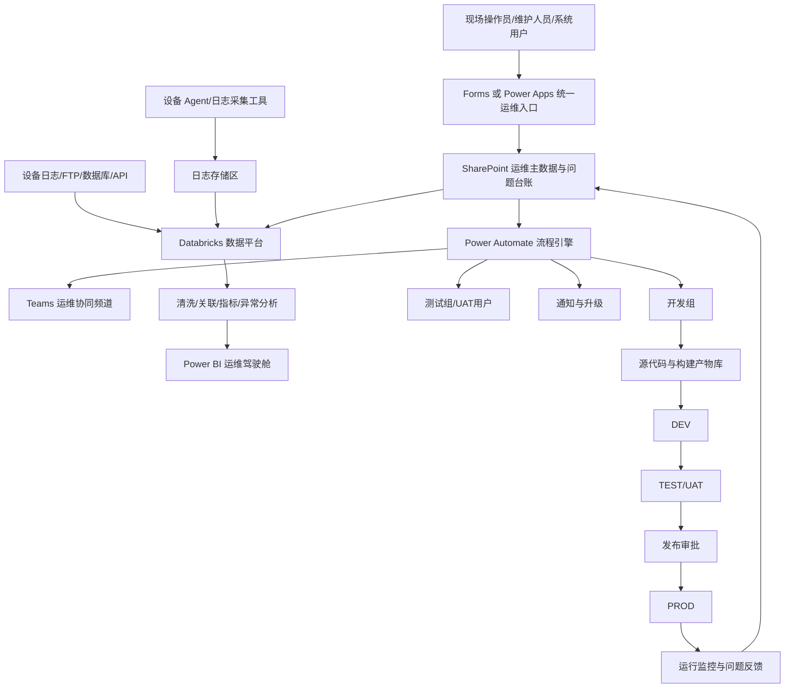
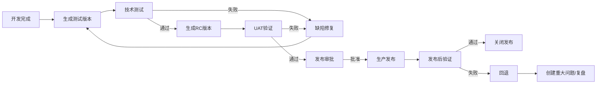
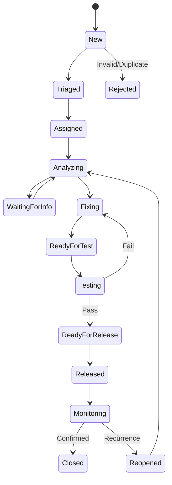

# 现场设备与系统运维数字化平台开发参考方案

> 文档定位：用于 BJ 工厂现场设备运维、业务系统运维、软件版本管理、测试管理、问题反馈、日志采集和数据分析平台的需求讨论、架构设计与开发实施参考。  
> 建议版本：V0.1  
> 文档状态：方案设计稿  
> 建设原则：统一入口、数据贯通、流程闭环、版本可追溯、生产可回退、权限可控制、过程可量化。

---

## 1. 项目概述

### 1.1 建设背景

随着现场数字化系统逐步增加，运维对象已经从单一设备扩展到设备、工控电脑、接口程序、Power BI 报表、Power Apps、Power Automate、Databricks 作业、Python/PowerShell 工具以及 MES/FTCS 等业务系统。

目前常见问题包括：

- 设备异常、系统问题、软件缺陷和改善需求分散在邮件、Teams 消息、Excel 和口头沟通中。
- 问题反馈信息不完整，开发人员难以确认设备号、发生时间、运行环境和软件版本。
- 设备日志依赖现场人员手工查找，日志与问题单无法自动关联。
- 测试版、候选发布版和正式版边界不清晰，存在错误版本进入生产环境的风险。
- 软件发布记录、变更内容、测试结果和回退版本缺少统一管理。
- 同类故障重复发生，但解决方法未形成可检索的知识库。
- 运维 KPI 依赖人工汇总，缺少系统级、版本级和设备级分析。

### 1.2 建设目标

建立一套覆盖“现场发现、自动取证、问题受理、开发修复、测试验证、版本发布、生产监控、知识沉淀”的统一数字化运维平台。

核心目标：

1. 建立标准化的问题反馈通道。
2. 自动关联设备、系统、环境和软件版本。
3. 自动或半自动采集设备日志、系统日志和现场图片。
4. 建立 DEV、TEST/UAT、PROD 环境隔离和发布门禁。
5. 管理测试用例、测试执行、缺陷修复和回归测试。
6. 建立软件版本、发布包、变更记录和回退记录。
7. 通过 Power Automate 与 Teams 建立运维和开发协同通道。
8. 通过 Databricks 完成海量日志、设备数据和历史事件的加工分析。
9. 通过 Power BI 建立设备、系统、项目、版本和运维效率驾驶舱。
10. 逐步形成可供 Copilot 检索和辅助分析的运维知识库。

---

## 2. 建设范围

### 2.1 运维对象

- 生产设备及设备控制电脑
- 设备客户端、Agent、扫码及辅助工具
- MES、FTCS、OHS、MPC 等业务或接口系统
- Power BI 报表与语义模型
- Power Apps 应用
- Power Automate 云端流程与桌面流程
- Microsoft Forms 表单
- Databricks Notebook、Job、Pipeline 和数据表
- Python、PowerShell、Windows Service 等自研程序
- 数据接口、文件交换、FTP/SFTP 任务和 API

### 2.2 管理对象

- 事件 Incident
- 软件缺陷 Bug
- 服务请求 Service Request
- 改善需求 Enhancement
- 测试任务 Test Request
- 测试用例 Test Case
- 软件版本 Version
- 发布记录 Release
- 变更记录 Change
- 日志包 Log Package
- 现场附件 Evidence
- 知识条目 Knowledge Article

---

## 3. 总体方案架构



### 3.1 工具定位

| 工具 | 主要定位 | 建议承载内容 |
|---|---|---|
| Microsoft Forms | 轻量反馈入口 | 问题报告、测试反馈、满意度、改善建议 |
| Power Apps | 专业运维门户 | 问题查询、状态更新、版本选择、测试执行、移动端处理 |
| SharePoint Lists | 轻量业务数据层 | 问题、版本、发布、测试、设备、系统、知识台账 |
| SharePoint 文档库 | 附件与发布资料 | 图片、日志包、测试报告、发布包、用户手册 |
| Power Automate | 流程与通知引擎 | 创建编号、分派、审批、催办、升级、关闭通知 |
| Microsoft Teams | 人员协同通道 | 运维频道、开发协作、自动通知、问题讨论 |
| Databricks | 数据加工与分析平台 | 大规模日志、设备历史、ETL、异常模式、数据质量 |
| Power BI | 管理驾驶舱 | SLA、MTTR、缺陷趋势、版本质量、测试通过率 |
| GitHub/GitLab/Azure DevOps | 源代码与版本控制 | 分支、代码评审、Tag、构建产物、发布说明 |

> 说明：SharePoint List 适合流程台账和相对轻量的数据；大量原始日志不建议直接存入 List，应放入文档库、数据湖或规定的日志存储位置，并在问题单中保存关联 ID 或链接。

---

## 4. 角色与职责

| 角色 | 主要职责 |
|---|---|
| 现场用户 | 提交问题、提供图片、确认问题是否恢复 |
| 运维受理人 | 信息完整性检查、影响判断、分类和初步诊断 |
| 设备维护人员 | 检查设备状态、采集日志、实施现场恢复措施 |
| 软件开发人员 | 缺陷分析、代码修复、生成测试版本、维护变更说明 |
| 测试人员 | 执行测试用例、记录结果、提交缺陷、执行回归测试 |
| 业务/UAT 代表 | 确认业务结果和生产适用性 |
| 发布负责人 | 核对发布条件、执行发布、监控结果、组织回退 |
| 系统管理员 | 权限、配置、环境、备份和审计管理 |
| 平台负责人 | 主数据、流程规则、KPI、治理规范和平台持续改善 |

### 4.1 RACI 建议

- 问题分类：运维负责，开发和现场协助。
- 缺陷修复：开发负责，运维提供现场复现条件。
- 测试结论：测试负责，开发不得自行代替最终 UAT 结论。
- 生产发布：发布负责人负责，开发提供发布包和说明。
- 关闭确认：现场用户或业务代表确认，运维执行关闭。
- 紧急回退：发布负责人组织，运维和开发共同执行。

---

## 5. 统一沟通通道设计

### 5.1 推荐通道

建议以“结构化问题单”为唯一正式记录，以 Teams 作为沟通和通知界面：

```text
Forms/Power Apps 提交
        ↓
SharePoint 生成唯一 Issue ID
        ↓
Power Automate 推送 Teams 卡片
        ↓
运维、开发、测试围绕同一个 Issue ID 沟通
        ↓
处理状态、附件、版本和结论回写问题单
```

邮件仅作为外部或正式通知补充，不作为问题状态和技术结论的唯一保存位置。

### 5.2 Teams 结构建议

团队：`Digital Solution Operation Center`

建议频道：

- `00-公告与发布`
- `01-新问题受理`
- `02-设备与客户端`
- `03-Power Platform`
- `04-Databricks与数据`
- `05-MES与接口`
- `06-测试与UAT`
- `07-重大问题War Room`
- `08-知识库与复盘`

### 5.3 Teams 自动通知内容

每条通知建议包含：

```text
Issue ID：INC-2026-000123
系统/项目：Equipment Workstation
设备号：K106
环境：PROD
检测版本：V1.2.5
问题类型：设备通信异常
严重度：High
发生时间：2026-09-17 09:15
当前状态：New
负责人：待分派
图片：已上传
日志包：LOG-20260917-K106-001
问题单：链接
```

沟通规则：

- 所有讨论必须引用 Issue ID。
- Teams 中的重要结论必须回写问题单。
- 不允许只在私聊中完成问题处理而不更新状态。
- 发布、回退、风险接受必须形成记录。

---

## 6. 问题反馈入口设计

### 6.1 入口选择

- Forms：适合快速上线、扫码反馈和普通用户提交。
- Power Apps：适合需要动态字段、主数据联动、版本自动带出、角色权限和复杂查询的正式平台。
- 系统内嵌“反馈问题”按钮：适合自动带出系统名、环境、版本和用户信息。
- 设备桌面“收集日志并反馈”工具：适合自动采集现场日志和设备上下文。

### 6.2 问题单核心字段

#### 身份与范围

| 字段 | 类型 | 是否必填 | 说明 |
|---|---|---:|---|
| Issue ID | 自动编号 | 是 | 全局唯一编号 |
| 标题 | 单行文本 | 是 | 简短描述问题 |
| 系统/项目 | 主数据选择 | 是 | 关联 Application Registry |
| 模块 | 选择/关联 | 否 | 报表、接口、扫码、日志、权限等 |
| 环境 | 选择 | 是 | DEV、TEST、UAT、PROD |
| 设备号 | 主数据选择 | 条件必填 | 现场设备相关问题必填 |
| 生产线/区域 | 自动带出或选择 | 否 | 来自设备台账 |
| 软件版本 | 关联选择 | 是 | 优先自动读取 |
| 客户端版本 | 文本/自动读取 | 否 | 设备端程序版本 |
| 数据/Pipeline 版本 | 文本 | 否 | Databricks 作业或数据模型版本 |

#### 问题描述

| 字段 | 类型 | 是否必填 | 说明 |
|---|---|---:|---|
| 问题类型 | 选择 | 是 | Incident、Bug、Request、Enhancement |
| 分类 | 选择 | 是 | 功能、数据、性能、通信、权限、界面等 |
| 严重度 | 选择 | 是 | Critical、High、Medium、Low |
| 发生时间 | 日期时间 | 是 | 必须支持准确时间 |
| 影响范围 | 多行文本 | 是 | 设备、LOT、生产、人员、报表等 |
| 操作步骤 | 多行文本 | 是 | 如何到达问题状态 |
| 实际结果 | 多行文本 | 是 | 当前出现的结果 |
| 期望结果 | 多行文本 | 是 | 正确结果应是什么 |
| 是否可复现 | 选择 | 是 | Always、Intermittent、Once、Unknown |
| 临时措施 | 多行文本 | 否 | 已采取的恢复措施 |

#### 证据与关联

| 字段 | 类型 | 是否必填 | 说明 |
|---|---|---:|---|
| 现场图片 | 附件 | 推荐 | 设备、报警、系统界面 |
| 屏幕截图 | 附件 | 推荐 | 错误信息和页面状态 |
| 日志包 ID | 文本/关联 | 条件必填 | 与日志清单关联 |
| 日志链接 | 超链接 | 否 | 指向受控存储位置 |
| 关联 LOT/批次 | 文本 | 否 | 用于生产影响分析 |
| 关联问题 | Lookup | 否 | 重复、父子或相关问题 |
| 关联版本 | Lookup | 是 | 指向版本注册表 |
| 关联发布 | Lookup | 否 | 判断是否由某次发布引起 |

### 6.3 严重度定义建议

| 等级 | 建议定义 | 处理策略 |
|---|---|---|
| Critical | 生产停止、关键系统不可用、数据完整性或安全风险 | 立即通知，建立 War Room，优先恢复 |
| High | 主要功能不可用或明显影响生产效率，但存在临时措施 | 高优先级分析和修复 |
| Medium | 局部功能异常，对生产影响可控 | 纳入正常修复排期 |
| Low | 轻微缺陷、显示问题、使用体验或改善建议 | 评估后进入版本计划 |

---

## 7. 日志与现场证据获取设计

### 7.1 核心原则

- 用户尽量不手工寻找日志路径。
- 日志采集必须与 Issue ID、设备号、版本和时间窗口关联。
- 默认采集最小必要范围，避免无边界复制生产数据。
- 原始日志只读保存，分析副本与原始文件分离。
- 日志访问需遵循最小权限和保留策略。

### 7.2 日志采集工具建议

开发一个设备端 `Collect Support Package` 工具或后台 Agent，支持：

1. 读取设备号、主机名、IP、Windows 用户和时间。
2. 读取当前应用名称、安装路径、文件版本、配置版本。
3. 选择采集时间范围，例如问题发生前后指定窗口。
4. 采集应用日志、Windows Event Log、服务状态和必要配置摘要。
5. 采集 CPU、内存、磁盘、网络及关键进程状态。
6. 允许用户补充截图或现场照片。
7. 将文件打包并计算 Hash。
8. 上传到受控文档库或日志存储区。
9. 返回 Log Package ID，并自动写入问题单。

### 7.3 日志包命名建议

```text
{IssueID}_{EquipmentID}_{Application}_{Version}_{yyyyMMdd_HHmmss}.zip
```

示例：

```text
INC-2026-000123_K106_ScannerTool_V1.2.5_20260917_092000.zip
```

### 7.4 Manifest 清单

每个日志包建议包含 `manifest.json`：

```json
{
  "issueId": "INC-2026-000123",
  "equipmentId": "K106",
  "hostName": "BJ-K106-PC",
  "application": "ScannerTool",
  "applicationVersion": "1.2.5",
  "environment": "PROD",
  "collectionTime": "2026-09-17T09:20:00+08:00",
  "eventTime": "2026-09-17T09:15:00+08:00",
  "collectorVersion": "1.0.0",
  "files": [
    {
      "name": "application.log",
      "sha256": "<hash>"
    }
  ]
}
```

### 7.5 现场图片管理

图片应保存：

- Issue ID
- 设备号
- 拍摄时间
- 上传人
- 图片类型
- 原始文件名
- 说明

建议图片类型：设备全景、控制面板、报警画面、软件界面、硬件连接、处理前、处理后。

---

## 8. 软件版本管理

### 8.1 版本状态

```text
Draft
  ↓
Development Build
  ↓
Test Build
  ↓
Release Candidate
  ↓
Approved
  ↓
Production
  ↓
Retired / Rolled Back
```

### 8.2 版本号规则

建议采用语义化版本：

```text
Major.Minor.Patch.Build
```

示例：`2.3.1.104`

- Major：重大架构变化或不兼容变更。
- Minor：新增向后兼容的功能。
- Patch：缺陷修复。
- Build：自动构建编号。

测试版示例：

```text
2.3.1-test.104
2.3.1-rc.1
2.3.1
```

### 8.3 Version Registry 字段

| 字段 | 说明 |
|---|---|
| Application ID | 应用唯一编号 |
| Version | 完整版本号 |
| Version Type | Test、RC、Production、Hotfix |
| Environment | DEV、TEST、UAT、PROD |
| Source Tag/Commit | 代码 Tag 或 Commit ID |
| Build ID | 构建编号 |
| Package Location | 发布包受控路径 |
| Release Notes | 变更内容 |
| Related Issues | 本版本修复或实现的问题 |
| Test Result | Not Tested、Passed、Failed、Blocked |
| Approval Status | Pending、Approved、Rejected |
| Rollback Version | 对应可回退版本 |
| Release Date | 正式发布日期 |
| Owner | 版本负责人 |
| Status | 当前状态 |

### 8.4 版本自动识别

问题入口应优先通过以下方式自动获得版本：

- 应用“关于”页面或状态 API。
- 安装目录中的版本文件。
- Windows 文件属性或程序集版本。
- Agent 定期上报。
- Databricks Job 参数、Git Tag 或部署元数据。
- Power BI 报表页面显示发布版本或从版本表读取。

如果无法自动识别，用户可手工选择，但必须标记 `VersionSource = Manual`。

---

## 9. 环境与发布通道

### 9.1 环境定义

| 环境 | 用途 | 建议限制 |
|---|---|---|
| DEV | 开发和单元测试 | 可快速迭代，不连接正式生产写入接口 |
| TEST | 集成测试和技术验证 | 使用测试数据或受控数据副本 |
| UAT | 业务验收 | 由业务代表验证真实业务场景 |
| PROD | 正式生产 | 仅允许批准版本，强制审计和回退准备 |

### 9.2 发布门禁

进入 PROD 前至少检查：

- 版本号唯一。
- 代码已进入受控分支并完成评审。
- 构建产物可追溯到 Tag/Commit。
- 测试范围、结果和证据完整。
- 已知问题和限制已记录。
- 数据库、接口和配置变更已评估。
- 备份和回退方案可执行。
- 发布窗口和影响范围已确认。
- 发布后验证用例已准备。
- 审批完成。

### 9.3 发布流程



### 9.4 紧急修复 Hotfix

Hotfix 不能绕过审计，只能压缩流程：

1. 明确生产影响和临时措施。
2. 从当前生产版本建立修复分支。
3. 执行针对性测试和关键回归测试。
4. 明确审批人和风险接受人。
5. 备份当前生产版本。
6. 发布后立即验证。
7. 失败时执行预定义回退。
8. 事后补齐完整测试和复盘记录。

---

## 10. 测试管理

### 10.1 测试类型

- 单元测试
- 接口测试
- 集成测试
- 设备联机测试
- 数据正确性测试
- 权限测试
- 性能测试
- 异常恢复测试
- 断线重连测试
- 回归测试
- UAT
- 发布后 Smoke Test

### 10.2 Test Case 字段

| 字段 | 说明 |
|---|---|
| Test Case ID | 唯一编号 |
| Application | 对应系统 |
| Module | 模块 |
| Version | 被测版本 |
| Environment | 测试环境 |
| Preconditions | 前置条件 |
| Test Data | 测试数据 |
| Steps | 操作步骤 |
| Expected Result | 期望结果 |
| Actual Result | 实际结果 |
| Result | Pass、Fail、Blocked、Not Run |
| Evidence | 截图、日志、报告 |
| Tester | 测试人 |
| Execution Time | 执行时间 |
| Related Issue | 关联缺陷 |

### 10.3 测试任务状态

```text
Planned → Ready → In Test → Failed/Blocked → Retest → Passed → Approved
```

### 10.4 缺陷与测试关联规则

- 每个 Fail 结果必须创建或关联一个 Bug。
- Bug 必须记录发现版本和修复版本。
- 修复后必须执行原始失败用例。
- 对高风险缺陷必须执行关联模块回归测试。
- 测试通过不等于自动批准生产发布。

---

## 11. 问题生命周期与状态机



### 11.1 必要状态字段

- 当前状态
- 当前负责人
- 状态更新时间
- 状态变更人
- 等待原因
- 下一步行动
- 目标日期
- 关闭代码
- 根因分类
- 解决方案

### 11.2 关闭条件

问题关闭前必须满足：

- 根因或处理结论已记录。
- 临时措施与永久措施已区分。
- 修复版本已填写。
- 测试结果已关联。
- 生产验证完成，或问题被正式接受。
- 用户/业务代表完成确认。
- 可复用经验已判断是否进入知识库。

---

## 12. SharePoint 数据模型建议

### 12.1 核心 Lists

1. `ApplicationRegistry`：系统和应用主数据。
2. `EquipmentRegistry`：设备主数据。
3. `IssueRegister`：问题主表。
4. `IssueHistory`：状态和字段变更历史。
5. `VersionRegistry`：软件版本表。
6. `ReleaseRegister`：发布记录。
7. `TestPlan`：测试计划。
8. `TestCase`：测试用例。
9. `TestExecution`：测试执行结果。
10. `LogPackageRegister`：日志包元数据。
11. `KnowledgeBase`：知识条目。
12. `SLAConfig`：优先级、响应和升级规则。

### 12.2 关键关系

```text
ApplicationRegistry 1 ── N VersionRegistry
ApplicationRegistry 1 ── N IssueRegister
EquipmentRegistry   1 ── N IssueRegister
IssueRegister       1 ── N IssueHistory
IssueRegister       N ── N VersionRegistry
VersionRegistry     1 ── N TestExecution
TestCase            1 ── N TestExecution
VersionRegistry     1 ── N ReleaseRegister
IssueRegister       1 ── N LogPackageRegister
IssueRegister       N ── N KnowledgeBase
```

### 12.3 附件存储

建议文档库：

- `IssueEvidence`
- `LogPackages`
- `TestEvidence`
- `ReleasePackages`
- `UserManuals`
- `Runbooks`

文件夹或元数据必须包含 Issue ID、Application ID、Version 和权限分类。

---

## 13. Power Automate 流程设计

### 13.1 新问题受理流程

触发：Forms 提交或 Power Apps 保存。

主要动作：

1. 校验必填字段。
2. 生成 Issue ID。
3. 查询设备和应用主数据。
4. 自动带出负责人、环境和当前版本。
5. 创建问题记录和附件目录。
6. 计算优先级或读取用户严重度。
7. 向 Teams 发布问题卡片。
8. 通知受理人。
9. 写入第一条历史记录。

### 13.2 SLA 升级流程

定时检查：

- 未确认的新问题。
- 超过响应目标的问题。
- 长时间无更新的问题。
- Critical/High 问题。
- 将到期或已到期的测试和发布任务。

升级对象通过 `SLAConfig` 和应用负责人配置确定，不在流程中硬编码。

### 13.3 版本发布流程

1. 创建发布申请。
2. 获取版本、测试结果、已知问题和回退版本。
3. 检查发布门禁。
4. 发起审批。
5. 审批通过后通知发布负责人。
6. 更新生产版本状态。
7. 创建发布后验证任务。
8. 记录最终结果。

### 13.4 关闭流程

1. 开发或运维提交解决方案。
2. 验证测试结果和修复版本。
3. 通知问题提出人确认。
4. 确认后关闭；未确认则退回处理。
5. 发送满意度或效果确认。
6. 判断是否生成知识条目草稿。

### 13.5 防止流程死循环

- 使用专用状态字段区分业务更新与系统更新。
- 仅在关键字段变化时触发通知。
- 流程写入时设置 Automation Update 标记。
- 保留 Correlation ID 和 Flow Run ID。
- 对重复通知设置幂等键。

---

## 14. Databricks 数据平台设计

### 14.1 数据来源

- SharePoint 问题、版本、测试和发布台账
- Power Automate 运行记录
- 设备日志和客户端 Agent 上报
- FTP/SFTP 文件
- CSV、Excel 和数据库
- MES、FTCS、接口系统
- Windows Event Log 摘要
- Power BI 刷新与使用记录（在授权范围内）

### 14.2 分层建议

```text
Bronze：原始数据，保留来源和采集时间
Silver：结构化、去重、标准化、主数据关联
Gold：运维 KPI、设备健康、版本质量、测试效率和管理报表
```

### 14.3 关键加工逻辑

- Issue 与设备号、应用、版本和发布记录关联。
- 日志事件按时间窗口关联 Issue。
- 统一严重度、状态、环境和根因代码。
- 计算首次响应、恢复、解决、关闭等时间点。
- 识别重复问题和版本回归问题。
- 生成设备、应用、版本、模块和时间维度指标。
- 检查数据新鲜度、完整性和重复数据。

### 14.4 日志智能分析扩展

后续可增加：

- 错误码频率与趋势。
- 同一时间窗口多设备共性异常。
- 发布前后异常率变化。
- 日志模式聚类和相似问题检索。
- 自动推荐历史解决案例。
- 关键数据缺失和 Pipeline 失败告警。

---

## 15. Power BI 驾驶舱设计

### 15.1 管理总览

- 当前开放问题
- Critical/High 问题
- 超期问题
- 当期新增和关闭趋势
- 生产系统健康状态
- 最近发布和回退情况

### 15.2 设备运维页

- Availability
- MTBF
- MTTR
- Alarm/JAM 趋势
- Top 设备和 Top 根因
- 重复故障
- 区域/线别对比

### 15.3 系统运维页

- 系统可用性
- Incident 数量与趋势
- 接口失败
- Databricks Job 状态
- 数据新鲜度和数据质量
- Power Automate 流程失败

### 15.4 项目与版本页

- 各应用当前生产版本
- 测试版、RC 版和正式版分布
- 每个版本关联的 Bug
- 发布成功、回退和紧急修复记录
- 发布前后问题趋势
- 长期未升级客户端/设备

### 15.5 测试质量页

- 测试执行进度
- Pass/Fail/Blocked
- 缺陷发现和关闭趋势
- 回归测试结果
- 按系统、版本、模块分类
- 未完成的发布门禁

### 15.6 运维效率页

- 首次响应时间
- MTTA、MTTR
- SLA 达成情况
- 各状态停留时间
- 等待信息时长
- 重开率和重复问题率

> KPI 口径必须在数据字典中定义。首次响应、恢复、解决和关闭不是同一个时间点，不能混用。

---

## 16. 权限、安全与审计

### 16.1 权限原则

- 最小权限。
- 开发、测试、生产环境权限分离。
- 提交人可查看自己有权限的问题。
- 现场图片和日志按系统、区域和敏感级别控制。
- 发布包只允许受控角色修改。
- PROD 发布和回退必须保留审批记录。

### 16.2 敏感数据处理

日志采集前应定义：

- 禁止采集的目录和字段。
- 账号、Token、密码和连接字符串脱敏规则。
- 生产数据最小化原则。
- 文件保留周期。
- 下载、分享和外发限制。
- 异常访问审计。

### 16.3 审计内容

- 谁创建、分派、修改和关闭了问题。
- 谁批准和执行了发布。
- 哪个版本部署到哪些设备。
- 谁下载了日志和发布包。
- 何时执行了回退。
- 状态、责任人和严重度的变更历史。

---

## 17. 非功能需求

### 17.1 可用性

- 运维入口应支持桌面和移动端。
- Critical 问题入口应有备用通道。
- 自动化流程失败时必须记录并通知平台管理员。

### 17.2 性能

- 问题表单加载和提交应满足现场使用体验。
- 大附件采用分离存储，问题单只保存元数据和链接。
- Power BI 使用聚合表，避免直接扫描原始日志。

### 17.3 可维护性

- 主数据、SLA、通知对象和分类配置化。
- 流程命名、连接引用、变量和错误处理标准化。
- 所有自研 Agent 和脚本必须有版本号和运行日志。

### 17.4 可追溯性

从任一问题应能追溯到：

```text
设备 → 应用 → 运行环境 → 发现版本 → 日志包
→ 修复提交 → 修复版本 → 测试记录 → 发布记录 → 生产验证
```

---

## 18. 实施阶段建议

### Phase 1：统一问题入口和协同闭环

交付内容：

- Application、Equipment、Issue 三个核心 List
- Forms 问题反馈入口
- 图片上传
- Issue ID 自动生成
- Teams 自动通知
- 基础状态流转
- Power BI 问题总览

### Phase 2：版本、测试和发布管理

交付内容：

- Version Registry
- Test Case/Test Execution
- Release Register
- DEV/TEST/UAT/PROD 管理规则
- 发布审批和回退记录
- 版本质量看板

### Phase 3：日志自动采集和数据平台

交付内容：

- 设备端日志采集工具/Agent
- Log Package Register
- 日志文档库或数据湖
- Databricks Bronze/Silver/Gold Pipeline
- 日志与 Issue 自动关联
- 设备和系统健康指标

### Phase 4：智能运维

交付内容：

- 相似问题匹配
- 日志摘要
- 根因候选建议
- 自动周报/月报
- 运维知识库
- Copilot 辅助查询

---

## 19. MVP 验收标准

MVP 建议至少满足：

- 用户可以从统一入口提交问题。
- 问题包含系统、设备、环境、版本和发生时间。
- 用户可以上传现场图片。
- 系统自动生成唯一 Issue ID。
- 运维与开发可以查看同一条问题记录。
- 状态、负责人和处理结论可更新并保留历史。
- 开发可以登记测试版本和修复版本。
- 测试人员可以记录 Pass/Fail 和证据。
- 生产发布可以关联版本、测试和回退版本。
- Power BI 可以展示问题状态、严重度、系统和版本分布。
- 日志至少可通过受控上传方式关联问题单。

---

## 20. 开发任务拆分建议

### Epic A：主数据与权限

- 定义应用、设备、环境和用户角色。
- 建立 SharePoint Lists。
- 配置权限组和字段权限策略。
- 建立数据字典。

### Epic B：问题入口

- 创建 Forms MVP。
- 创建 Power Apps 正式入口原型。
- 实现设备和版本联动。
- 实现附件上传和问题详情页。

### Epic C：流程自动化

- Issue ID 流程。
- Teams 通知流程。
- 分派和状态流转流程。
- SLA 催办与升级流程。
- 关闭确认流程。

### Epic D：版本测试发布

- 版本注册表。
- 测试计划、用例和执行记录。
- 发布申请和门禁。
- 回退记录。

### Epic E：日志采集

- 日志采集需求定义。
- 采集器原型。
- Manifest 与 Hash。
- 安全上传和日志关联。
- 失败重试与本地缓存。

### Epic F：数据与分析

- 数据采集接口。
- Databricks 分层模型。
- KPI 计算。
- Power BI 数据模型和报表。
- 数据质量与刷新监控。

---

## 21. 建议的接口与事件

### 21.1 问题创建事件

```json
{
  "eventType": "IssueCreated",
  "issueId": "INC-2026-000123",
  "applicationId": "APP-001",
  "equipmentId": "K106",
  "environment": "PROD",
  "detectedVersion": "1.2.5",
  "severity": "High",
  "eventTime": "2026-09-17T09:15:00+08:00"
}
```

### 21.2 日志上传事件

```json
{
  "eventType": "LogPackageUploaded",
  "issueId": "INC-2026-000123",
  "logPackageId": "LOG-20260917-K106-001",
  "equipmentId": "K106",
  "applicationVersion": "1.2.5",
  "storageLocation": "<controlled-location>",
  "uploadedTime": "2026-09-17T09:20:00+08:00"
}
```

### 21.3 发布完成事件

```json
{
  "eventType": "ReleaseCompleted",
  "applicationId": "APP-001",
  "releaseId": "REL-2026-0098",
  "version": "1.2.6",
  "environment": "PROD",
  "rollbackVersion": "1.2.5",
  "result": "Success"
}
```

---

## 22. 风险与控制措施

| 风险 | 控制措施 |
|---|---|
| 用户绕过平台，继续私聊或邮件 | 规定 Issue ID 为开发受理前提，Teams 自动通知统一回链 |
| 反馈信息不完整 | 条件必填、动态字段、自动采集设备和版本信息 |
| 日志太大或包含敏感信息 | 分离存储、白名单采集、压缩、脱敏和保留策略 |
| 错误版本发布到生产 | 环境隔离、版本状态、发布门禁、审批和自动校验 |
| 修复引发回归问题 | 回归用例集、RC 版本、UAT 和发布后验证 |
| Power Automate 流程失败 | 独立异常处理、重试、运行日志和管理员告警 |
| SharePoint 数据量增长 | 台账与原始日志分离，归档历史数据，Databricks 承担分析 |
| 指标口径不一致 | 建立 KPI 数据字典和统一时间戳定义 |
| 责任边界不清 | RACI、系统 Owner、版本 Owner 和发布负责人明确化 |

---

## 23. 最终业务闭环

```text
现场发现问题
  ↓
扫描二维码或系统内提交
  ↓
自动识别设备、环境和软件版本
  ↓
上传现场图片并采集日志包
  ↓
生成 Issue ID 和 Teams 通知
  ↓
运维分级、初步恢复和分派
  ↓
开发分析并生成测试版本
  ↓
测试执行、缺陷回归和 UAT
  ↓
发布审批、生产发布和验证
  ↓
失败回退 / 成功关闭
  ↓
Databricks 汇总日志与历史数据
  ↓
Power BI 展示运维、质量和版本 KPI
  ↓
解决方案沉淀到知识库
```

---

## 24. 方案结论

本方案不只是建立一个问题反馈表，而是建立一条贯通现场运维、软件开发、系统测试、版本发布和数据分析的标准化通道。

平台的核心不是单个工具，而是五个闭环：

1. **问题闭环**：发现、受理、分派、处理、验证、关闭。
2. **证据闭环**：设备、版本、时间、图片、日志、测试证据可追溯。
3. **版本闭环**：代码、构建、测试版、RC、正式版和回退版一致关联。
4. **发布闭环**：测试、审批、发布、验证、监控和回退全过程受控。
5. **数据闭环**：业务台账进入 Databricks 加工，通过 Power BI 支撑管理与改善。

建议优先从问题入口、版本主数据和 Teams 协同开始，随后逐步增加测试发布管理、日志采集和 Databricks 分析能力，最终形成统一的“现场设备与系统运维数字化平台”。
